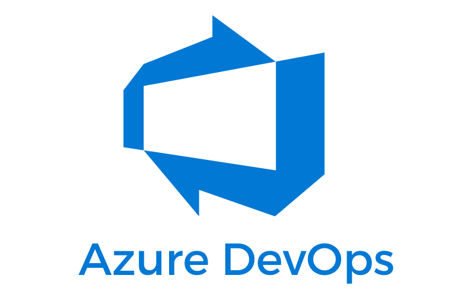

# Azure DevOps

Azure DevOps Server (formerly Team Foundation Server (TFS) and Visual Studio Team System) is a Microsoft product that provides version control (either with Team Foundation Version Control (TFVC) or Git), reporting, requirements management, project management (for both agile software development and waterfall teams), automated builds, lab management, testing and release management capabilities. It covers the entire application lifecycle, and enables DevOps capabilities.

MettleCI is compatible with both…

*   **Azure DevOps Server**, collaboration software for software development formerly known as Team Foundation Server and Visual Studio Team System, and
    
*   **Azure DevOps Services**, cloud service for software development formerly known as Visual Studio Team Services, Visual Studio Online and Team Foundation Service Preview
    

### MettleCI features enabled by Azure DevOps integration

*   Commit to Azure DevOps-managed Git repositories
    
*   Retrieve Compliance Rules from a Azure DevOps-managed Git repository
    
*   Perform a live lookup of Azure DevOps work items for users to select from when they are performing a Git commit.
    
*   Execute sophisticated CI/CD Azure DevOps Pipelines for Information Server using the [MettleCI Command Line Interface](https://datamigrators.atlassian.net/wiki/spaces/MCIDOC/pages/408354840/MettleCI+Command+Line+Interface)
    
*   Provide Compliance, Unit Test, and Integration Test results as Azure DevOps-compatible [JUnit test reports](https://docs.microsoft.com/en-us/azure/devops/pipelines/tasks/test/publish-test-results)
    

* * *

## Detailed Integration Steps

*   [Preparing your Azure environment](./azure-devops/preparing-your-azure-environment.md)
*   [Azure Git Repositories](./azure-devops/azure-git-repositories.md)
*   [Azure Work Item Management](./azure-devops/azure-work-item-management.md)
*   [Azure Pipelines](./azure-devops/azure-pipelines.md)
*   [Azure DevOps Questions and Answers](./azure-devops/azure-devops-questions-and-answers.md)
*   [Automating project creation with the Azure API](./azure-devops/automating-project-creation-with-the-azure-api.md)
*   [Re-deploy a prior Azure DevOps release](./azure-devops/re-deploy-a-prior-azure-devops-release.md)

## See also

*   [https://datamigrators.atlassian.net/wiki/spaces/MCIDOC/pages/2084569091](https://datamigrators.atlassian.net/wiki/spaces/MCIDOC/pages/2084569091)
    
*   [MettleCI Example Pipeline for DevOps](https://datamigrators.atlassian.net/wiki/spaces/MCIDOC/pages/2222653459/MettleCI+Example+Pipeline+for+DevOps)
    
*   [MettleCI Example Pipeline for Upgrades](https://datamigrators.atlassian.net/wiki/spaces/MCIDOC/pages/2178875414/MettleCI+Example+Pipeline+for+Upgrades)