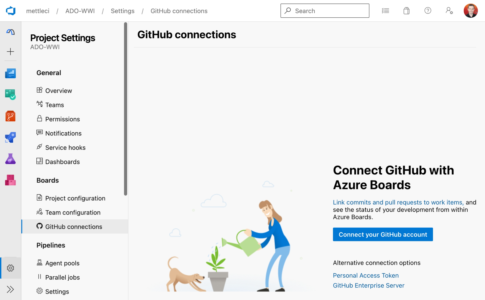

# Azure Linked to GitHub Repositories

As well as using its internal Git repository capability Azure DevOps can instead use an externally linked [GitHub](https://github.com/) repositories.

The integration of MettleCI with Microsoft Azure currently assumes that you use an Azure-hosted Git repository. MettleCI does not currently support Azure DevOps project using externally-linked GitHub repositories but this is a [known issue](https://datamigrators.atlassian.net/wiki/spaces/MCIDOC/pages/2311225345/MettleCI+IBM+OEM+Release+1.1#Known-Issues), and a priority enhancement for a forthcoming MettleCI release.

