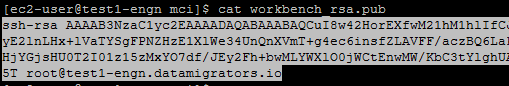
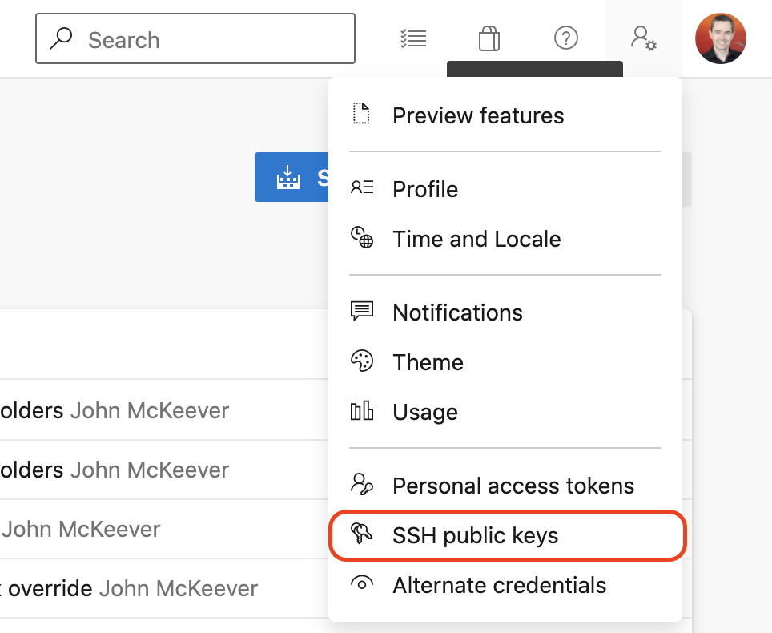
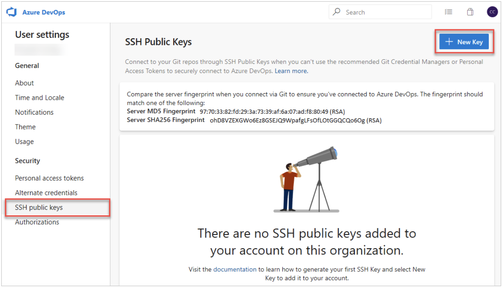

# Configure MettleCI Workbench Authentication to Azure Git Repo

Integrating your MettleCI Workbench with Azure DevOps will enable you to use an Azure DevOps Git repository to store your DataStage project artefacts.

## Granting Azure DevOps Git repository access to Workbench

1.  Log onto the server hosting MettleCI Workbench and navigate to `/opt/dm/mci/`
    
2.  Open the public Git SSH key `workbench.key.pub` in your favourite text edit and copy its contents:
    
    
    
    Note that this file is automatically generated and configured during MettleCI workbench installation purely as a convenience to you. It is not obligatory that you use this file. Feel free to use your preferred SSH key for the following steps.
    
3.  Next we’ll add the public key to Azure DevOps Services/TFS. Open your security settings by browsing to the web portal and selecting your avatar in the upper right of the user interface. Select **Security** in the menu that appears.
    
    
    
4.  Select **SSH public keys**, and then select **\+ New Key**.
    
    
    
5.  Copy the contents of the public key (for example, `workbench.key.pub`) that you generated into the **Public Key Data** field.
    
    **Important**: Avoid adding whitespace or new lines into the **Key Data** field, as they can cause Azure DevOps Services to use an invalid public key. When pasting in the key, a newline often is added at the end. Be sure to remove this newline if it occurs.
    
    
    
6.  Give the key a useful description (this description will be displayed on the **SSH public keys** page for your profile) so that you can remember it later. Select **Save** to store the public key. Once saved, you cannot change the key. You can delete the key or create a new entry for another key. There are no restrictions on how many keys you can add to your user profile.
    
7.  Ensure that on your local system (to which you will clone the repository) your have added the associated private key to the list maintained by `ssh-agent`:
    
    ```
    $> ssh-add ~/.ssh/dev.azure.com-mettleci
    Identity added: /Users/username/.ssh/dev.azure.com-mettleci (username@MyMacbook)
    ```
    

Done!