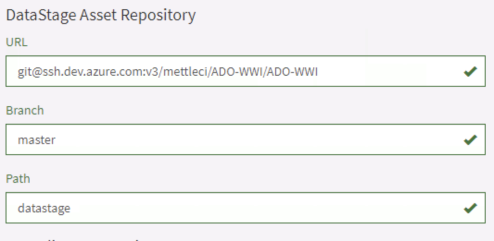
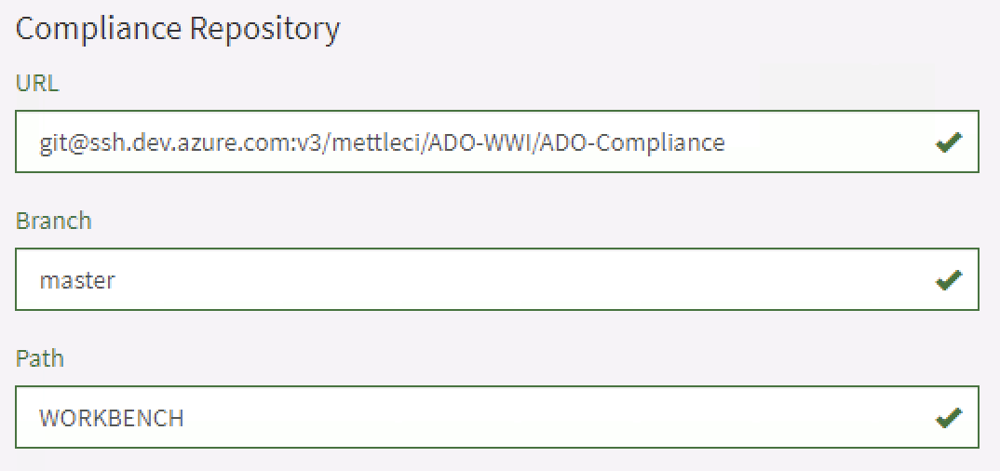

# Azure DevOps Setup Roadmap

Prerequisites:

*   A machine with git installed that has the required access to push to repositories in your Azure DevOps instance
    

Here is a simple roadmap to getting up and running with DataStage and Azure DevOps:

1.  Create an [Azure DevOps Project](https://azure.microsoft.com/en-au/features/devops-projects/)
    
2.  Create two Git repositories from the MettleCI templates:
    
    1.  [One to host your Compliance Rules](https://datamigrators.atlassian.net/wiki/spaces/MCIDOC/pages/1033568267/TO+DO+-+Configure+compliance+repository+on+Azure+DevOps). We will customise these later.
        
    2.  [One to host your DataStage solution](https://datamigrators.atlassian.net/wiki/spaces/MCIDOC/pages/810942491/TO+DO+-+Setting+up+an+Azure+DevOps+Repository). This will includes default YAML pipelines for your DataStage CI/CD process which we will customise later.
        
3.  [Install MettleCI Workbench](https://datamigrators.atlassian.net/wiki/spaces/MCIDOC/pages/453902355/Installing+MettleCI+Workbench)
    
    1.  Make sure you generate an SSH key pair if you don't already have one available
        
4.  Configure [MettleCI Workbench to use HTTPS](https://datamigrators.atlassian.net/wiki/spaces/MCIDOC/pages/458556297/Configuring+Workbench+to+use+HTTPS)
    
5.  Add your SSH Public Key to Azure DevOps to provide authentication when performing a Git commit.
    
6.  [Register MettleCI as an App](https://datamigrators.atlassian.net/wiki/spaces/MCIDOC/pages/1035730972/Registering+MettleCI+Workbench+as+an+OAuth+2.0+Azure+DevOps+App) in Azure Active Directory, enabling MettleCI Workbench to perform dynamic lookup of Azure DevOps Work Items.
    
7.  Create a sample Azure DevOps Work Item for us to associate with the first Git commit.
    
8.  Register your first DataStage project in MettleCI Workbench
    
    1.  Enter the details for the DataStage solution repository in Azure DevOps. e.g.
        
        
        
    2.  Enter the details for the Compliance repository in Azure DevOps. e.g.
        
        
        
9.  [Run a Compliance check](https://datamigrators.atlassian.net/wiki/spaces/MCIDOC/pages/375357479/Improve+Code+Quality+using+Compliance) using the MettleCI Workbench
    
10.  [Perform a Git commit](https://datamigrators.atlassian.net/wiki/spaces/MCIDOC/pages/374865930/Committing+DataStage+Assets+to+Git) using the MettleCI Workbench
    
    1.  Enter some text to find your Work item in Azure DevOps
        
    2.  Commit your asset to Azure DevOps
        

Done!