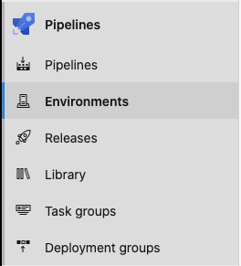
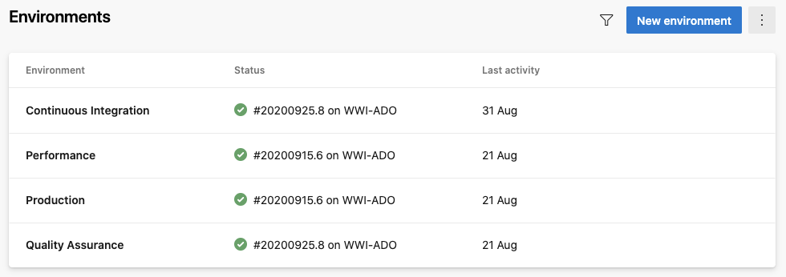
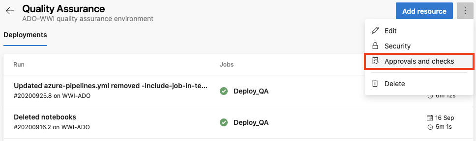
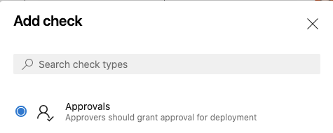
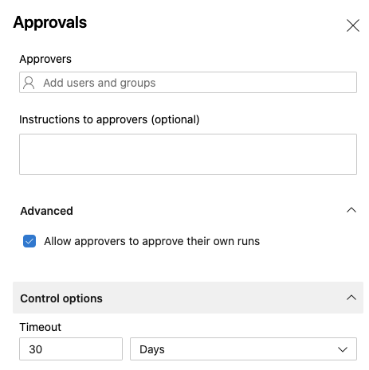
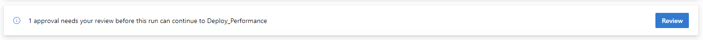
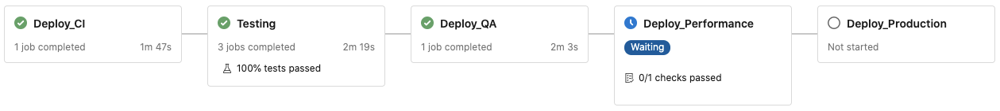
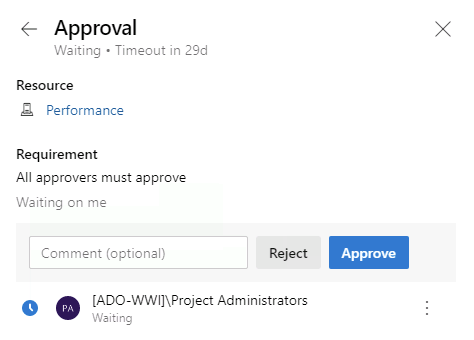
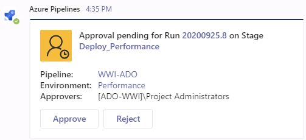

# Configuring Manual Approval Steps in Azure DevOps

The sample multi-stage Azure DevOps pipeline that ships with MettleCI supports the automated testing and deployment of your code through a number of notional environments:

*   Continuous Integration
    
*   Quality Assurance
    
*   Performance
    
*   Production
    

It's rare that an organisation would want a Git commit to be automatically promoted all the way to Production; most organisations would want at least one part of the delivery pipeline to require a manual approval. Fortunately this can be easily configured in Azure DevOps.

## Configuring a Manual Approval Check

1.  In your Azure DevOps project, go to the resource (ie. environment) that needs to be protected.
    
    
    
    
    
2.  Navigate to Approvals and Checks for the resource.
    
    
    
3.  Select \[+\] to create a check and select Approvals then Next.
    
    
    
4.  Provide the approvers and an optional message, and select **Create** to complete addition of the manual approval check.
    
    
    

You can add multiple approvers to an environment. These approvers can be individual users or groups of users. When a group is specified as an approver only one of the users in that group needs to approve for the run to progress. Using the **Advanced** options you can configure minimum number of approvers to complete the approval. A group is considered as one approver. You can also restrict the user who initiated the run from completing the approval. This option is commonly used for separation of duties amongst users. Users configured as approvers must review and approve or reject the deployment. If you have multiple runs executing simultaneously, you must approve or reject each of them independently. If all required approvals are not complete within the Timeout specified for the approval and all other checks succeed, the stage is marked skipped.

When you run a pipeline the execution of that run pauses before entering a stage that uses the environment. Each stage’s environment requirements are specified using the **environment** key as a property of a **deployment** job. The example below is taken from the pipeline that ships with MettleCI where the environment name is parameterised:

```
...
jobs:
  - deployment: Deploy_${{ parameters.EnvironmentID }}
    displayName: Deploy to ${{ parameters.EnvironmentName }}
    pool: 'My Agent Pool Name'
    environment: ${{ parameters.EnvironmentName }}
    strategy:
      runOnce:
        deploy:
          steps:
            ...
```

Pipeline deployment stages configured wth manual approval steps will appear in the build results summary page with a blue clock icon and a WAITING indicator when they are awaiting approval:





On this page you can click **Review** to display the approval dialog where you can enter a comment before clicking **Approve** or **Reject**.



If you have configured [Azure DevOps Teams Integration](../azure-pipelines/integrate-azure-devops-with-microsoft-teams.md) you will also receive a post in your Teams channel from which you can also submit your approval by clicking **Approve**:

