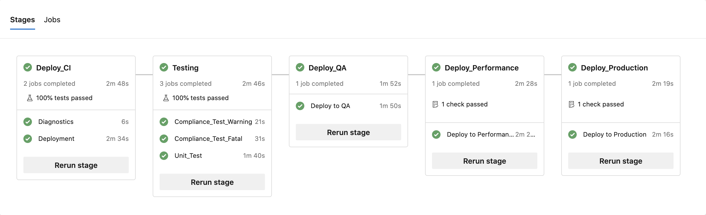

# Deploying an Azure DevOps CI/CD Pipeline

MettleCI ships with a template Git repository which includes an `azure-pipelines.yml` file which you can modify as required. This [pipeline is annotated](https://datamigrators.atlassian.net/wiki/spaces/MCIDOC/pages/1041104924/Understanding+your+Azure+DevOps+CI+CD+Pipeline) to make it easy to understand where you need to place your environment-specific values, such as hostnames and credentials.

## Tests

DataStage job compilation, MettleCI Compliance testing, and MettleCI Unit testing are all exposed as jUnit-compatible XML files, and so appear as tests in the Azure DevOps Build Results page:

