# Install and configure an Azure DevOps self-hosted agent

MettleCI requires an [Azure DevOps self-hosted agent](https://docs.microsoft.com/en-us/azure/devops/pipelines/agents/v2-windows?view=azure-devops#permissions) to run your MettleCI-enabled build and deployment pipeline. This agent enables Azure DevOps pipelines to invoke the MettleCI command line on a dedicated Windows server, which is required because the DataStage compilation process (v11.7 and earlier) still requires the use of Microsoft Windows-based components.

In the example described on this page we’ll configure an agent to run as a Window service under the `NT AUTHORITY\NETWORK SERVICE` account. Note that these configuration options work for Azure DevOps running either in the cloud or on premises.

There are three steps to follow:

*   [Create a PAT (Personal Access Token)](#create-a-pat-personal-access-token)
*   [Trust Azure Certificate (Azure DevOps Server only)](#trust-azure-certificate-azure-devops-server-only)
*   [Download and configure an Agent](#download-and-configure-an-agent)

# Create a PAT (Personal Access Token)

1.  From the **User settings** menu select **Personal access tokens**
    
    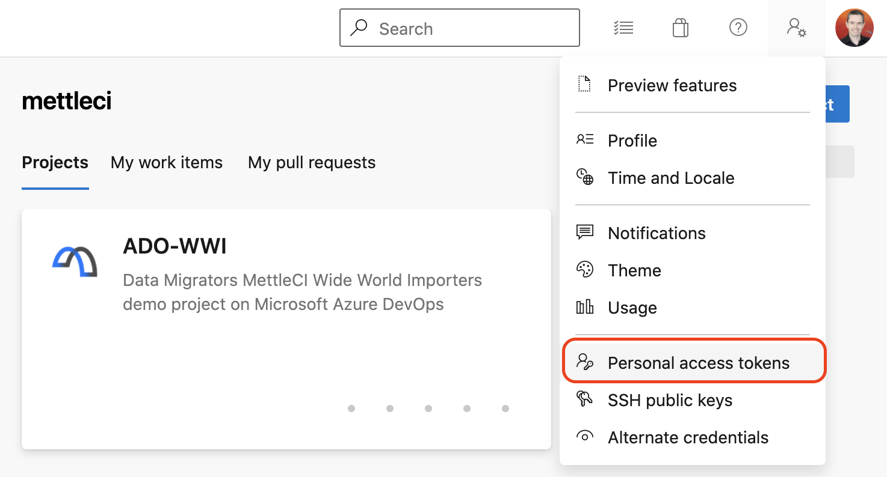
    
2.  Select **New Token** and enter the name of your Windows machine, select your Azure organisation, specify your token’s expiry period, and select a scope of **Full access**.
    
    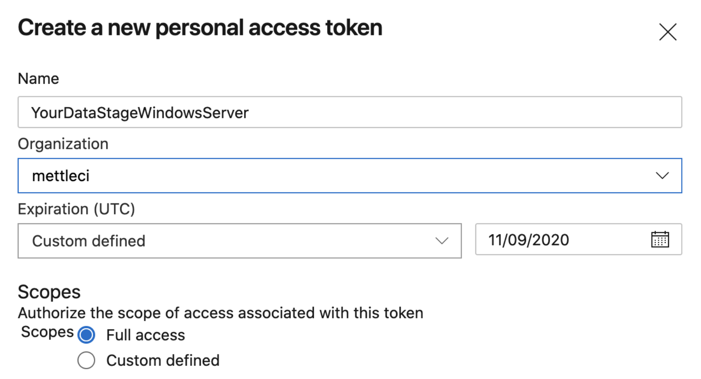
    
    The only permissions you need to execute the example pipelines provided with MettleCI is **Code - Read & Write**.
    
    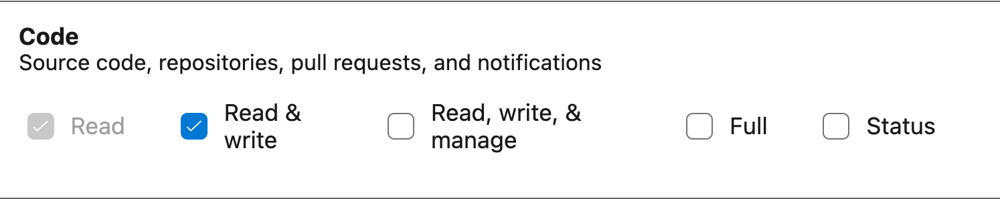
    
3.  Copy the generated token and keep it somewhere secure. You’ll need it in subsequent steps.
    
    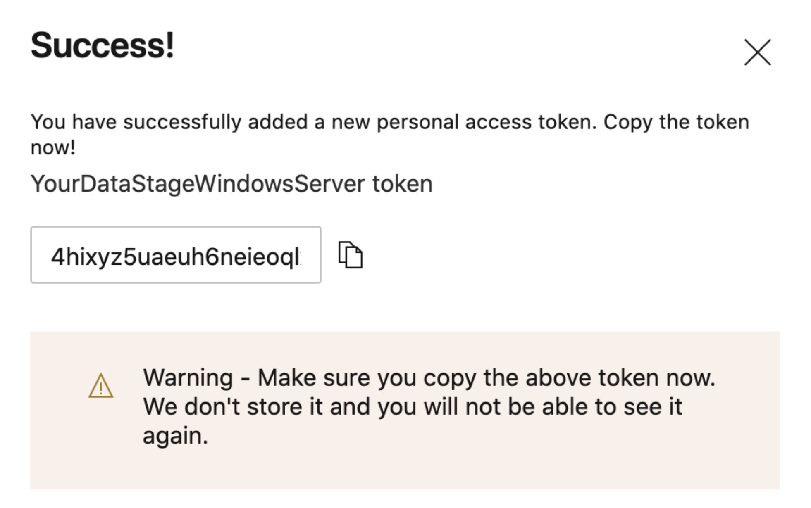
    

# Trust Azure Certificate (Azure DevOps Server only)

If your Azure DevOps Server instance is using a self-signed certificate, you will need to trust that certificate from the machine that you are going to run your agent on.

1.  Navigate to your Azure DevOps Server instance in the browser on the machine you will install the agent on and click “Continue to this website”:
    
    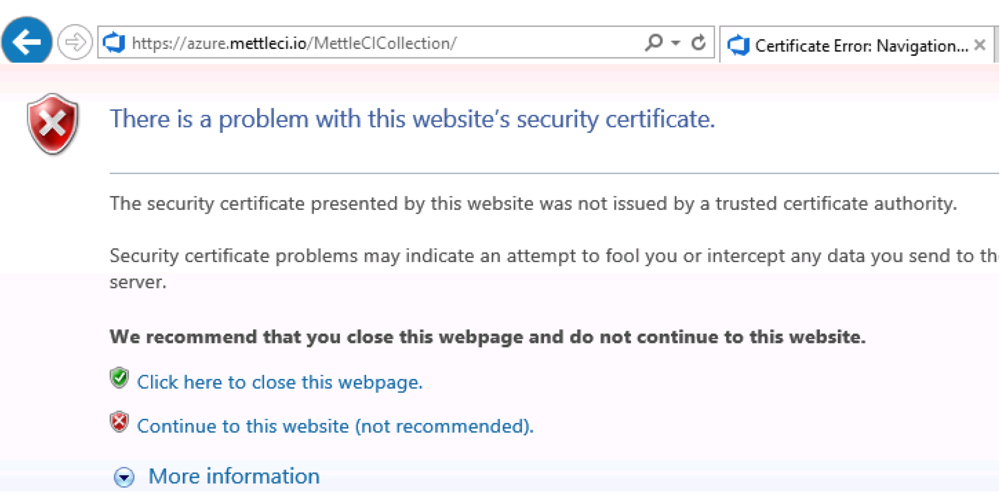
    
2.  Click “Certificate error” in the address bar, then “View certificates”:
    
    
    
3.  Select the **Details** tab then **Copy to File…**
    
    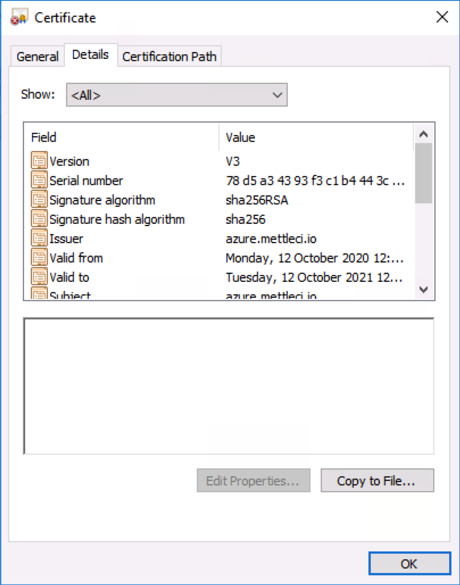
    
4.  Select the P7B certificate and check the box to Include all certificates in path
    
    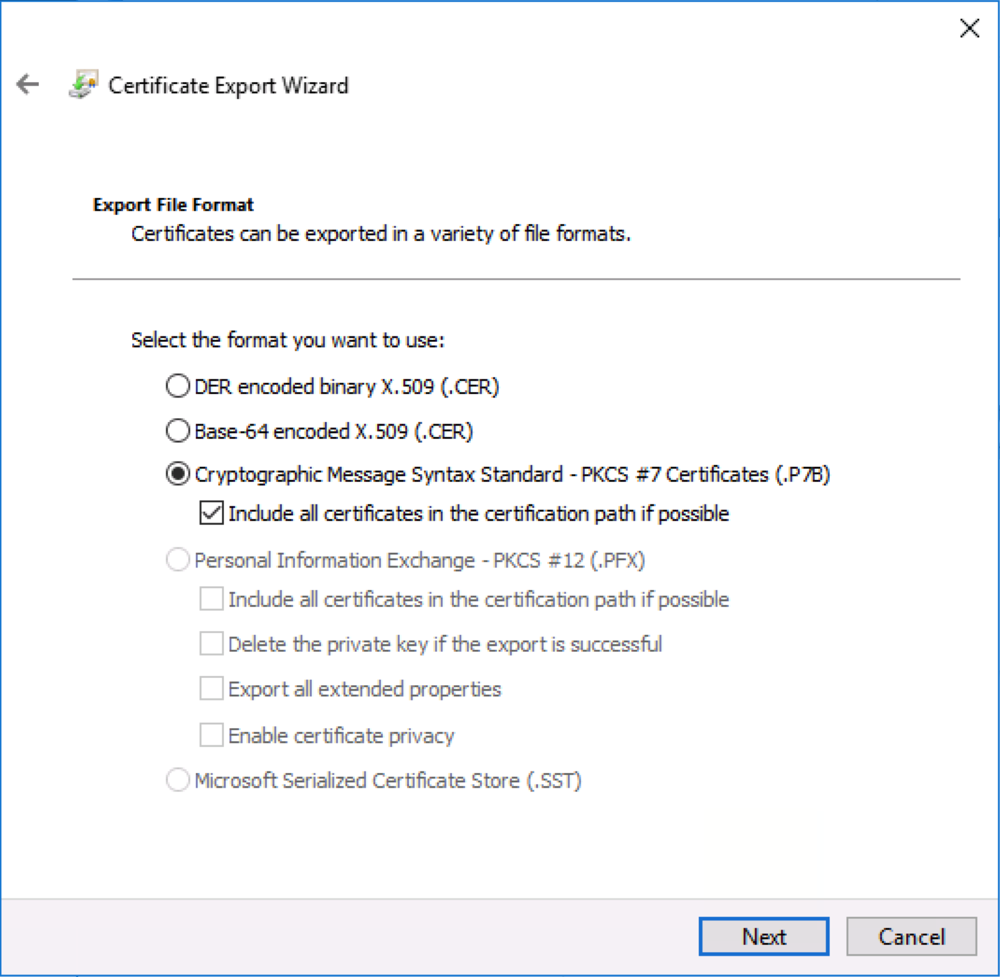
    
5.  Select the path to save the certificate to
    
6.  Locate the file in File Explorer, right click and select “Install Certificate”
    

# Download and configure an Agent

1.  Under Project Settings create an **Agent Pool** for your agents. For example, here’s a list including a pool of agents across Data Migrators' AWS infrastructure:
    
    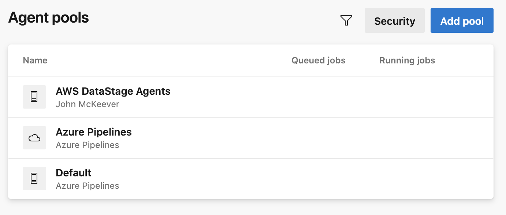
    
2.  Select the **Agents** tab,
    
    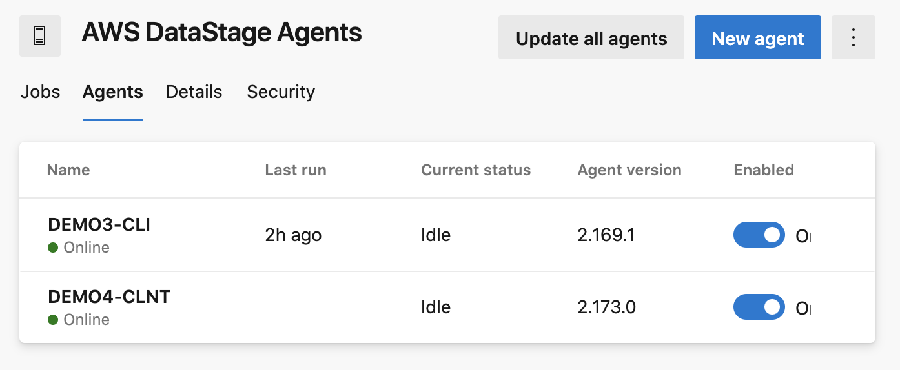
    
3.  Click **New agent**
    
    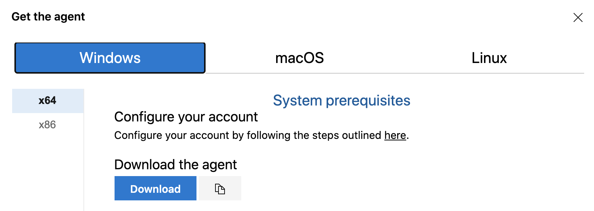
    
4.  Download the appropriate agent (e.g. Windows x64 for traditional DataStage v11.7 instances) on to the server you intent to use for CI-related job compilation and follow the PowerShell instructions provided.  
      
    **Azure DevOps Services**  
    **Server URL:** https://dev.azure.com/\[ORGANIZATION\]  
      
    **Azure DevOps Server**  
    **Server URL:** https://\[AZURE\_SERVER\_URL\]/\[AZURE\_COLLECTION\]  
      
    Your PowerShell output should look a little like this:
    
    ```
    Windows PowerShell
    Copyright (C) 2016 Microsoft Corporation. All rights reserved.
    
    PS C:\Users\Administrator> cd c:\
    PS C:\> mkdir agent ; cd agent
        Directory: C:\
    Mode                LastWriteTime         Length Name
    ----                -------------         ------ ----
    d-----       12/08/2020   8:12 PM                agent
    
    PS C:\agent> Add-Type -AssemblyName System.IO.Compression.FileSystem ; [System.IO.Compression.ZipFile]::ExtractToDirectory("$HOME\Downloads\vsts-agent-win-x64-2.173.0.zip", "$PWD")
    PS C:\agent> .\config.cmd
    
      ___                      ______ _            _ _
     / _ \                     | ___ (_)          | (_)
    / /_\ \_____   _ _ __ ___  | |_/ /_ _ __   ___| |_ _ __   ___  ___
    |  _  |_  / | | | '__/ _ \ |  __/| | '_ \ / _ \ | | '_ \ / _ \/ __|
    | | | |/ /| |_| | | |  __/ | |   | | |_) |  __/ | | | | |  __/\__ \
    \_| |_/___|\__,_|_|  \___| \_|   |_| .__/ \___|_|_|_| |_|\___||___/
                                       | |
            agent v2.173.0             |_|          (commit ecd4119)
    
    >> Connect:
    Enter server URL > https://dev.azure.com/mettleci
    Enter authentication type (press enter for PAT) >
    Enter personal access token > ****************************************************
    Connecting to server ...
    >> Register Agent:
    Enter agent pool (press enter for default) > AWS DataStage Agents
    Enter agent name (press enter for DEMO4-CLNT) >
    Scanning for tool capabilities.
    Connecting to the server.
    Successfully added the agent
    Testing agent connection.
    Enter work folder (press enter for _work) >
    2020-08-12 10:24:26Z: Settings Saved.
    Enter run agent as service? (Y/N) (press enter for N) > Y
    Enter User account to use for the service (press enter for NT AUTHORITY\NETWORK SERVICE) >
    Granting file permissions to 'NT AUTHORITY\NETWORK SERVICE'.
    Service vstsagent.mettleci.AWS DataStage Agents.DEMO4-CLNT successfully installed
    Service vstsagent.mettleci.AWS DataStage Agents.DEMO4-CLNT successfully set recovery option
    Service vstsagent.mettleci.AWS DataStage Agents.DEMO4-CLNT successfully set to delayed auto start
    Service vstsagent.mettleci.AWS DataStage Agents.DEMO4-CLNT successfully configured
    Service vstsagent.mettleci.AWS DataStage Agents.DEMO4-CLNT started successfully
    PS C:\agent>
    ```
    
5.  You’ll need to grant your Azure agents the relevant capabilities specified in your Azure pipeline. The example pipelines provided with MettleCI require at least one agent with the following capabilities:
    
    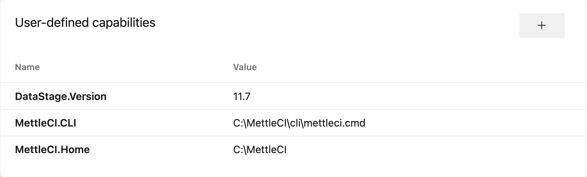
    
6.  Now you’re ready to use that agent in your pipeline YAML definitions!