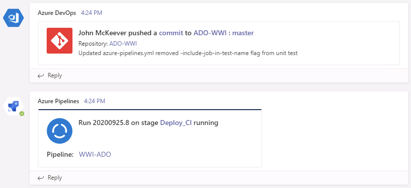
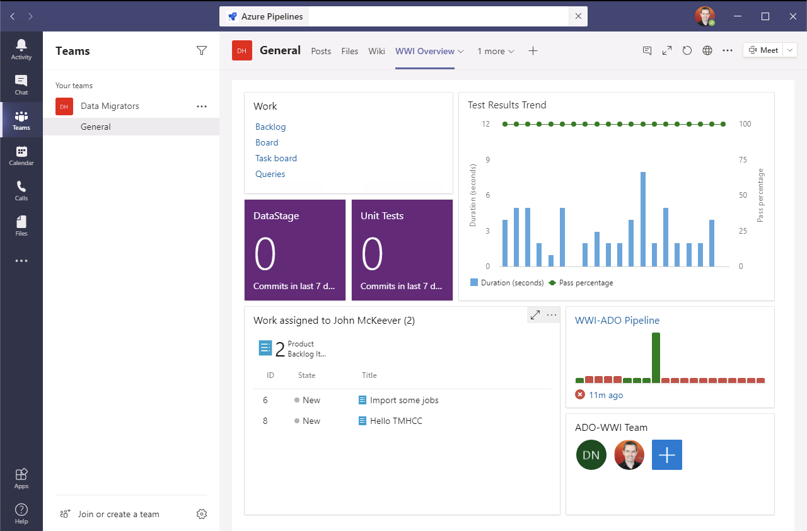
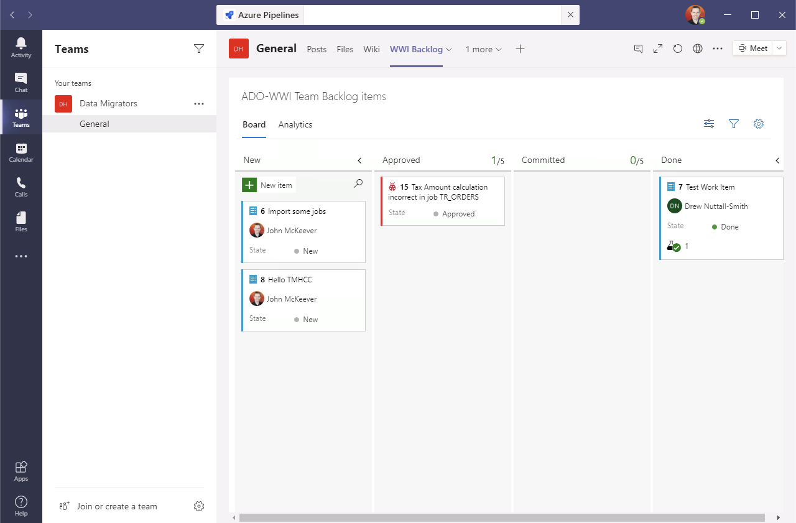
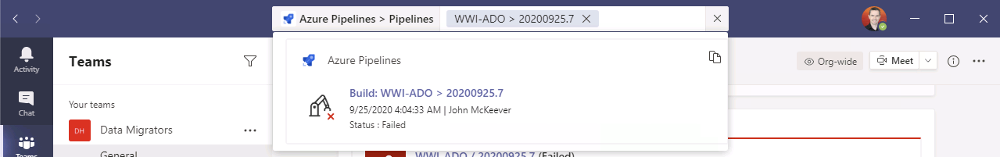
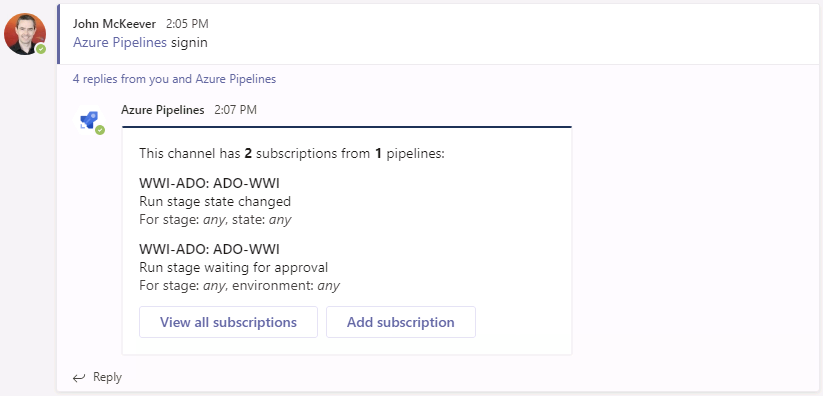

# Integrate Azure DevOps with Microsoft Teams

You can integrate Microsoft Azure DevOps Pipelines with Microsoft Teams in a number of ways:

*   [Channel Posts](#channel-posts)
*   [Azure DevOps Tabs](#azure-devops-tabs)
*   [Azure DevOps Bot](#azure-devops-bot)

> [!WARNING]
> **Note:** Only Azure DevOps organizations in the same organization (AAD tenant) can be used to integrate with your Microsoft Teams account.

## Channel Posts

Configure Azure DevOps to automatically post activity updates to your team’s channels: [Instructions here](https://www.azuredevopslabs.com/labs/vstsextend/teams/#integrating-microsoft-teams-with-azure-devops-services)

## Azure DevOps Tabs

Access Kanban Boards and Dashboards as tabs in your Microsoft Teams interface: [Instructions here](https://www.azuredevopslabs.com/labs/vstsextend/teams/#azure-devops-kanban-board--dashboards-in-teams)

## Azure DevOps Bot

Install an Azure Pipelines Bot to your team so you can interact with Azure DevOps using `@azure pipelines` directly from within a team channel: [Instructions here](https://www.azuredevopslabs.com/labs/vstsextend/teams/#azure-pipelines-with-microsoft-teams)

This also permits configuring [user-specific subscriptions](https://www.azuredevopslabs.com/labs/vstsextend/teams/#subscribe-for-the-pipelines-notifications) to pipeline activity

