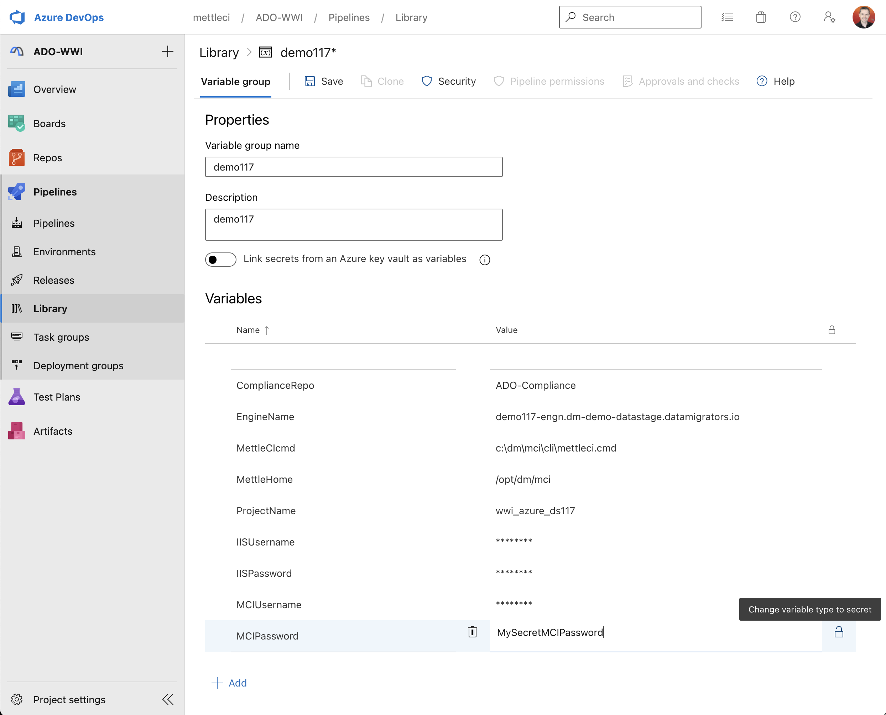
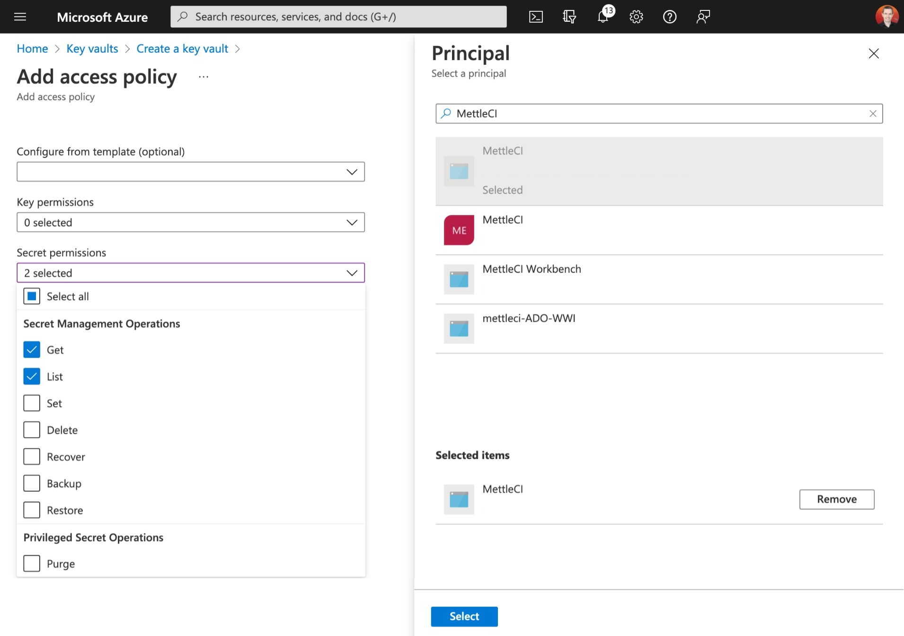
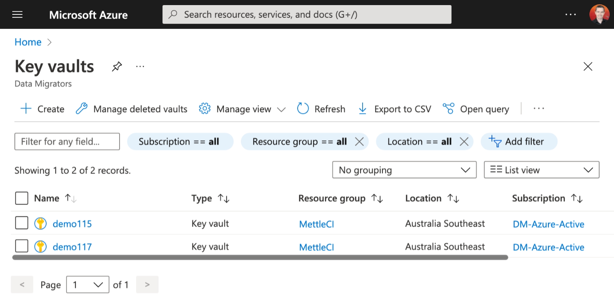
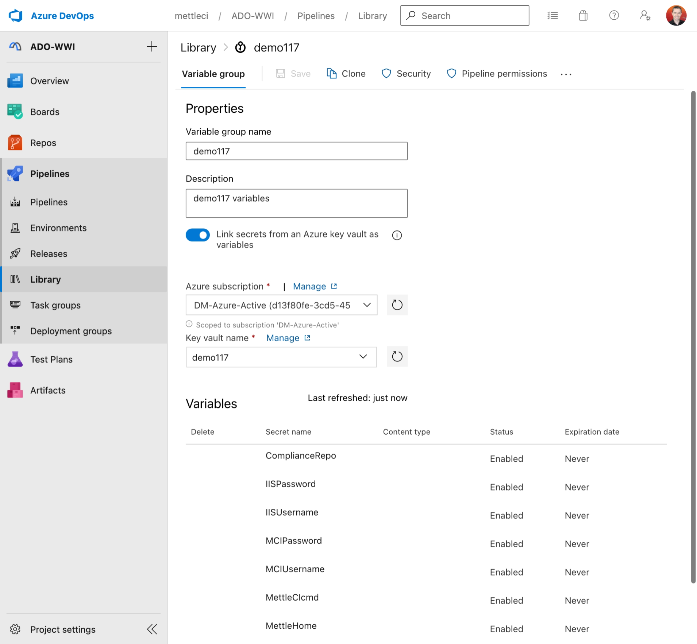
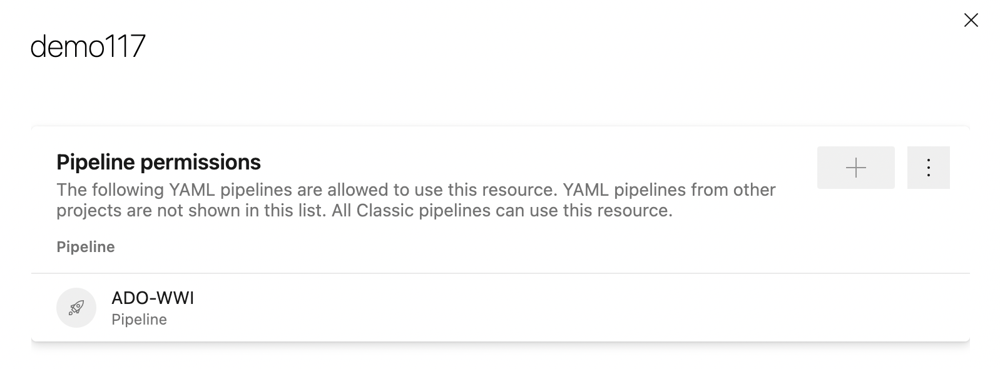
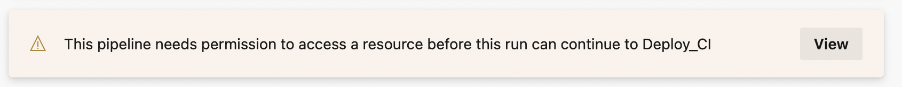

# Protecting sensitive information used in Azure DevOps Pipelines

An Azure DevOps pipeline unavoidably uses confidential information such as usernames and passwords which need to be protected from unauthorised access and alteration. Azure DevOps enables this by allowing your Pipeline to reference variables stored in a [Variable Group](https://docs.microsoft.com/en-us/azure/devops/pipelines/library/variable-groups?view=azure-devops&tabs=yaml) which itself can be configure in one of two ways, each approach described in detail the sections below.

*   Define your variables in a *Variable Group* and protect those variables which are sensitive (e.g. access credentials) by [marking each of them as *Secret*](https://docs.microsoft.com/en-us/azure/devops/pipelines/scripts/cli/pipeline-variable-group-secret-nonsecret-variables?view=azure-devops), or
    
*   Protect all [variables by storing them in as *Secrets* in an *Azure Key Vault*](#keyvault) and [defining a Variable Group linked to that Key Vault](https://docs.microsoft.com/en-us/azure/devops/pipelines/library/variable-groups?tabs=yaml&view=azure-devops&preserve-view=true#link-secrets-from-an-azure-key-vault).
    

## How many Variable Groups should you create?

We recommend creating a Variable Group per DataStage Engine.

*   For DevOps scenarios this usually involves customers creating one Variable Group for each non-production environment (e.g. DEV and QA), and one for their production environment (assuming they use Azure DevOps to deploy to production)
    
*   For DataStage upgrade scenarios most customers create…
    
    *   one Variable Group for each non-production legacy environment,
        
    *   one Variable Group for each non-production target environment, where upgrade acceptance testing will take place,
        
    *   one Variable Groups for each production legacy environment, if they want to use Azure DevOps to deploy to their legacy production environment while they plan their cutover
        

# Create a Variable Group including secret variables

In your project in Azure DevOps select **Pipeline** → **Library** → **\+ Variable Group**.



Give your variable group a name, description, and add the values you need in your pipeline. **Do not** select the **Link secrets from an Azure key vault as variables** toggle.

The variables you need to add to support the example Azure Pipelines shipped with MettleCI are described below (using the Azure CLI to describe them):

> [!INFO]
> Note that Azure DevOps Server 2019 doesn't provide support for the Azure CLI. The example below is provided as a reference for operations you should replicate in the Azure DevOps Server user interface.

```
# Login to Azure and configure CLI defaults
$> az login
$> az account set --subscription MyAzureSubscription
$> az config set defaults.location=mygeolocation

# Setup DevOps CLI defaults
$> az devops configure --defaults project=MyProject
$> az devops configure --defaults organization=https://dev.azure.com/MyOrganization 

# Describe all the Variable Groups used for Data Migrators demos
$> az pipelines variable-group list --query-order Asc --output table
ID    Name             Type    Description                          Number of Variables
----  ---------------  ------  -----------------------------------  ---------------------
1     demo117_NONPROD  Vsts    DataStage Demo v11.7 Non-Production  10
2     demo115_NONPROD  Vsts    DataStage Demo v11.5 Non-production  10
3     demo117_PROD     Vsts    DataStage Demo v11.7 Production      10
4     demo115_PROD     Vsts    DataStage Demo v11.5 Production      10

# Get the variables in the Variable Group we're interested in (Group 1, demo117_NONPROD)
$> az pipelines variable-group variable list --group-id 1 --output table
Name            Is Secret    Value
--------------  -----------  -----------------------------------------------------
ComplianceRepo  False        ADO-Compliance
DomainName      False        demo117-svcs.your-org.com:59445
EngineName      False        demo117-engn.your-org.com
IISPassword     True
IISUsername     False        isadmin
MCIPassword     True
MCIUsername     False        mciworkb
MettleHome      False        /opt/dm/mci
ProjectName     False        wwi_azure_ds117
IISVersion      False        11.7  
```

# Create a Variable Group based on an Azure Key Vault

Microsoft have [good documentation on creating an Azure Key Vault](https://docs.microsoft.com/en-us/azure/devops/pipelines/release/key-vault-in-own-project) which we recommend you consult.

Ensure you…

*   **Create a Key Vault:** Create one Key Vault per Variable Group. See our advice above on how may variable groups to create.
    
*   **Attach an Access Policy:** This must provides the **Get** and **List** permissions for **Secrets**.
    
*   **Attach a Service Principal:** This is simply an identity created for your application. You can create the service principal by using Azure CLI (see an example at the bottom of this page), or use the service principal created if/when your application is registered in Azure AD.
    





## Create a Variable Group linked to a Key Vault



Next, back in Azure DevOps, go to the Library within your Project and create a Variable Group. Make sure you select the **Link secrets from an Azure key vault as variables** toggle.

Click the **Pipeline permissions** tab and ensure that you give your pipeline permission to access this Variable Group:



## Grant an Azure Pipeline access to your Variable Group

When executing your Pipeline for the first time you may see a prompt like this.



Click View then grant access on the dialog which appears.

# Reference

## Creating Azure assets using the Azure CLI

```
# Login to Azure and configure CLI defaults
$> az login
$> az account set --subscription MyAzureSubscription
$> az config set defaults.location=mygeolocation

# Setup DevOps CLI defaults
$> az devops configure --defaults project=MyProject
$> az devops configure --defaults organization=https://dev.azure.com/MyOrganization 

# Create a Resource Group to group our MettleCI-related resources
$> az group create --name MettleCI

# Create key vault
$> az keyvault create \\n  --name MyDataStageEnvironment \\n  --resource-group MettleCI

# Set a secret in the vault
$> az keyvault secret set \\n  --name "MyPassword" \\n  --value "mysecretpassword" \\n  --vault-name MettleCI

# Create an Azure service principal called 'MettleCI'
$> az ad sp create-for-rbac --name MettleCI
```