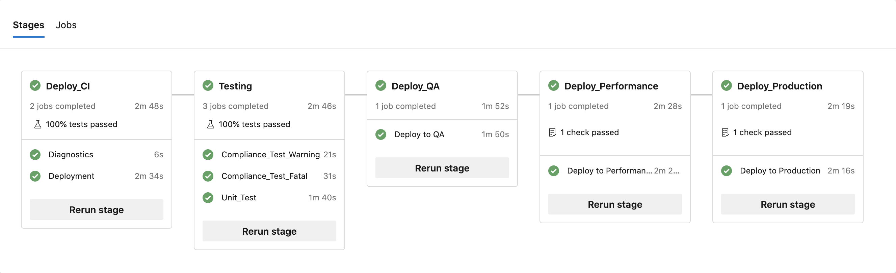
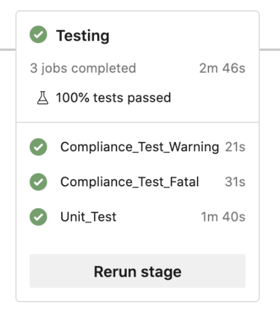

# Understanding your Azure DevOps CI/CD Pipeline

# Structure



The Azure DevOps pipeline is defined in the file `azure_pipline.yml` file and has the following structure:

```
# Preamble, setting up parameters for the pipeline
# ------------------------------------------------

trigger:                                  # The repository event(s) which trigger this pipeline
pool:                                     # Describing the Azure DevOps agents which will execute this pipeline
variables:                                # The configurable parametesrs controlling the behaviour of this pipeline

# Stages, where the actual execution steps of the pipeline are defined
# --------------------------------------------------------------------

stages:                                   # A list of stage definitions which represent the distinct logical steps in the pipeline 
- stage: Deploy_CI                        #
- stage: Deploy_QA                        # 
- stage: Deploy_Perf                      # 
- stage: Deploy_Prod                      # 
```

# The Preamble

The start of the pipeline defines global information about the pipeline itself:

```
# You can add more steps to your pipeline that build, run tests, deploy, and more.
# See https://aka.ms/yaml for more details

trigger:                                    # This pipeline is trigger by a commit to the associated repository's master branch
- master                                    #

pool:                                       # The pool of agents from which an agent should be assigned for execution of this pipeline
  AWS DataStage Agents                      #

variables:                                  # A set of key:value pairs used throughout the pipeline definition
  IISUsername: isadmin                      # 
  IISPassword: your-password-here           #
  MCIUsername: mciworkbench                 #
  MCIPassword: your-password-here           #
  AzureUsername: your.name@domain.com       #
  AzurePassword: your-password-here         #
  ProjectName: your-datastage-repo          #
  MettleHome: /opt/dm/mci                   #
  ComplianceRepo: your-compiance-repo       #
```

# Stages



Each Stage defines a number of ***jobs*** and is structured like this:

```
- stage: StageName                        # A label for the stage
  variables:                              # The configurable parameters controlling the behaviour of this stage
  jobs:                                   # A list of job definitions (not to be confused with DataStage Jobs) which represent the distinct operational steps in the pipeline
  - job: Compliance_Test_Warning          # 
  - job: Compliance_Test_Fatal            # 
  - job: Unit_Test                        # 
  - job: Some_Other_Job                   # 
```

# Jobs

> [!WARNING]
> Note that an Azure DevOps Pipeline ‘Job’ is not relate to a DataStage ‘Job’. An Azure DevOps Pipeline Job is a unit of work within an Azure DevOps pipeline.

Jobs can be thought of as simple sequential scripts which perform units of work. Here’s an example job from the default `azure_pipline.yml` which ships with MettleCI:

```
  - job: Compliance_Test_Fatal                               # The name of the job, for logging purposes
    steps:                                                   # The list of steps (operations) which form the job
    - checkout: git://ADO-WWI/ADO-Compliance                 # An Azure DevOps built-in Git operation (see Azure documentation)
    - checkout: self                                         # An Azure DevOps built-in Git operation (see Azure documentation)
    - script:                                                # A step which runs a shell script on the agent's host 
        mettleci compliance test <<REDACTED FOR BREVITY>>    # A MettleCI CLI call (redacted for brevity)
      displayName: 'Run Compliance (Fatal)'                  # The name of this script, for logging purposes
    - task: PublishTestResults@2                             # An Azure DevOps built-in operation (see Azure documentation)
      condition: always()                                    # Parameters to the 'PublishTestResults@2' task
      inputs:                                                # Parameters to the 'PublishTestResults@2' task
        testRunTitle: 'MettleCI Unit Tests'                  # Parameters to the 'PublishTestResults@2' task
        ...                                                  # etc.
```

Sometimes you’ll find that you need to re-use the same logic in multiple jobs across different stages. Deploying your jobs to a target environment is a good example, as your changes will need to be deployed identically to all your downstream CI, QA, and (potentially) Production environments. The best way to do this is to use a **pipeline template**, which is a set of jobs defined in an external file which can be called repeatedly from multiple stages. A template has a name and input parameters, and is used like this:

```
- stage: Deploy_CI                        # The Stage which deploys your repository to a Continuous Integration environment to conduct the tests described in the following Stage
  variables:                              # Information about your CI environment 
  jobs:                                   # 
  - template: deploy-template.yml         # An external/utility pipeline which is called from this pipeline using the supplied parameters
    parameters: ...                       # Parameter values supplied to the named template
      IISUsername: $(IISUsername)         # Using variable defined earlier
      IISPassword: $(IISPassword)         # Using variable defined earlier
      ...                                 # etc.
```

# The Default MettleCI Pipeline

Here’s a summary of the default `azure_pipline.yml` which ships with MettleCI:

```
#-----------------------------------------
- stage: Deploy_CI                        # The Stage which deploys your repository to a Continuous Integration environment to conduct the tests described in the following Stage
  variables:                              # Information about your CI environment 
  jobs:                                   # 
  - template: deploy-template.yml         # An external/utility pipeline which is called from this pipeline using the supplied parameters
    parameters: ...                       # 
#-----------------------------------------
- stage: Testing                          # 
  variables:                              # 
  jobs:                                   # 
  - job: Compliance_Test_Warning          # Check for Compliance Rules calssed as Warnings, which log an error but will not cause the pipeline to fail
  - job: Compliance_Test_Fatal            # Check for Compliance Rules calssed as Fatal, which will cause the pipeline to fail
  - job: Unit_Test                        # Run the MettleCI unit tests associated with the changed (comitted) jobs
#-----------------------------------------
- stage: Deploy_QA                        # 
  variables:                              # 
  jobs:                                   # 
  - template: deploy-template.yml         # Call the external 'deploy-template' pipeline
    parameters: ...                       # Supply appropriate parameters to the external 'deploy-template' pipeline
#-----------------------------------------
- stage: Deploy_Performance               # As above, but for the 'Performance' environment
  ...                                     # 
#-----------------------------------------
- stage: Deploy_Production                # As above, but for the 'Production' environment
  ...                                     # 
```

# Also See

*   [Azure DevOps CI Triggers](https://docs.microsoft.com/en-us/azure/devops/pipelines/repos/azure-repos-git?view=azure-devops&tabs=yaml#ci-triggers)