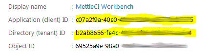
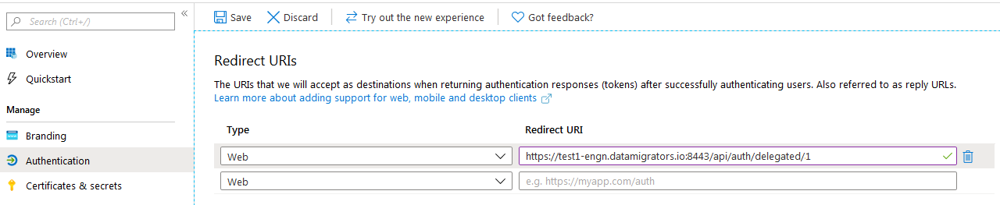

# Integrating Azure DevOps Work Item Lookup with MettleCI Workbench

# Defining MettleCI Workbench as an OAuth 2.0 Azure DevOps App

Registering MettleCI Workbench as an Azure DevOps App will enable MettleCI Workbench to perform a dynamic lookup of Azure DevOps work items when linking Git commits to Azure DevOps work items

1.  Start by [configuring Workbench to use HTTPS](https://datamigrators.atlassian.net/wiki/spaces/MCIDOC/pages/458556297/How+do+I+configure+Workbench+to+use+HTTPS).  
    (**NOTE:** In order for MettleCI Workbench and Azure DevOps to communicate MettleCI Workbench **must** be accessible using an **HTTPS** based URL. This URL does not have to be accessible outside your corporate network.)
    
2.  Follow Microsoft’s instructions for [registering a new app with Azure](https://docs.microsoft.com/en-us/graph/auth-register-app-v2). Use the following settings:  
    
    
    
3.  Press the button to REGISTER. Note down the “Application (client) ID” and Directory (tenant) ID for later use:  
    
    
    
4.  Navigate to the “Authentication” section of your application registration. Select “+ Add a Platform”. Choose ‘Web’ and add a Redirect URI for workbench using a URI of the form `https://<workbench url>/api/auth/delegated/<N>` where N is the number of this Work Item configuration (the default generic one is 0, so if this is the first integration you are adding, N would be 1, and if you added one already, N would be 2, and so on) and click save. In the below illustration `<workbench url>` is `test1-engn.datamigrators.io:8443` and `<N>` is `l`
    
    
    
    If your organization has installed multiple MettleCI Workbench application instances, (for example, you have more than one development environment, or you have legacy and target instances) you can add them all to the same Azure App Registration by adding multiple Redirect URIs, one for each different Workbench instance.  
    
5.  Navigate to the “Certificates & Secrets” section of your application registration and add a “New Client Secret”. Provide a description and select an expiry (Never is convenient). The ‘Value' will be generated for you. Note down the generated secret for later use (this value will never be displayed again):
    
    
    
6.  Navigate to the “API permissions” section of your application registration, click “Add a permission” and select “Azure DevOps” → “user\_impersonatation”:
    
    
    

# Configuring MettleCI Workbench Work Item Lookup with Azure DevOps

1.  Access the MettleCI Workbench page to integrate with your Azure Work Item Management system by logging in to MettleCI Workbench and select **Issue Management** from the **Profile** menu (top right)
    
    1.  
        
2.  Enter the following values and click **Submit**:
    
    
    
    *   **Issue Management Type:** Azure
        
    *   **Name:** Anything you like, but something that identifies your Azure organisational instance would be a sensible choice
        
    *   **Tenant ID:** Your Directory (tenant) ID
        
    *   **Client ID:** Your Application (client) ID
        
    *   **Client Secret:** Your client secret
        
3.  You will also have the opportunity to point to an issue management service which is in a different organization and repository to that which holds your assets.
    
    
    
4.  Restart the workbench service:
    
    ```
    $> sudo service dm-mettleci-workbench restart
    ```
    
5.  Azure Work Items will now be available from the the Issues drop down on the Git Commit page:
    

