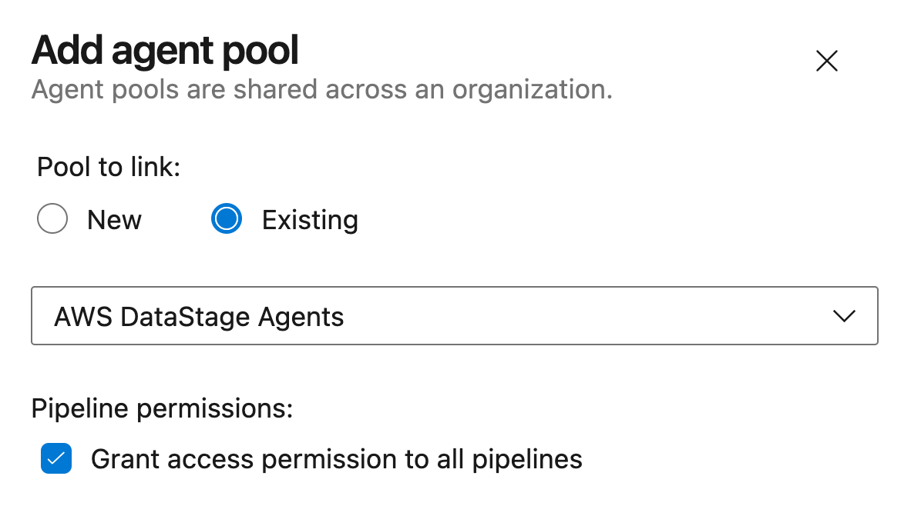

# Preparing your Azure environment

MettleCI ships with a sample Azure DevOps repository which includes a number of example pipelines definitions as well as a shell script which demonstrates how to use the Azure command line to establish the requires assets in your Azure environment. This page describes the contents of that file.

## Collecting your required information

1.  Connectivity
    
    ```
    export ADO_USERNAME=myuser.name@mycorp.com                      # Your Azure DevOps username
    export ADO_PASSWORD=MyPassword                                  # Your Azure DevOps password
    export ADO_ORGANIZATION_URL=https://dev.azure.com/mettleci      # Your Azure DevOps organization's URL
    export ADO_PROJECT=MyProject                                    # Your Azure DevOps project name (this project doesn't need to pre-exist)
    ```
    
2.  Git repository references
    
    ```
    export ADO_REPOSITORY_DATASTAGE=MyAzureDataStageRepo
    export ADO_GIT_SOURCE_URL_DATASTAGE=https://dev.azure.com/myorg/my-template-project/_git/MyAzureDataStageRepo
    export ADO_REPOSITORY_COMPLIANCE=MyAzureComplianceRepo
    export ADO_GIT_SOURCE_URL_COMPLIANCE=https://dev.azure.com/myorg/my-template-project/_git/MyAzureComplianceRepo
    ```
    
3.  Variable groups
    
    ```
    export ADO_VARGROUP_NONPROD=MyProject_NONPROD                   # The name of the variable group for variables describing your non-production environment
    export ADO_VARGROUP_PROD=MyProject_PROD                         # The name of the variable group for variables describing your production environment
    ```
    

## Create your Azure Project and configure your CLI environment

1.  Connect to your Azure DevOps instance by opening a browser-based interactive authentication session:
    
    ```
    az login
    ```
    
2.  Create an Azure DevOps project to host your DataStage assets and Azure build pipelines:
    
    ```
    az devops project create \
        --name $ADO_PROJECT \
        --description 'MettleCI-enabled DataStage project' \
        --org $ADO_ORGANIZATION_URL \
        --source-control git \
        --visibility private
    ```
    
3.  Set the default organisation and project for the Azure CLI environment:
    
    ```
    az devops configure \
        --defaults \
        organization=$ADO_ORGANIZATION_URL \
        project=$ADO_PROJECT
    ```
    

## Agents and Agent Pools

Agent pools can be created easily using the Azure DevOps UI. Neither the number of pools you create, nor the names you give them, are relevant to your MettleCI-enabled pipelines as jobs are automatically assigned to agents by Azure DevOps which matches the demands of each of your pipelines' steps with the capabilities advertised by your agents.

The definition of Agents requires you to install one or more self-hosted Azure agents on a suitably equipped host (see [https://learn.microsoft.com/en-us/azure/devops/pipelines/agents/windows-agent?view=azure-devops](https://learn.microsoft.com/en-us/azure/devops/pipelines/agents/windows-agent?view=azure-devops)) and associate the agent(s) with a relevant agent pool.

1.  List your agent pools:
    
    ```
    az pipelines pool list \
        --organization $ADO_ORGANIZATION_URL \
        --output table
    ```
    
2.  Select (or create) your preferred agent pool and assign its ID to `$ADO_AGENT_POOL_id` (for subsequent use):
    
    ```
    export ADO_AGENT_POOL_id=$(az pipelines pool list \
        --organization $ADO_ORGANIZATION_URL \
        --query '[?name == `MyFavouriteAgentPool`].id' \
        --output tsv)
    ```
    
3.  List your agent pools' constituent agents:
    
    ```
    az pipelines agent list \
        --organization $ADO_ORGANIZATION_URL \
        --pool-id $ADO_AGENT_POOL_id \
        --output table
    ```
    



## Environments

The creation of Deployment Environments is not currently supported by the Azure CLI. Environments are created by the supplied pipelines as they are references. i.e., if you try and run a MettleCI deployment to an environment called *MyQualityAssurance* then environment of that name will be automatically created. Once a deploy environment has been created (either manually using the Azure UI or automatically by reference from a pipeline) you can then configure its **Approvals and checks** settings to restrict deployment to that environment as required.

## Repositories

1.  Create DataStage repository:
    
    ```
    export ADO_REPO_DATASTAGE_id=`az repos create \
      --name $ADO_REPOSITORY_DATASTAGE \
      --org $ADO_ORGANIZATION_URL \
      --project $ADO_PROJECT \
      --query 'id' `
    ```
    
2.  Import DataStage repository from source repository (`$ADO_GIT_SOURCE_URL_DATASTAGE`):
    
    ```
    az repos import create \
      --git-source-url $ADO_GIT_SOURCE_URL_DATASTAGE \
      --org $ADO_ORGANIZATION_URL \
      --project $ADO_PROJECT \
      --repository $ADO_REPOSITORY_DATASTAGE \
      --requires-authorization
    ```
    
3.  Create Compliance repository:
    
    ```
    export ADO_REPO_COMPLIANCE_id=`az repos create \
      --name $ADO_REPOSITORY_COMPLIANCE \
      --org $ADO_ORGANIZATION_URL \
      --project $ADO_PROJECT \
      --query 'id'`
    ```
    
4.  Create Compliance repository & import from source repository (`$ADO_GIT_SOURCE_URL_COMPLIANCE`):
    
    ```
    az repos import create \
      --git-source-url $ADO_GIT_SOURCE_URL_COMPLIANCE \
      --org $ADO_ORGANIZATION_URL \
      --project $ADO_PROJECT \
      --repository $ADO_REPOSITORY_COMPLIANCE \
      --requires-authorization
    ```
    

## Variable Groups

This example creates two variable groups: one containing all the variables required to specify the details of your non-production environment a similar one for your production environment. You’ll need one of these variable groups for each of your distinct DataStage environments. Each variable group also makes use of passwords stored [secret variables](https://learn.microsoft.com/en-us/azure/devops/pipelines/process/set-secret-variables?view=azure-devops&tabs=yaml%2Cbash).

| **Non-production** | **Production** |
| --- | --- |
| ```<br># Create Non-Production Variable Group<br>export ADO_VARGROUP_NONPROD_id=`az pipelines variable-group create \<br>  --name $ADO_VARGROUP_NONPROD \<br>  --variable \<br>        AgentMettleCmd=C:\MettleCI\cli\mettleci.cmd \<br>        AgentMettleHome=C:\MettleCI \<br>        EngineUnitTestBaseDir=/opt/dm/mci \<br>        IISDomainName=MyNonProductionServicesTier.MyOrganization.com:59445 \<br>        IISEngineName=MyNonProductionEngineTier.MyOrganization.com \<br>        IISProjectTemplateDir=/opt/IBM/InformationServer/Server/Template \<br>        IISUsername=isadmin \<br>        IISVersion=11.7 \<br>        MCIUsername=mciworkb \<br>  --authorize true \<br>  --description 'Non-production pipeline variables' \<br>  --organization $ADO_ORGANIZATION_URL \<br>  --project $ADO_PROJECT  \<br>  --query 'id' `<br><br># IISPassword secret variable<br>az pipelines variable-group variable create \<br>    --group-id $ADO_VARGROUP_NONPROD_id \<br>    --org $ADO_ORGANIZATION_URL \<br>    --project $ADO_PROJECT \<br>    --secret true \<br>    --name IISPassword \<br>    --value MyPassword<br><br># MCIPassword secret variable<br>az pipelines variable-group variable create \<br>    --group-id $ADO_VARGROUP_NONPROD_id \<br>    --org $ADO_ORGANIZATION_URL \<br>    --project $ADO_PROJECT \<br>    --secret true \<br>    --name MCIPassword \<br>    --value MyPassword<br>``` | ```<br># Create Production Variable Group<br>export ADO_VARGROUP_PROD_id=`az pipelines variable-group create \<br>  --name $ADO_VARGROUP_PROD \<br>  --variable \<br>        AgentMettleCmd=C:\MettleCI\cli\mettleci.cmd \<br>        AgentMettleHome=C:\MettleCI \<br>        EngineUnitTestBaseDir=/opt/dm/mci \<br>        IISDomainName=MyProductionServicesTier.MyOrganization.com:59445 \<br>        IISEngineName=MyProductionEngineTier.MyOrganization.com \<br>        IISProjectTemplateDir=/opt/IBM/InformationServer/Server/Template \<br>        IISUsername=isadmin \<br>        IISVersion=11.7 \<br>        MCIUsername=mciworkb \<br>  --authorize true \<br>  --description 'Production pipeline variables' \<br>  --organization $ADO_ORGANIZATION_URL \<br>  --project $ADO_PROJECT  \<br>  --query 'id' `<br><br># IISPassword secret variable<br>az pipelines variable-group variable create \<br>    --group-id $ADO_VARGROUP_PROD_id \<br>    --org $ADO_ORGANIZATION_URL \<br>    --project $ADO_PROJECT \<br>    --secret true \<br>    --name IISPassword \<br>    --value MyPassword<br><br># MCIPassword secret variable<br>az pipelines variable-group variable create \<br>    --group-id $ADO_VARGROUP_PROD_id \<br>    --org $ADO_ORGANIZATION_URL \<br>    --project $ADO_PROJECT \<br>    --secret true \<br>    --name MCIPassword \<br>    --value MyPassword<br>``` |

## Pipelines

1.  Create a DevOps Continuous Integration pipeline:
    
    ```
    az pipelines create \
        --org $ADO_ORGANIZATION_URL \
        --project $ADO_PROJECT \
        --name MyDataStage-DevOps-CI \
        --description 'DevOps CI' \
        --repository $ADO_REPOSITORY_DATASTAGE \
        --branch master \
        --yml-path /devops-ci.yml \
        --repository-type tfsgit
    ```
    
2.  Create a Hot Fix Continuous Integration pipeline:
    
    ```
    az pipelines create \
        --org $ADO_ORGANIZATION_URL \
        --project $ADO_PROJECT \
        --name MyDataStage-HotFix-CI \
        --description 'HotFix CI' \
        --repository $ADO_REPOSITORY_DATASTAGE \
        --branch master \
        --yml-path /hotfix-ci.yml \
        --repository-type tfsgit
    ```
    
3.  Create a Hot Fix Deploy pipeline:
    
    ```
    az pipelines create \
        --org $ADO_ORGANIZATION_URL \
        --project $ADO_PROJECT \
        --name MyDataStage-HotFix-Deploy \
        --description 'HotFix Deploy' \
        --repository $ADO_REPOSITORY_DATASTAGE \
        --branch master \
        --yml-path /hotfix-deploy.yml \
        --repository-type tfsgit
    ```
    

## Next Steps

1.  Register your DataStage development project in the MettleCI Workbench referencing your Azure DevOps DataStage and Compliance repositories.
    
2.  Test your Compliance connection by running compliance using MettleCI Workbench.
    
3.  Commit a DataStage asset to your new DataStage repository using MettleCI Workbench. This should trigger your new `MyDataStage-DevOps-CI` pipeline.