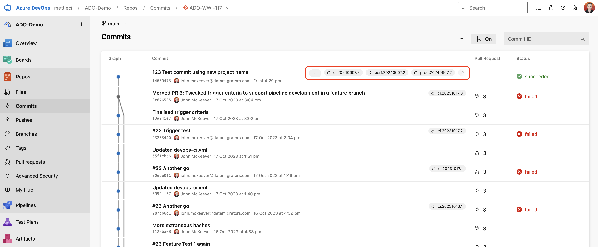
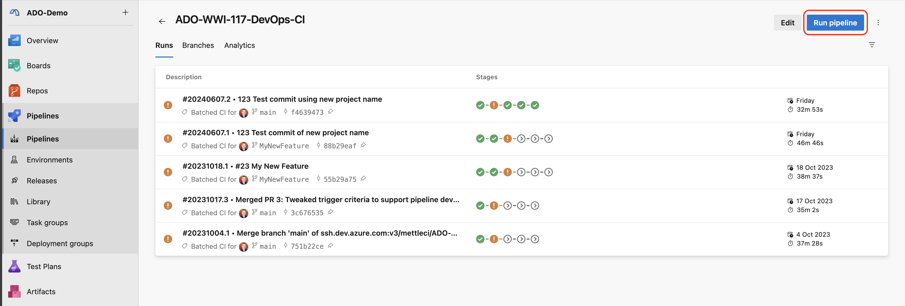
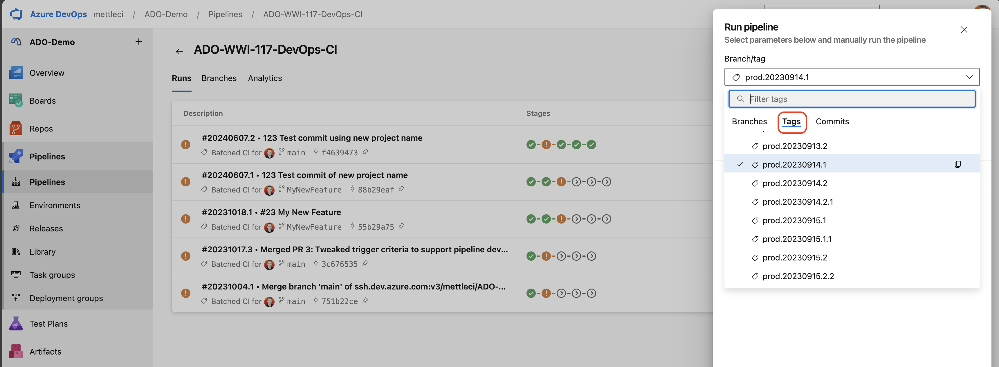

# Re-deploy a prior Azure DevOps release

How you re-deploy a previous version of a release depends on your build system (Jenkins, Azure, GitHub, etc.) but generally it’s simply a case of re-running a deployment of a previously successful (and consequently *tagged*) release.

In Azure DevOps look at the **Commits** page and identify which tagged build you want to re-release…

Go to **Run pipeline** …

Select **Tags** and select the tag of the deployment you want to release. The example below will re-deploy the build tagged `prod.20230914.1` to **Production**.

