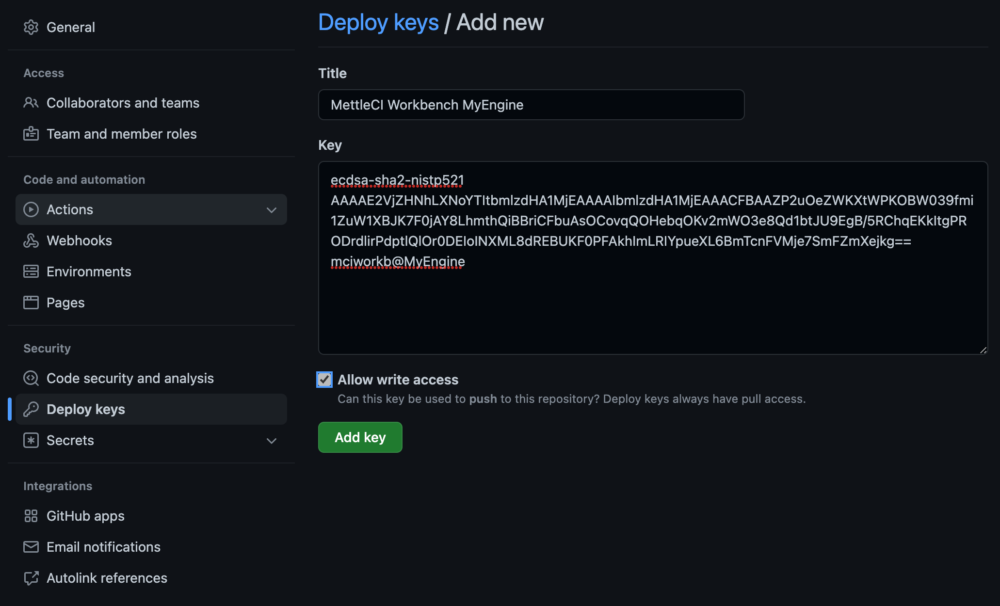

# Adding public keys to GitHub

To use the SSH keys to connect MettleCI Workbench with your Github service you'll need to provide GitHub with your public key.

> [!WARNING]
> When you install MettleCI Workbench (**v1450 or earlier**) it generates  a `workbench.key` / `workbench.key.pub` key pair using an RSA encryption algorithm.  This was fine up until 15th March 2022 when GitHub unexpectedly stopped accepting RSA and DSA keys.   
>   
> MettleCI Workbench **v1451 or later** generates **GitHub-compliant ECDSA keys by default**  
> MettleCI Workbench **v1664 or later** generates **GitHub-compliant and Azure-compliant RSA SHA256 keys by default**
> If you wish to integrate MettleCI with GitHub you should do the following…
> *   Delete (or backup, if they’re being used for anything) the existing `workbench.key` / `workbench.key.pub` key pair generate during Workbench setup.
>     
> *   Generate a new RSA SHA256 key pair using the command `ssh-keygen -t rsa-sha2-256 -b 2048 -f workbench.key`
>     
> *   Ensure the `sshKey: "/opt/dm/mci/workbench.key"` entry in the `gitAuthentication:` section of your `config.yml` file is pointing to the newly-generated private key file.
>     
> *   Register the public key file `workbench.key.pub`in GitHub (see steps below). 
>     
> *   You can use the same key for accessing the DataStage and Compliance repositories so register that public key with each of those repositories. 
>     
> *   When registering the key with the Compliance repository the Engine does not require *write* access so feel free to leave that option deselected.
>     
> *   [Restart the Workbench service](https://datamigrators.atlassian.net/wiki/spaces/MCIDOC/pages/1954578453/Starting+Stopping+the+Monitoring+MettleCI+Workbench+Service) and test GitHub access by running Compliance and a Check-in from Workbench.Process

1.  Select the repository to which you wish to add your SSH and click the **Settings** option.
    
2.  From the left-hand navigation pane select **Deploy keys**.
    
3.  In the top right select **Add deploy key**.
    
4.  Give the key a descriptive **Title** (including a reference to the related DataStage Engine host and its use for MettleCI Workbench might be a good idea)
    
5.  On the DataStage Engine where Workbench is installed `cat` UNIX or `type` WINDOWS your public key file (typically `workbench.key.pub`) and copy it to your clipboard (⌘-C/Ctrl-C).
    
6.  Paste the contents of the public key into the **Key** field.
    
7.  If this is a repository to which Workbench should be able to write (e.g. a repository to which it will commit DataStage assets) then check the **Allow write access** option.
    
8.  Click **Add key**.
    

## [​](https://developer.1password.com/docs/ssh/public-key-autofill#github)