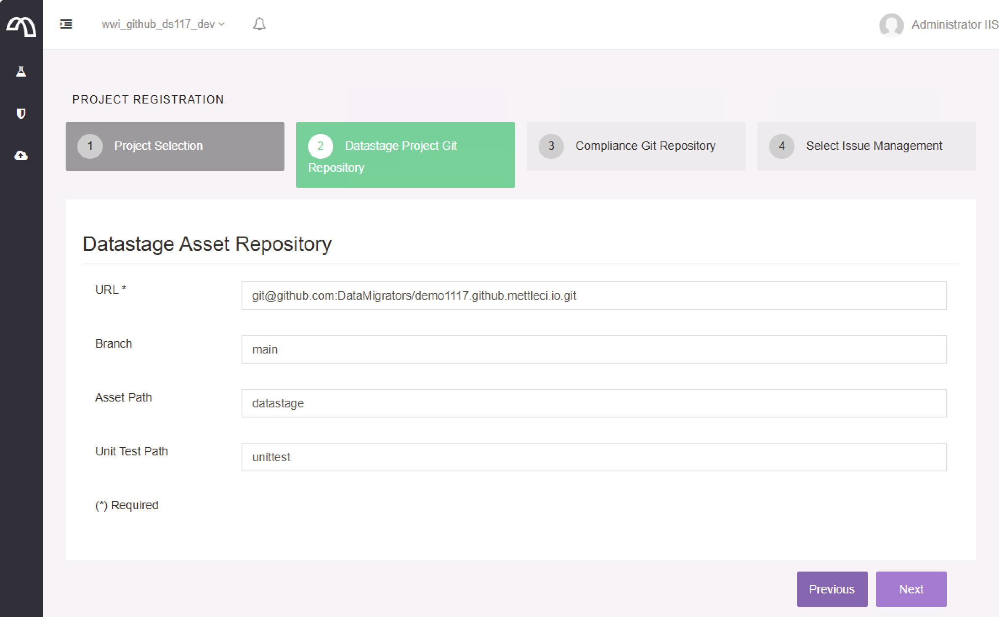
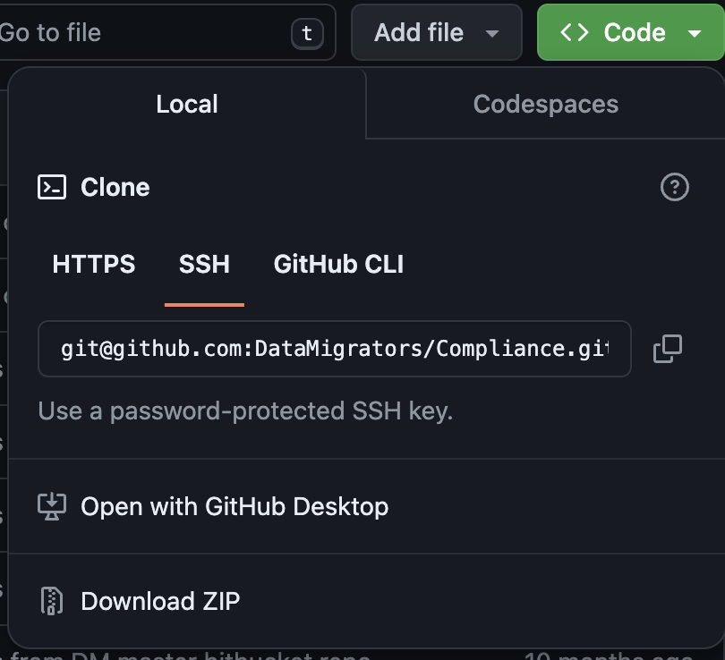

# Configuring MettleCI Authentication to GitHub

When configuring access to GitHub in MettleCI Workbench (**Your Profile → Manage Projects**) you should use the ‘SSH’ clone string from GitHub as your repository URL.

