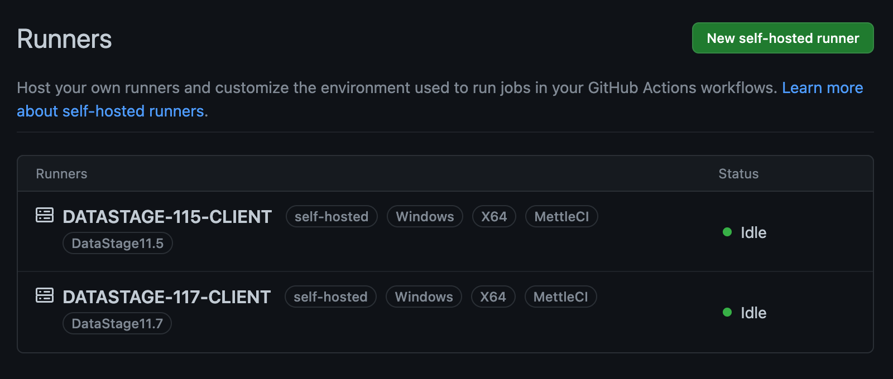
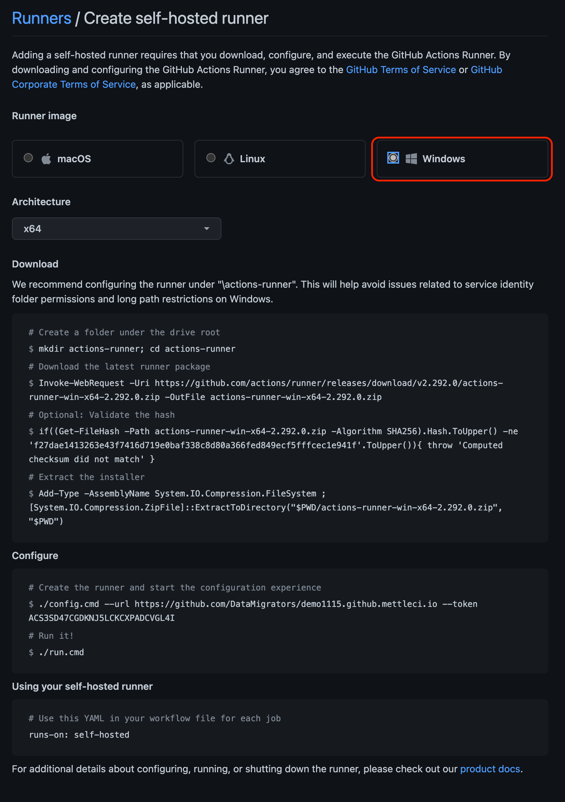

# Install and Configure a GitHub Runner

MettleCI requires a [GitHub self-hosted runner](https://docs.github.com/en/actions/hosting-your-own-runners/about-self-hosted-runners) to run your MettleCI-enabled build and deployment pipelines. This agent enables GitHub Actions workflows to invoke the MettleCI command line on a dedicated Windows server (the [MettleCI Agent Host](https://datamigrators.atlassian.net/wiki/spaces/MCIDOC/pages/1770520622/A+Summary+of+MettleCI+Components#MettleCI-Agent-Host)), which is required because the DataStage compilation process (v11.7 and earlier) still requires the use of Microsoft Windows-based components.

1.  GitHub runners can be configured at multiple levels on your GitHub management hierarchy:
    

*   **Repository-level runners**, which are dedicated to a single repository,
    
*   **Organization-level runners**, which can process jobs for multiple repositories in an organization, and
    
*   **Enterprise-level runners**, which can be assigned to multiple organizations in an enterprise account.
    

The example shown on this page describes the configuration of an organization-level GitHub self-hosted runner which will run on a MettleCI agent host as a Window service under the `NT AUTHORITY\NETWORK SERVICE` account.

Note that other [complex topologies](https://datamigrators.atlassian.net/wiki/spaces/MCIDOC/pages/1766817793/Using+Multiple+MettleCI+Agents) you’ll need to define a runner on each MettleCI Agent Host.

For upgrade scenarios (where MettleCI pipelines are using multiple runners on separate environments to affect an upgrade between two different versions of DataStage) you should give each runner a label to describe whether it is resident within your legacy environment or target environment. These labels are then used by GitHub when selecting which runner should be employed for each Job in a GitHub Actions pipeline. The sample GitHub workflows that ship with MettleCI use the labels `DataStage11.5` and `DataStage 11.7` to determine which runner each Job should be executed on.

# Steps

Define the runner at the level you wish…

1.  Start by navigating to your GitHub Organization (for organization-level runners) or Repository (for repository-level runners) and select **Settings**, then select **Actions** → **Runners** from the menu on the left-hand side.
    
2.  On the page displayed click **New self-hosted runner**.
    
    
    
3.  For the *Runner image* select **Windows** (as you’ll be installing this runner on a [MettleCI Agent Host](https://datamigrators.atlassian.net/wiki/spaces/MCIDOC/pages/1770520622/A+Summary+of+MettleCI+Components#MettleCI-Agent-Host)). The *Architecture* will be automatically set to **x64**.
    
    
    
4.  Follow the prompts on the screen to paste the supplied scripts into a PowerShell window on your MettleCI Agent Host. This script will …
    

a. Create a `C:\actions-runner` directory

b. Download a [Runner for GitHub Actions](https://github.com/actions/runner) from GitHub and unzip it.

> [!INFO]
> If you experience difficulties in downloading the runner archive, you may need to allow TLS 1.2:
> ```
> [Net.ServicePointManager]::SecurityProtocol = [Net.SecurityProtocolType]::Tls12;
> ```

c. Run a configuration script (`config.cmd`)

5.  Start the runner (which you should configure to run as a Windows Service) with `run.cmd`.
    

Here's an example GitHub self-hosted runner installation which …

a. installs the runner in the default runner group

b. adds the `MettleCI` and `DataStage11.7` tags to your runner

c. installs the runner as a Windows Service executing under account `NT AUTHORITY\NETWORK SERVICE`

```
PS C:\actions-runner> ./config.cmd --url https://github.com/johnmckeever/github.mettleci.io --token XXXX_YOUR_TOKEN_XXXX
--------------------------------------------------------------------------------
|        ____ _ _   _   _       _          _        _   _                      |
|       / ___(_) |_| | | |_   _| |__      / \   ___| |_(_) ___  _ __  ___      |
|      | |  _| | __| |_| | | | | '_ \    / _ \ / __| __| |/ _ \| '_ \/ __|     |
|      | |_| | | |_|  _  | |_| | |_) |  / ___ \ (__| |_| | (_) | | | \__ \     |
|       \____|_|\__|_| |_|\__,_|_.__/  /_/   \_\___|\__|_|\___/|_| |_|___/     |
|                                                                              |
|                       Self-hosted runner registration                        |
|                                                                              |
--------------------------------------------------------------------------------
# Authentication
√ Connected to GitHub

# Runner Registration
Enter the name of the runner group to add this runner to: [press Enter for Default] <ENTER>
Enter the name of runner: [press Enter for DEMO115-CLNT] <ENTER>
This runner will have the following labels: 'self-hosted', 'Windows', 'X64'
Enter any additional labels (ex. label-1,label-2): [press Enter to skip] MettleCI,DataStage11.7 <ENTER>

√ Runner successfully added
√ Runner connection is good

# Runner settings
Enter name of work folder: [press Enter for _work] <ENTER>

√ Settings Saved.
Would you like to run the runner as service? (Y/N) [press Enter for N] Y <ENTER>
User account to use for the service [press Enter for NT AUTHORITY\NETWORK SERVICE] <ENTER>
Granting file permissions to 'NT AUTHORITY\NETWORK SERVICE'.
Service actions.runner.johnmckeever-github.mettleci.io.DEMO117-CLNT successfully installed
Service actions.runner.johnmckeever-github.mettleci.io.DEMO117-CLNT successfully set recovery option
Service actions.runner.johnmckeever-github.mettleci.io.DEMO117-CLNT successfully set to delayed auto start
Service actions.runner.johnmckeever-github.mettleci.io.DEMO117-CLNT successfully configured
Waiting for service to start...
Service actions.runner.johnmckeever-github.mettleci.io.DEMO117-CLNT started successfully

PS C:\actions-runner>
```