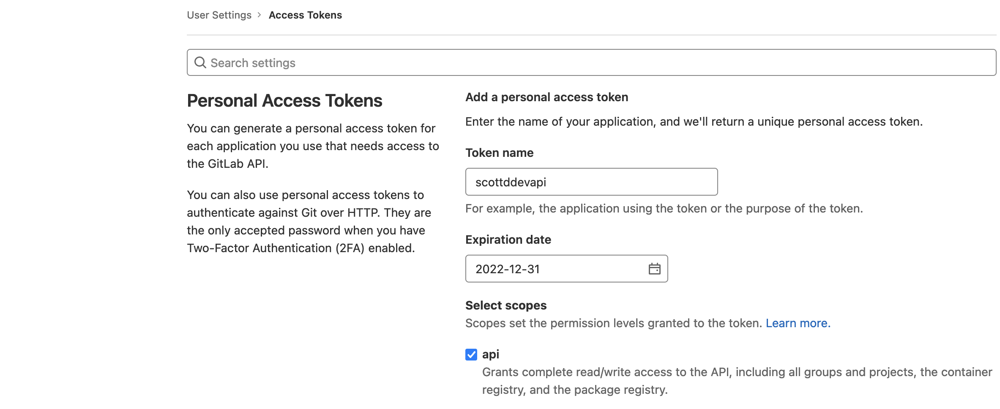
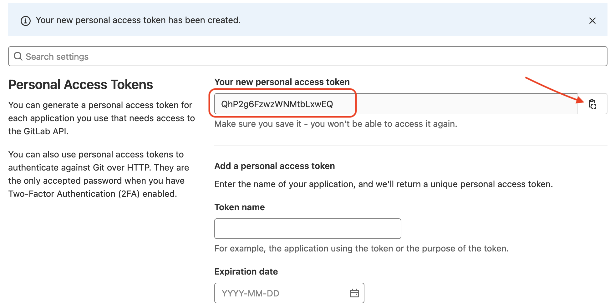
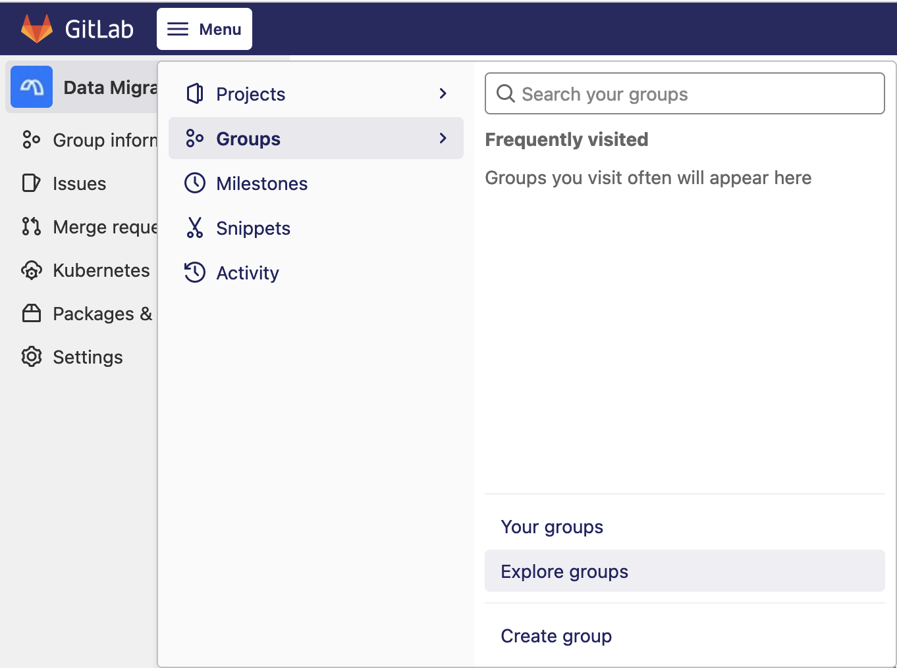
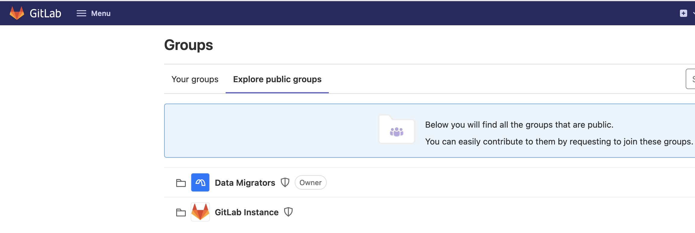
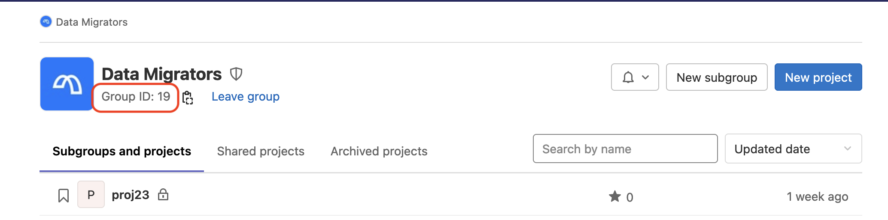

# Automating project creation with the GitLab API

The MettleCI GitLab DataStage repository template requires the specification of GitLab projects, environment variables, and credentials. Some DataStage organisations have multiple development teams working on multiple DataStage development projects, each of which would typically require a dedicated Git repository associated with a dedicated GitLab project and all its attendant GitLab artefacts. Creating all of these artefacts manually for a large number of DataStage delivery streams could be very onerous and error prone. A better solution might be to automate this process using the the [GitLab API](https://docs.gitlab.com/ee/api/) which provides calls that can minimise the effort of creating multiple GitLab projects, environment variables, and credentials.

# Guides

*   [Prerequisites](#prerequisites)
*   [Create a GitLab Personal Access Token](#create-a-gitlab-personal-access-token)
*   [Find the GitLab Group ID](#find-the-gitlab-group-id)
*   [List GitLab Projects](#list-gitlab-projects)
*   [Create GitLab Project](#create-gitlab-project)
*   [Create GitLab Environments](#create-gitlab-environments)
*   [Create GitLab Variables](#create-gitlab-variables)

See [API Docs (GitLab.com)](https://docs.gitlab.com/ee/api/#how-to-use-the-api).

# Prerequisites

In order to successfully make calls to the GitLab REST API you require…

*   a private token created to allow the script to call the GitLab server,
    
*   an account that can create projects, and
    
*   the Group ID to which the projects should belong.
    

# Create a GitLab Personal Access Token

A Personal Access Token (“PAT”) is created using the GitLab user interface. Its value can only be retrieved during the creation process. If you lose the token value you will need to create a new one.

## Steps

1.  Logon to GitLab.
    
2.  Click on your avatar and select **Edit Profile**.
    
3.  From the left pane click **Access Tokens**. You can see if you have any active Access Tokens at the bottom of the page.
    
4.  To create a new Personal Access Token provide a **Token name** and an expiry date. Check the **api** scope. Scroll down to the bottom of the page and click **Create personal access token**.
    
    
    
5.  Copy the token (using the button on the right hand side of the field) and save it somewhere secure since it will not be accessible after you leave this page. You can see that you have a new active token by scrolling down to the bottom of the page.
    
    
    

# Find the GitLab Group ID

You need the Group ID to create the GitLab projects.

## Steps

1.  From the top bar, click Menu, then click Groups, then click Explore groups. You will see the groups have access to.
    
    
    
2.  Locate the group you with to retrieve the value for and click on the name.
    
    
    
3.  Locate the Group ID under the group name.
    
    
    

# List GitLab Projects

The command returns the project id and project name which you (the token) have access to.

You have to set the environment variables token and gitlabserver to run the command or hard code the values in the syntax.

```
$> curl --REQUEST GET "https://$gitlabserver/api/v4/projects?private_token=$token"
```

Working example from bash. Command will format the output using jq.

```
$> curl --REQUEST GET "https://$gitlabserver/api/v4/projects?private_token=$token" \
   | jq '.[] | "id=\(.id) name=\(.name)"'
```

Results from running the command

```
$> curl --REQUEST GET "https://$gitlabserver/api/v4/projects?private_token=$token" \
   | jq '.[] | "id=\(.id) name=\(.name)"'
  % Total    % Received % Xferd  Average Speed   Time    Time     Time  Current
                                 Dload  Upload   Total   Spent    Left  Speed
100 45804    0 45804    0     0  15635      0 --:--:--  0:00:02 --:--:-- 15675
"id=38 name=proj23"
"id=21 name=proj4"
"id=19 name=proj2"
"id=18 name=proj1"
"id=16 name=gitlab-compliance"
"id=15 name=gitlab-wwi-117"
"id=14 name=gitlab-wwi-115"
"id=13 name=proj_dstage2"
"id=12 name=proj_dstage1"
"id=4 name=wwi_gitlab_ds117_ds117"
"id=3 name=compliance"
"id=1 name=Monitoring"
```

# Create GitLab Project

The command creates a new GitLab project.

The command requires the following values. The values have been defined as environment variables.

*   `token`
    
*   `gitlabserver`
    
*   `repo` : Project name
    
*   `namespace_id` : The numeric ID of the group you wish the project to be created under
    

```
token=jXbxTY3knv3vCPCJC1ig
gitlabserver=gitlab.mycorp.com
namespace=19

$> curl --header "PRIVATE-TOKEN: $token" \
   -X POST \
   "https://$gitlabserver/api/v4/projects?name=$repo&namespace_id=$namespace"
```

Working example using bash:

```
$> curl --header "PRIVATE-TOKEN: $token" \
   -X POST "https://$gitlabserver/api/v4/projects?name=$repo&namespace_id=$namespace"
```

# Create GitLab Environments

Below is an example of a REST API call which creates a new Environment for a specified GitLab Project. The call requires the following values:

*   `token` : An access token which provides the authentication required to perform the action
    
*   `projenv` : Environment name to create
    

*   `gitlabserver` : The URL of your GitLab instance
    
*   `projid` : Numeric ID of the Project
    

```
token=jXbxTY3knv3vCPCJC1ig
gitlabserver=gitlab.mycorp.com

$> curl --data "name=$projenv&external_url=https://$gitlabserver" \
        --header "PRIVATE-TOKEN:$token" \
        "https://$gitlabserver/api/v4/projects/$projid/environments"
```

# Create GitLab Variables

The command creates a new Variable for a specific project.

The command requires the following values. The values have been defined as environment variables.

*   `projenv` : Environment name to create
    
*   `token`
    
*   `gitlabserver`
    
*   `projid` : Numeric ID of the project
    
*   `varname` : Variable name
    
*   `varvalue` : Value to set the variable to
    
*   `envscope` : The environment the value is assigned to. Use `*` to specify *all* environments.
    

```
token=jXbxTY3knv3vCPCJC1ig
gitlabserver=gitlab.mycorp.com

$> curl --request POST --header "PRIVATE-TOKEN: $token" \
     "https://$gitlabserver/api/v4/projects/$projid/variables" --form "key=$varname" --form "value=$varvalue" \
     --form "environment_scope=$envscope"
```

e.g.,

```
while IFS="," read varname myenv varvalue; 
do 
  echo "Variable name is $varname, Environment is $myenv, Variable value is $varvalue"
  curl --request POST --header "PRIVATE-TOKEN: $access_token" \
       "https://$gitlabserver/api/v4/projects/$projid/variables" --form "key=$varname" --form "value=$varvalue" \
       --form "environment_scope=$myenv"
done << _EOF_
AgentMettleCmd,*,"C:\\\\MettleCI\\\\cli\\\\mettleci.cmd"
AgentMettleHome,*,"C:\\\\MettleCI"
ENVID,CI,ci
ENVID,QA,ci
ENVID,PROD,qa
IISDomainName,CI,dev-svcs.mycorp.com:59445
IISDomainName,QA,test-svcs.mycorp.com:59445
IISDomainName,PROD,prod-svcs.mycorp.com:59445
IISEngineName,CI,dev-engn.mycorp.com
IISEngineName,QA,test-engn.mycorp.com
IISEngineName,PROD,prod-engn.mycorp.com
IISPassword,CI,mypassword
IISPassword,QA,mypassword
IISPassword,PROD,mypassword
IISProjectTemplateDir,*,/opt/IBM/InformationServer/Server/Template
IISUsername,*,isadmin
MCIPassword,*,mypassword
MCIUserName,*,mciworkb
UnitTestPath,*,/opt/dm/mci
_EOF_
```