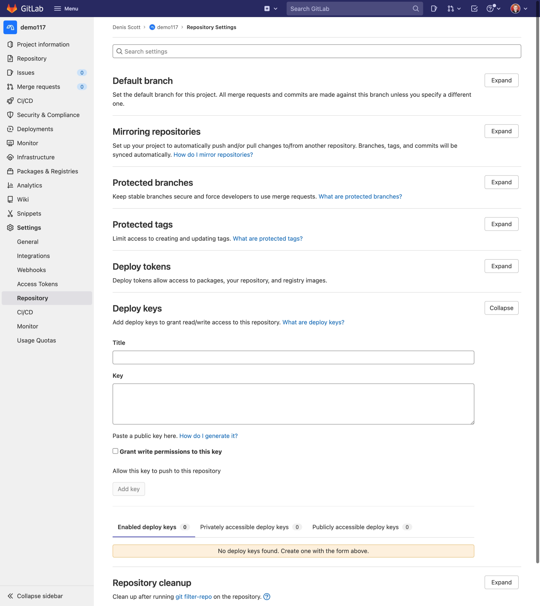
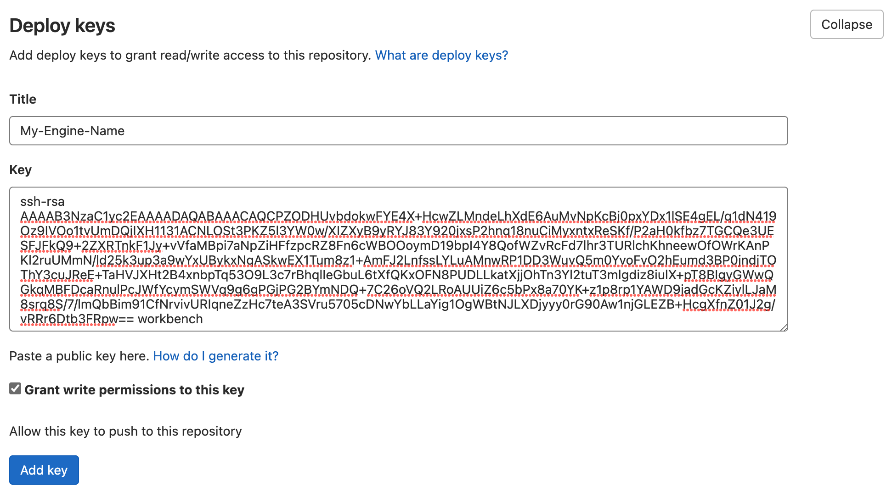

# Configuring MettleCI Workbench SSH Authentication to GitLab

Integrating your MettleCI Workbench with GitLab will enable you to use a GitLab hosted Git repository to store your DataStage project artefacts. This is facilitated with deploy keys.

## Granting a GitLab Git repository/project access to Workbench

During MettleCI Workbench installation the installer automatically generated an SSH key pair with filenames `workbench.key` (private key) and `workbench.key.pub` (public key). We're going to use this key pair to authenticate MettleCI Workbench to GitLab.

1.  Open an SSH session on the DataStage Engine hosting MettleCI Workbench service.
    
2.  Copy the contents of your public key file to the clipboard, ready to paste into the GitLab interface. E.g.
    
    ```
    $> sudo cat /opt/dm/mci/workbench.key.pub
    ssh-rsa AAAAB3NzaC1yc2EAAAADAQABAAACAQCHzqapr2U5RsthQ5Insd62q39WYm41S1h45Zy/pxecp0oIdZpb2iMpUkXOYI05cHT7xPSZnuZYNMuYUffKr8pZa+k4yrNP8McMjkLyD3ji+ZSH8bFgnd+MFOcr
    +USwsmT42tLZyfXGT4h+1sQAfjC9xkxo12sMh87cxOzub89N94Z4tv/kznyZ2/rctlxWWIEOPE7zgyqhJzPYrCmas/LikJlvkIRia9WLZTfkTmSruthB0fMLwIPmDl8HSZyNpVpoFa9/QQSK3Dl61wswO6C/Oo0W
    SaOfiN99WQpZmWulDNLH8qvbhNLEM2pP694urqn+xyaE/o+dn0YnKpb8JWXdNyd4FU9P41Y4iktn7JNLgytepqSWhySAy14GX30HNd4kcu0ER73bYh5nfSIJZPWvVSoS/jE+tJNj4wdMn60xM1HviS0w3Cd3ShiS
    qjmUXcx6Sn86h/iiIdznFxJYcZgodszUQ5J0tTy3M6thOKKHeQ+9qD3CxMobVtlN2BHLqQzXrPQ/ktWljL+v5qIKo71hi27ubw/G69QHxOYQmd1DtQNSLribHqFA9LYOU6xxH9nK0A1S3+2YMbZUT7bvqaqlY5ZT
    mV9QQ9GnvDoZXbe5O/L4SCrPZkW4yCzxIoH4MRqj1wvBX31QlaxQEDa0winc12u6DTz1NMeIeb1eDmbM3w== workbench
    &>
    ```
    
3.  Next, register your public key to GitLab. Go to the CI/CD administration page in the settings for your project (e.g. [http://gitlab.your-organization.com/user-name/repository-name/-/settings/](http://test1-gitlab.datamigrators.io/lar/wwi_gitlab_ds117_ds117/-/settings/ci_cd)) and click on **Repository**: and expand the **Deploy keys** section:
    
    
    
4.  Paste the contents of the public key held in your clipboard into the **Key** field.
    
    **Important**: Avoid adding whitespace or new lines into the **Key** field, as they can cause GitLab to use an invalid public key. When pasting in the key, a newline may be added at the end. Be sure to remove this newline if it occurs.
    
    
    
    Ensure you’ve checked Write Access allowed if this is a project repository (write access not needed for compliance) then give a useful description in the title. Once you save the Deploy Key you cannot change the key value or title associated with it, you will have to delete and recreate it.
    
5.  When you are satisfied press the Add key button to save it. There are no restrictions on how many keys you can add to the project.
    

**Done!**