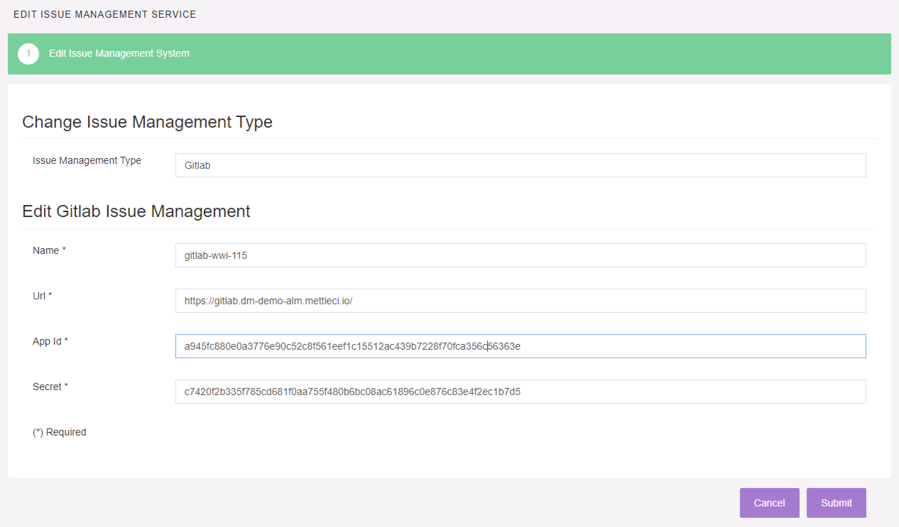
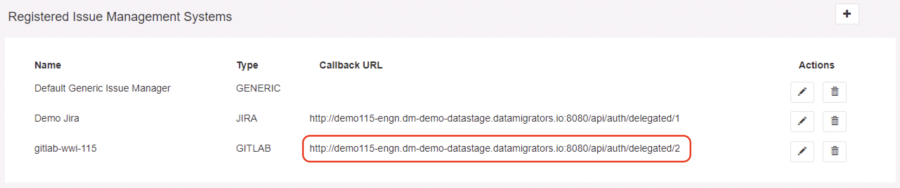
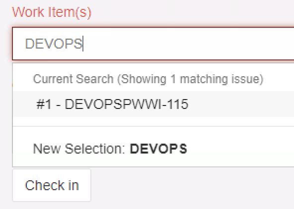
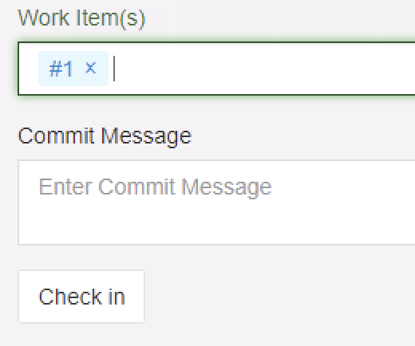
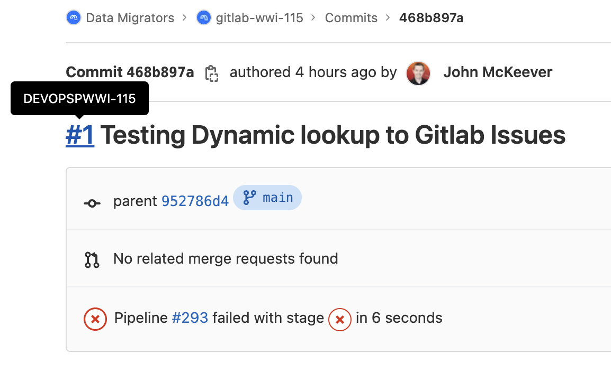

# Integrating GitLab Issue Lookup with MettleCI Workbench

There are a few simple steps to get GitLab Issue Lookup working in MettleCI Workbench:

*   [Register MettleCI Workbench as an GitLab Application](#register-mettleci-workbench-as-an-gitlab-application)
*   [Configure your GitLab Issue Lookup in Workbench](#configure-your-gitlab-issue-lookup-in-workbench)
*   [Associate it with a MettleCI project](#associate-it-with-a-mettleci-project)
*   [Test your GitLab Issue Lookup is working by Workbench](#test-your-gitlab-issue-lookup-is-working-by-workbench)

* * *

# Register MettleCI Workbench as an GitLab Application

Register your Engine’s MettleCI Workbench instance as an authorised Application in GitLab.

> [!NOTE]
> Note that there’s a confusing configuration dependency here:
> MettleCI Workbench requires a GitLab Application ID in order to provide a Callback URL **BUT** a Callback URL is required by GitLab in order to provide you with an Application ID!
> So, we address this by entering a *provisional* Callback URL and returning later to edit it with the actual Callback URL provided by the MettleCI Workbench.

1.  From the menu icon on the top banner select **Admin** → **Applications** → **New application**
    
2.  Name your application logically so GitLab administrators understand its function. Something like **MettleCI Workbench** ***{EngineName}*** might be a good example.
    
3.  For your **Redirect URI** start by enter a *provisional* URL following the example given below (substituting your DataStage Engine URI to appropriate values)
    
    *   `http://your-engine.your-org.com:PORT/api/auth/delegated/2`
        
    *   e.g `http://demo115-engn.dm-demo-datastage.datamigrators.io:8080/api/auth/delegated/2`
        
4.  Ensure the following checkboxes are selected:
    
    *   Trusted
        
    *   Confidential
        
    *   Expire access tokens
        
    *   Scopes
        
        *   API
            
        *   openid
            
5.  Click **Save application** and you’ll be presented with information about your registered application such as the Application ID, Secret, Callback URL, etc.
    

> [!WARNING]
> You should **keep this window open**, to support you during the next configuration step, as…
> *   You’ll need to copy and paste the **Application ID** and **Secret** values into the MettleCI Workbench, and
>     
> *   You ***may*** need to edit the GitLab Application Callback URL, depending upon what Workbench tells you in later configuration steps

# Configure your GitLab Issue Lookup in Workbench

You’ll need to register your GitLab instance as an Issue lookup source in MettleCI Workbench.

1.  From the Profile icon in the top-right of the MettleCI Workbench window select the menu item **Issue Management**.
    
2.  On the resulting page click the **\[+\]** icon, in the top-right, to add a new issue management system.
    
3.  Select **GitLab** as your **Issue Management Type**, then **Next**.
    
4.  On the next page enter
    
    1.  A **Name** that will help you uniquely identify your GitLab instance,
        
    2.  The **URL** of your GitLab instance
        
    3.  The **Application ID** and **Secret** values you were presented by GitLab in the previous configuration step
        
        
        
5.  Once complete, click **Next**. You’ll be presented with your list of registered Issue Management Systems including your newly-defined GitLab instance
    
    
    

> [!WARNING]
> At this point you must check that the **Callback URL** presented on this page matches the **Callback URL** shown against your registered Application in GitLab.
> The value presented by Workbench takes precedence, so if the values don’t match return to GitLab and **Edit** the Application definition to replaced the previously-entered *provisional* **Callback URL** with the value presented by Workbench.

# Associate it with a MettleCI project

1.  Select **Manage Projects** from the Profile icon in the top-right of the Workbench window.
    
2.  Select the pencil icon alongside the DataStage project with which you wish to use GitLab issue lookup
    
3.  At the bottom of the project configuration page select your newly defined GitLab **Issue management Service** then click **Update Project**.
    

# Test your GitLab Issue Lookup is working by Workbench

Now test your GitLab Issue Lookup has been configure you can test that it’s working in MettleCI Workbench.

1.  Navigate to the Commit/Check-in page of the MettleCI Workbench
    
2.  Type some text (minimum 3 characters) that matches title of one or more GitLab issues in your integrated GitLab instance. Matching issues will be presented as options in a drop-down menu.
    
    
    
3.  Select the issue(s) you wish to associate with your commit and they’ll be added to the **Work item(s)** field
    
    
    
4.  Click **Check in** to commit your asset to GitLab
    
5.  Navigate to GitLab → Repository → Commits. Select your commit and verify that the specified Issue has been associated with it. e.g.
    
    
    
6.  Click the Issue reference to verify that your Commit is referenced directly from the Issue. e.g.
    
    
    

* * *

# See also

*   [Configuring MettleCI Workbench SSH Authentication to GitLab](../gitlab/configuring-mettleci-workbench-ssh-authentication-to-gitlab.md)