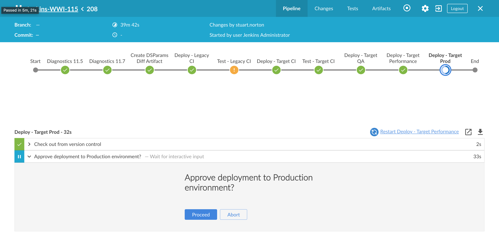

# Configuring Manual Approval Steps in Jenkins



You may want to configure your pipeline to wait at certain points for a human to manually approve the pipeline to proceed. You can do this most simply using the [input step](https://plugins.jenkins.io/pipeline-input-step/) plugin which will pauses Pipeline execution and present some configured text along with **proceed** and **abort** options:

```
steps {
    input message: 'Approve deployment to Production environment?'

    <manually approved steps here>
}
```

You can also request approval by one or more specific submitters…

```
stage ('Approve?')
{
    timeout(time:4, unit:'HOURS')
    {
        input message: 'Approve deployment?', submitter: MY_APPROVERS
    }
}
```

> [!INFO]
> Note that the ability to specify a Group as a submitter is, at the time of writing, still subject to an [improvement request](https://issues.jenkins.io/browse/JENKINS-27134?page=com.atlassian.jira.plugin.system.issuetabpanels%3Acomment-tabpanel&showAll=true).

You can also script a more sophisticated solution, if required. The following example script renders a drop down list from which a user can choose a deployment target:

```
stage ('Wait for user to specify deployment target') {
    steps {
        script {
             def userInput = input(
                 id: 'userInput', message: 'Deploy target?',
                 parameters: [[
                     $class: 'ChoiceParameterDefinition', 
                     defaultValue: 'strDef', 
                     description:'describing choices', 
                     name:'nameChoice', 
                     choices: "QA\nUAT\nProduction"
                 ]]
             )
            println(userInput); //Use this value to branch to different logic if needed
        }
    }
}
```

See the relevant documentation here: [Pipeline: Input Step (jenkins.io)](https://www.jenkins.io/doc/pipeline/steps/pipeline-input-step/)