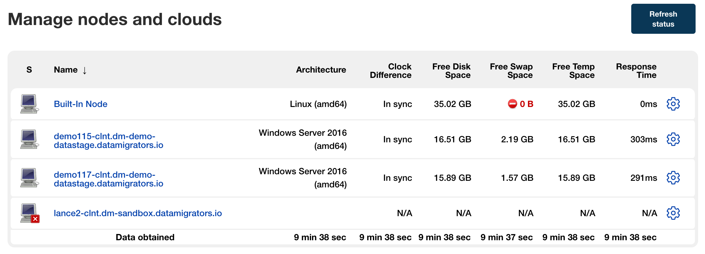

# Jenkins Build Agents

*   [Introduction](#introduction)
*   [Terminology](#terminology)

*   [Install and Configure a Jenkins Agent](./jenkins-build-agents/install-and-configure-a-jenkins-agent.md)
*   [Jenkins Agent Assignment](./jenkins-build-agents/jenkins-agent-assignment.md)

# Introduction

The use of the word ‘Jenkins’ typically refers to the Jenkins Controller (formerly ‘Master’) which is the central build process coordinator that stores configuration and renders the various Jenkins user interfaces. This Controller achieves its aims using a combination of local and remote resources, the latter of which are made available to the Controller through Agents (formerly ‘Slaves’) that are processes sitting on various machines on your network.

Customers choosing to use Jenkins with MettleCI will typically already have an existing Jenkins installation with a Controller and multiple Agents. Instructions for installing the Controller are beyond the scope of this page but there are a few key points, detailed below, that are important to highlight.

# Terminology

**Jenkins Controller:** The Jenkins Controller is the Jenkins service itself and is where Jenkins is installed.

**Node:** A Node is a registered host computer on which a Jenkins build agent runs. Jenkins monitors each registered node for disk space, free temp space, free swap, clock time/sync and response time. A node is taken offline if any of these values go outside a configured threshold. The Jenkins controller itself runs on a special *built-in node*.

**Agent:** An agent is a small (170KB single jar) Java client process which manages the task execution on behalf of the Jenkins controller by using Executors. Tools required for building and testing your code (such as a DataStage Client tier and a [MettleCI Command Line Interface](https://datamigrators.atlassian.net/wiki/spaces/MCIDOC/pages/2216886273/MettleCI+Command+Line+Interface)) are installed on the Node where the Agent runs. In practice, Nodes and Agents are essentially the same but it is good to remember that they are conceptually distinct.

**Executors:** An executor is a slot for execution of tasks; effectively, it is a thread in the agent. The number of executors on a node defines the number of concurrent tasks that can be executed on that node at one time. In other words, this determines the number of concurrent Pipeline `stages` that can execute on that node at one time. **Data Migrators do not recommend running more than one Executor per Jenkins Node** as this could permit the definition of Pipelines which cause to resource contention with underlying DataStage components.

