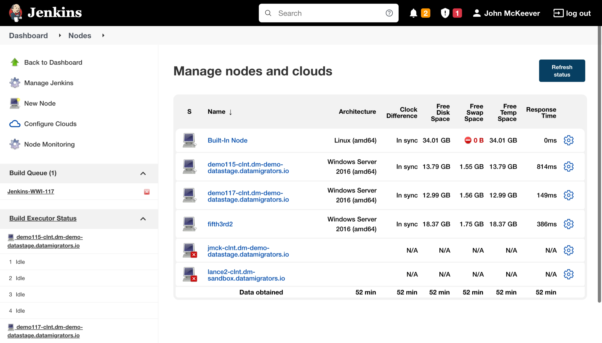

# Install and Configure a Jenkins Agent

*   [Defining a Jenkins Agent](#defining-a-jenkins-agent)
    *   [Creating a Jenkins Node](#creating-a-jenkins-node)
*   [Assign Labels to your Jenkins Agents](#assign-labels-to-your-jenkins-agents)
*   [Installing a Jenkins Agent and configuring is as a Windows Service](#installing-a-jenkins-agent-and-configuring-is-as-a-windows-service)
    *   [Notes on multiple agents](#notes-on-multiple-agents)
*   [See also](#see-also)

# Defining a Jenkins Agent

This section assumes you’ve already installed and configured the Jenkins Controller already and can log in as the Jenkins Administrator. This page is not a substitute for a careful study of the Jenkins documentation.

Jenkins Agents can be installed as a Windows service and start automatically once they have undergone some initial configuration.

1.  Using the Jenkins Controller user interface
    
    1.  Define a new Jenkins [Node](https://www.jenkins.io/doc/book/glossary/#node)
        
2.  On your MettleCI Agent host, either
    
    1.  Download a `.jar` file and run a Windows command, or
        
    2.  Click a [JNLP](https://en.wikipedia.org/wiki/Java_Web_Start) (Java Web Start) link from a browser. **NOTE** that in Data Migrators' experience this method was a far less reliable means of configuring a Jenkins Agent.
        

## Creating a Jenkins Node

When you create the new Jenkins Node we suggest the following:

*   Use the default fully qualified machine name that Jenkins suggests
    
*   Raises the number of [executors](https://www.jenkins.io/doc/book/glossary/#executor) from the default of 1 to at least 2. If you experience pipelines failing to complete due to a lack of Agents, raise the number of executors further.
    
*   Choose labels carefully. A label should describe agent capability (such as `mettleci:DS_11.7.1` to denote that this Agent has the capabilities to run MettleCI commands supported by a DataStage 11.7.1 client) rather than describing the machine location or name. This means that the execution of Pipeline [Steps](https://www.jenkins.io/doc/book/glossary/#step) is delegated only to Agents that reside on machines with the necessary pre-requisites for those steps.
    
*   Select **Launch agent by connecting it to the controller** as the launch method.
    

Below is a sample agent creation screen illustrating some of the points above:


After clicking **Save** you will be presented with the Agent Status screen showing your new agent:



Clicking on the agent name gets you to the agent status page, from which you can derive the resources required to install and configure your Jenkins Agent:  


If an error happens like:-

```
Aug. 14, 2024 12:46:38 PM hudson.remoting.Launcher$CuiListener status
INFO: Locating server among [http://jenkins-new.dm-dev.datamigrators.io:8080/]
Aug. 14, 2024 12:46:38 PM hudson.remoting.Launcher$CuiListener status
INFO: Could not locate server among [http://jenkins-new.dm-dev.datamigrators.io:8080/]; waiting 10 seconds before retry
java.io.IOException: http://jenkins-new.dm-dev.datamigrators.io:8080/tcpSlaveAgentListener/ is invalid: 404 Not Found
        at org.jenkinsci.remoting.engine.JnlpAgentEndpointResolver.resolve(JnlpAgentEndpointResolver.java:229)
        at hudson.remoting.Engine.innerRun(Engine.java:829)
        at hudson.remoting.Engine.run(Engine.java:574)
```

Then go to `Manage Jenkins`, `Security`, section `Agents`, select `Random` and click `Save`.

The issue was that the TCP port for inbound agents is disabled by default.


# Assign Labels to your Jenkins Agents

As [noted here](https://datamigrators.atlassian.net/wiki/spaces/MCIDOC/pages/2246770695/Jenkins+Build+Agents#Assigning-Pipeline-operations-to-specific-Agents-using-Labels), the Sample Pipelines supplied with MettleCI make assumptions about the availability of Agents with specific labels. You’ll need to assign appropriate labels to your Jenkins Agents to be able to use the Pipeline examples as supplied.

> [!INFO]
> The Jenkins Pipeline examples supplied with MettleCI are configured to look for Nodes with the following labels:
> *   For the DevOps pipeline: `mettleci` and `datastage11.7`
>     
> *   For the Upgrade pipeline: `mettleci`, `datastage11.5`, and `datastage11.7`
> You may want to alter these in your pipeline implementation.

# Installing a Jenkins Agent and configuring is as a Windows Service

If you launched the Agent using the launch button then once the Agent is running it will present a dialog box offering to set it up as a service. If these methods fail you can set up the agent as a service yourself. Data Migrators recommend using [http://nssm.cc](http://nssm.cc) and the following configuration process:

1.  Create a directory on your MettleCI Windows Agent machine for the necessary files. e.g. `C:\Jenkins-agent`
    
2.  Copy the snippet of code shown on the Jenkins Agent Status page (as shown in the illustration above) to a `.cmd` file in the directory you just created. e.g. `C:\Jenkins-agent\startAgent.cmd`
    
3.  Download the required `agent.jar` from Jenkins by clicking on its name on the Jenkins Agent Status page above and save it to the same directory.
    
4.  Choose a desired work directory for your Agent to keep temporary, build-related files. e.g. `C:\Jenkins-agent\builds`
    
5.  Edit the `agent.cmd` file to verify/correct the paths to the `agent.jar` file and to your Agent’s work directory.
    
6.  Make sure your Jenkins Controller is running and then on your Agent host execute the `startAgent.cmd` that you created above from a Windows Command shell. Administrator privileges should **not** be required. Your console should report that the Agent has started (with a log culminating in `INFO: Connected`) and you should see your Agent reported on the Jenkins Controller's Agent Status page as running. A red X against the Agent on that screen indicates failure.
    
7.  Stop the Agent by issuing a `CTRL` + `C`.
    
8.  You need an operating system account to run the service. At the time of writing Jenkins' support for using the `Local System` account for running its Agents appears to be unreliable. **For this reason we strongly discourage using the** `Local System` **account for running Jenkins Agents**. Locate or create a suitable user and configure it in NSSM Log On tab
    
9.  Next we’ll use NSSM to create a Windows Service (consult the [NSSM documentation](http://nssm.cc/commands) for further details). Issue a `nssm install jenkins-agent` from a Windows Administrator Command Shell to launch the NSSM user interface:
    
    
    
    
    
10.  Complete the Application, Details, and Log on tabs using the details from the previous steps. Other tabs can be left as empty/default. Click **Install service**.
    
11.  Check that the Service is started OK in System Services (you may have to start it manually the first time) and that you can see it reported as active in the Jenkins Controller's Agent Status page. If you need to edit some details issue an `nssm edit jenkins-agent` command to correct things. In these cases click the non-intuitive **Edit service** to save your changes.
    
12.  Done!
    

* * *

## Notes on multiple agents

For performance reasons (each agent can run one stage of one pipeline at a time) you may want to have multiple agents on the same machine (your MettleCI Windows Host). These agents can share the same agent.jar and can use the same instance of the MettleCI CLI. But each agent needs to have a different name (appending \_2 \_3, etc seems to work well) and a different working directory (the “remote root directory” in the configuration above.)

If you are using multiple agents you will want them to share the same fingerprint files when doing DataStage deploy, compliance, unit testing etc. So your configuration variables need to point there. There is one danger, though, in that you should never have two agents updating the same fingerprint file at the same time. Usually Jenkins will take care of this for you as long as you don’t run the same pipeline twice, but it’s a thing to watch out for.

Note, there is another reason to have multiple agents. If you are using the reference implementation of Jenkins pipelines supplied by MettleCI, you will need one agent per target environment, as some environment settings are kept at the agent level. In this case, appending the target environment to the agent name (and to the working directory you create for it) is a good way to keep things straight. See [Jenkins Environment Variables](../../jenkins/jenkins-environment-variables.md) and [Jenkins Agent Assignment](../jenkins-build-agents/jenkins-agent-assignment.md) for more discussion on this

# See also

*   [https://www.jenkins.io/doc/book/installing/](https://www.jenkins.io/doc/book/installing/)
    
*   [https://www.jenkins.io/doc/book/glossary/](https://www.jenkins.io/doc/book/glossary/)