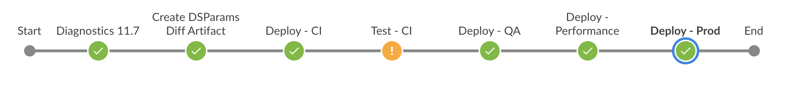
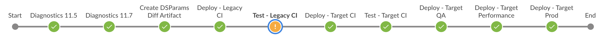

# Jenkins Agent Assignment

In the case of the supplied **MettleCI Upgrade Pipeline** certain Pipeline operations need to happen in specific Agents - i.e. some operations must execute on your environment’s *legacy* Agent, whilst others need to be assigned to a *target* Agent. To achieve this the MettleCI Sample Jenkins Pipeline assumes the availability of two Agent labels which you should have created and assigned:

METTLECI DATASTAGE11.5\- A Jenkins Agent hosting a MettleCI Command Line on a DataStage v11.5 Client Tier

METTLECI DATASTAGE11.7\- A Jenkins Agent hosting a MettleCI Command Line on a DataStage v11.7.1 Client Tier

You’ll see the labels used in the Pipeline definitions like this:

```
stages {
    stage("Some Pipeline Stage") {
        agent {
            label 'mettleci datastage11.5'
        }
        environment {
            ENVID = "ci"
            DATASTAGE_PROJECT = "${env.IIS_BASE_PROJECT_NAME}_${env.ENVID}"
        }
        steps { ... }           
```

> [!INFO]
> Note that the DevOps Pipeline only assumes the presence of a single Agent with the METTLECI:DATASTAGE11.7.1 label, as all operations can execute there.

# Assigning Pipeline operations to Agents using Labels

The `agent` sections of your Jenkins Pipeline definition denote which Jenkins Agents your Pipeline can be executed on. More specifically, it denotes which labels will be used to dynamically select an execution Agent from the pool of available Agents.

MettleCI ships with two sample Jenkins Pipelines, each of which have different Agent requirements:

**A DevOps Pipeline**, which performs CI/CD of a DataStage [changeset](https://en.wikipedia.org/wiki/Changeset) and is described in generic terms [here](https://datamigrators.atlassian.net/wiki/spaces/MCIDOC/pages/2222653459/MettleCI+Example+Pipeline+for+DevOps), and

**An Upgrade Pipeline**, which, like the DevOps pipeline, performs CI/CD of a DataStage [changeset](https://en.wikipedia.org/wiki/Changeset) before deploying the code to a newly-upgraded DataStage environment, upgrading your DataStage assets and rerunning Unit Tests to verify the efficacy of the upgrade. This pipeline is described in generic terms [here](https://datamigrators.atlassian.net/wiki/spaces/MCIDOC/pages/2178875414/MettleCI+Example+Pipeline+for+Upgrades).

The Jenkins Agent specification requirements of each of these is described below.

## DevOps Pipeline



The DevOps Pipeline is the simpler of the two Jenkins Pipelines shipped with MettleCI. It responds to a commit of a DataStage asset by performing MettleCI Compliance and Unit Tests before deploying to one or more downstream QA or Production environments. This assumes a [simple deployment topology with a single Jenkins Agent running on a single MettleCI Agent host](https://datamigrators.atlassian.net/wiki/spaces/MCIDOC/pages/1085767681/Jenkins+DevOps+Deployment+Topologies#Topology-Connections).

## Upgrade Pipeline



For an Upgrade pipeline you will need to differentiate between Stages which run on your Legacy Agent and those which need to run on your Target Agent(s). Note that Pipelines will stall if no running Agent with a label (or labels) is found.

This table summaries the Agent Label required for each Stage of the sample pipeline:

| **Stage** | **Agent Labels** |
| --- | --- |
| Diagnostics 11.5 (Legacy) | WINDOWS METTLECI DATASTAGE11.5.1 (Legacy) |
| Diagnostics 11.7 (Target) | WINDOWS METTLECIDATASTAGE11.7.1 (Target) |
| Create DSParams Diff Artifact | WINDOWS METTLECIDATASTAGE11.5.1 (Legacy) |
| Deploy - Legacy CI | WINDOWS METTLECIDATASTAGE11.5.1 (Legacy) |
| Test - Legacy CI | WINDOWS METTLECIDATASTAGE11.5.1 (Legacy) |
| Deploy - Target CI | WINDOWS METTLECIDATASTAGE11.7.1 (Target) |
| Test - Target CI | WINDOWS METTLECIDATASTAGE11.7.1 (Target) |
| Deploy - Target QA | WINDOWS METTLECIDATASTAGE11.7.1 (Target) |
| Deploy - Target Performance | WINDOWS METTLECIDATASTAGE11.7.1 (Target) |
| Deploy - Target Prod | WINDOWS METTLECIDATASTAGE11.7.1 (Target) |