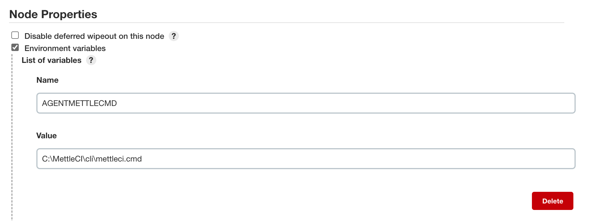

# Jenkins Environment Variables

*   [Jenkins Node Properties](#jenkins-node-properties)
*   [Pipeline Environment Variables](#pipeline-environment-variables)

The MettleCI Pipelines require the establishment of a set of input values which provide the information about your environment required to support the execution of the Pipeline’s steps. The MettleCI Pipeline derives these values from two sources

*   Jenkins Node Properties, which is accessed by selecting **Jenkins → Manage Jenkins → Manage Nodes and Clouds → {your node’s cog icon}**, and
    
*   Environment Variables (using the `environment {...}` syntax) defined at different scopes within the supplied sample Pipelines
    

# Jenkins Node Properties



The values assumed to have been defined by MettleCI’s sample Jenkins Pipelines are as follows:

| **Property Name** | **Typical Value** | **Notes** |
| --- | --- | --- |
| AGENTMETTLECMD | `C:\MettleCI\cli\mettleci.cmd` | The location of the Windows MettleCI command line interface (`mettleci.cmd`) on your Jenkins Node (Windows Agent host). |
| AGENTMETTLEHOME | `C:\MettleCI` | The location where temporary files are to be kept for the duration of the Jenkins build process.. |
| ENGINEUNITTESTBASEDIR | `/opt/dm/mci` | The location of your MettleCI installation on your DataStage Engine tier. |
| IISDOMAINNAME | `services_tier.your_corp.com:59445` | Your DataStage Services tier and port. |
| IISENGINENAME | `engine_tier.your_corp.com` | Your DataStage Engine tier. |
| IISUSERNAME | `isadmin` | Your IIS user name. |
| IISPASSWORD | `my_iisadmin_password` | The **name of the Jenkins Credentials entry** that contains your IIS user’s password for this node.<br><br>See [Protecting Sensitive Information used in Jenkins Pipelines](../jenkins/protecting-sensitive-information-used-in-jenkins-pipelines.md) for a detailed explanation. |
| IISPROJECTTEMPLATEDIR | `/opt/IBM/InformationServer/Server/Template` | The location of the project Template directory on your DataStage Engine tier. |
| MCIUSERNAME | `mciworkb` | The DataStage Engine tier user under which your MettleCI workbench is installed. |
| MCIPASSWORD | `my_mciworkb_password` | The **name of the Jenkins Credentials entry** that contains your Engine tier’s MettleCI Workbench installation user’s password.<br><br>See [Protecting Sensitive Information used in Jenkins Pipelines](../jenkins/protecting-sensitive-information-used-in-jenkins-pipelines.md) for a detailed explanation. |
| `WORKBENCHURL` | `https://engine_tier.your_corp.com:port_number` | The URL of the MettleCI Workbench server. |

You’ll see these values being used in various places within the supplied Pipeline templates. e.g.:

```
steps {
    withCredentials([
        string(credentialsId: "${env.IISPASSWORD}", variable: 'IISPASSWORD'),
        string(credentialsId: "${env.MCIPASSWORD}", variable: 'MCIPASSWORD')
    ]) {
        ....
    }
}
```

> [!INFO]
> Note that despite the table above only listing passwords as being stored privately as Jenkins Credentials this process can be applied to any and all values that you use.

# Pipeline Environment Variables

You’ll need to scan the supplied Pipelines for instances of the the `environment {...}` keyword and replace the supplied values with values appropriate to your needs.

For example, the start of the Upgrade Pipeline defines some global Environment Variables:

```
environment {
    IIS_BASE_PROJECT_NAME = 'wwi_jenkins_ds_115'
    COMPLIANCE_REPO_CREDENTIALS = 'ComplianceRepoCredentials'
    COMPLIANCE_REPO_URL = '<https://user@git.mettleci.io/compliance-rules.git'>
    UPGRADE_ORACLE_VARIANT = true
    UPGRADED_ORACLE_VERSION = 12
}
```

You’ll also see environment variables defined within Stages, some of which make use of global variables:

```
stage("Create DSParams Diff Artifact") {
    agent {
        label 'mettleci:datastage11.5.1'
    }
    environment {
        ENVID = "ci"
        DATASTAGE_PROJECT = "${env.IIS_BASE_PROJECT_NAME}_${env.ENVID}"
    }
    etc...
```