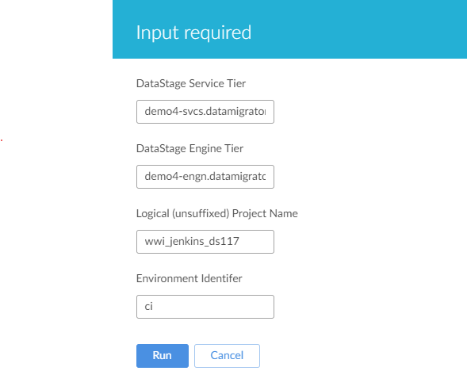
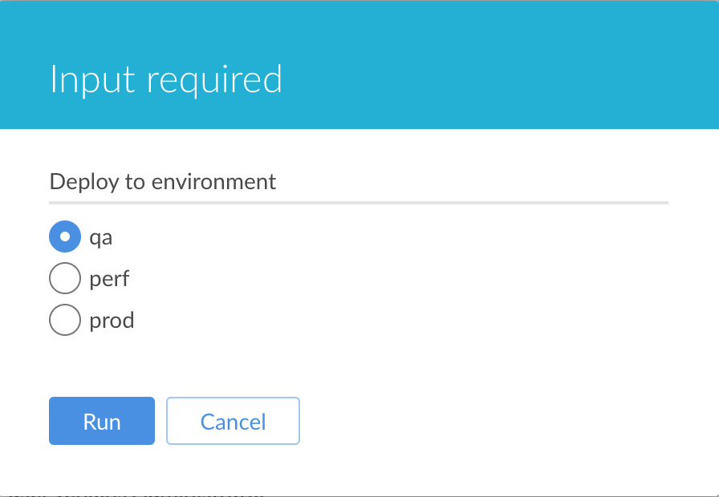

# Jenkins Pipeline Parameters and Waiting for manual inputs

## Parameters section

The parameters section enumerates the parameters to the pipeline with their default values. The four parameters used in the template, and their meanings are discussed in [https://datamigrators.atlassian.net/wiki/spaces/MCIDOC/pages/741310474](https://datamigrators.atlassian.net/wiki/spaces/MCIDOC/pages/741310474)

> [!INFO]
> note that parameters are immutable, and once set at pipeline (or scope section) start, cannot be changed

```
parameters {
    string(name: 'domainName', defaultValue: 'services_tier.datamigrators.io:59445', description: 'DataStage Service Tier')
    string(name: 'serverName', defaultValue: 'engine_tier.datamigrators.io', description: 'DataStage Engine Tier')
    string(name: 'projectName', defaultValue: 'wwi_jenkins_ds117', description: 'Logical (unsuffixed) Project Name')
    string(name: 'environmentId', defaultValue: 'ci', description: 'Environment Identifer')
}
```

When run interactively, the user will be prompted for these at pipeline start time like so:



Similarly, users can be prompted to make a choice from a selection…

```
parameters {
    choice (name: 'targetEnvironment', choices: ['qa', 'perf', 'prod'], description: 'Deploy to environment')
}
```

