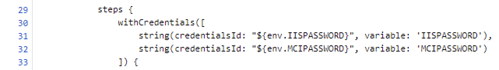
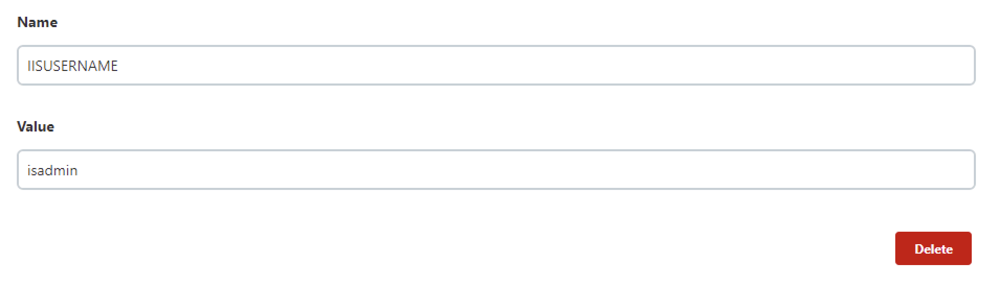
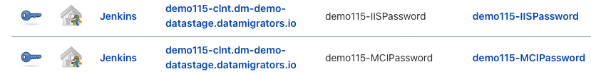
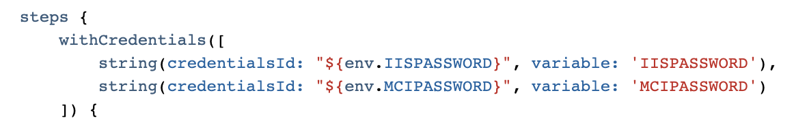
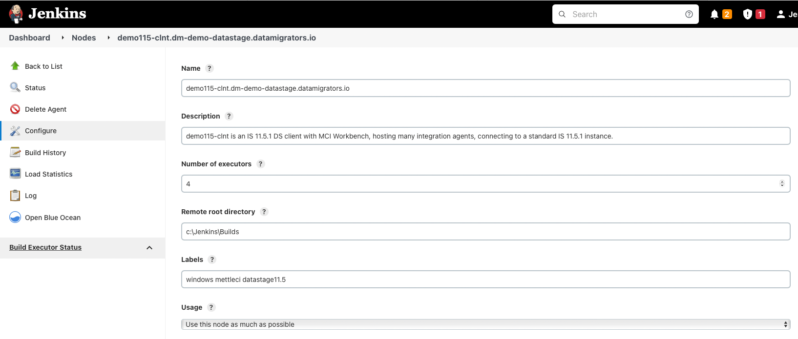
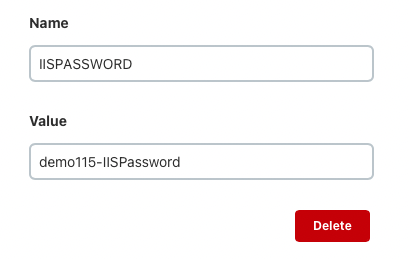
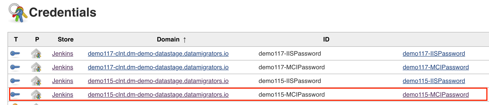
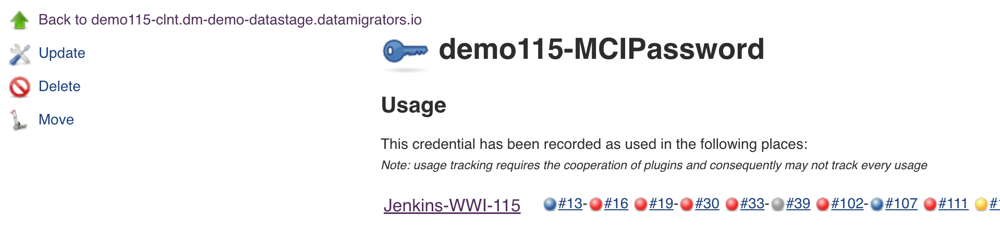

# Protecting Sensitive Information used in Jenkins Pipelines

A Jenkins pipeline unavoidably uses confidential information such as usernames and passwords which need to be protected from unauthorised access and alteration. Jenkins enables this by allowing the variables used in your pipeline definition (stored in the file **Jenkinsfile**) to be sourced from your *Jenkins Credentials* which are then accessed via properties on your **Jenkins Agents**. To be more explicit:

|     |     |     |     |
| --- | --- | --- | --- |
| **Location** | JENKINSFILE | NODE VARIABLES | GLOBAL CREDENTIALS |
| **URL Format** | `http://git-host.com/dastage-repository/Jenkinsfile` | `http://jenkins-host.com/credentials/` | `http://jenkins-host/computer/node-name/configure` |
| **Contents** | The `${env.variables}` entries are the names of NODE VARIABLES. | Node variable values are names of GLOBAL CREDENTIALS. | Global credentials values are the **actual** (potentially encrypted) values used at runtime. |
| **Example** |  |  |  |

# Environment and Local Variables

Note that the Jenkins [Credentials Binding Plugin](https://www.jenkins.io/doc/pipeline/steps/credentials-binding/) is used to take the values of encrypted environment variables and place their values into variables within the scope of the pipeline step.

For Example:

```
withCredentials([
      string(credentialsId: "${env.MY_ENVIRONMENT_VARIABLE}", variable: 'MY_LOCAL_VAR'),
])
```

# Example

## Jenkinsfile

This **Jenkinsfile** contains a reference to a variable `${env.MCIPASSWORD}`



## Node Variable

The Jenkinsfile reference `${env.MCIPASSWORD}` points to an environment variable which is one of the properties of a **Jenkins Agent** (sometimes referred to as a **Jenkins Node**) used to execute the relevant pipeline stage(s):



Node Properties for this Agent include the referenced Environment Variable:



See [Using Jenkins Agents - Jenkins documentation](https://www.jenkins.io/doc/book/using/using-agents/)

From the Jenkins documentation:

> [!INFO]
> Environment variables defined here will be made available to every build executed by this agent, and will override any environment variables that have the same *Name* as those defined on the *Configure System* page.
> Using the syntax `$NAME` or `${NAME}` (`%NAME%` on Windows), these variables can be used in job configurations, or from process launched by a build.
> Jenkins also supports a special syntax, `BASE+EXTRA`, which allows you to add multiple key-value pairs here, which will be prepended to an existing environment variable.
> For example, if you have a machine which has `PATH=/usr/bin`, you could add to the standard path by defining an environment variable here, with the name `PATH+LOCAL_BIN` and value `/usr/local/bin`.  
> This would result in `PATH=/usr/local/bin:/usr/bin` being exported during builds executed on this machine. `PATH+LOCAL_BIN=/usr/local/bin` will also be exported.  
> Multiple entries are prepended to the "base" variable according to the alphabetical order of the "extra" part of the name.
> If the *Value* is empty or whitespace-only, it will not be added to the environment, nor will it override or unset any environment variable with the same name that may already exist (e.g. a variable defined by the system).

## Global Credentials

[Jenkins Credentials](https://www.jenkins.io/doc/book/using/using-credentials/) may be of a variety of types, including…

*   Username with password
    
*   Docker Host Certificate Authentication
    
*   SSH Username with private key
    
*   Secret file
    
*   Secret text
    
*   Certificate
    

In this example the Node’s Environment Variable with the ID `MCIPASSWORD` has, in this example, the value `demo115-MCIPassword` which is actually the **ID** of a value in your **Jenkins Credentials** store (see below). You can see from the Key icon in the '**T**' column that that these credentials are of the type **Secret text**.



Taking a look at the specified value reveals the ***actual*** value used by the Jenkins pipeline at runtime:

