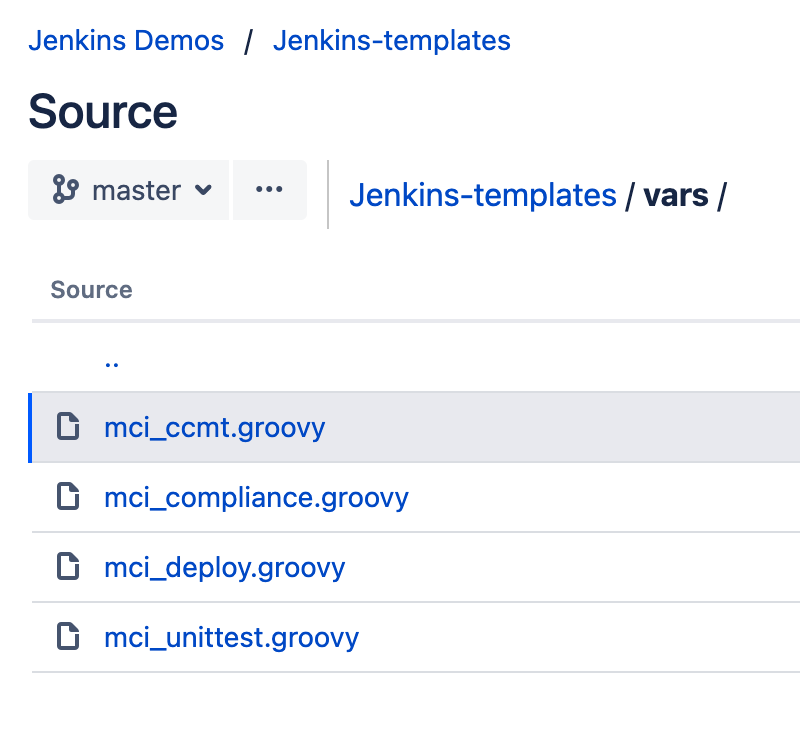

# Reusable Pipeline Templates in Jenkins

## MettleCI Custom Steps and Shared Libraries for Jenkins

All MettleCI example pipelines have the need to repeat certain components of the pipeline more than once (running the same deployment process with multiple different targets, for example) and so rather than copy and paste the deployment steps into the pipeline multiple times we instead [refactor](https://en.wikipedia.org/wiki/Code_refactoring) this into a single repeatable component which can be called multiple times with different parameters. This honours the principle of [DRY software development](https://en.wikipedia.org/wiki/Don't_repeat_yourself).

Build tools typically enable you to define a pipeline which is invoked by a repository event, such as a commit, and acts as the main definition, which we’ll refer to this as the ‘*principal pipeline*’, that coordinates the build and deployment activity for your software. This principal pipeline, which is stored in the same repository into which your DataStage artefacts will be committed and is often expressed using YAML, can also call other utility pipelines which are most commonly written using the same YAML grammar and which are stored in the same repository as the principal pipeline definition. Jenkins, however, takes a different approach:

*   The principal pipeline (called a [Jenkinsfile](https://www.jenkins.io/doc/book/pipeline/jenkinsfile/#ji-toolbar)) is written using [Jenkins Pipeline Declarative Syntax](https://www.jenkins.io/doc/book/pipeline/syntax/) - a grammar similar to YAML - and is stored in the same repository into which your DataStage artefacts will be committed.
    
*   The Jenkinsfile can optionally invoke one or more [Jenkins Custom Steps](https://www.jenkins.io/doc/book/pipeline/shared-libraries/#defining-custom-steps), each of which is defined within a file called a [Jenkins Shared Librar](https://www.jenkins.io/doc/book/pipeline/shared-libraries/)y. These Shared Libraries are:
    
    *   Written in [Groovy](https://groovy-lang.org/), and
        
    *   **Stored in a different repository to your principal pipeline**, using a prescribed directory structure.
        



# Using Custom Steps in a Pipeline

Custom steps exposed through shared libraries may have parameters which are supplied by the principal pipeline. For example, here’s an example of the structure of a Shared Library defines a Jenkins Custom Step called (somewhat unimaginatively) ‘**do\_datastage\_things**’.

## Share Library Repository `My_Shared_Library`

```
.
├── vars
│   ├── do_datastage_things.groovy
│   ├── ...
:   :
```

## Custom Step definition `do_datastage_things.groovy`

```
def call(
    def USERNAME_PARAMETER,
    def PASSWORD_PARAMETER,   
    def OTHER_PARAMETER_1,
    def OTHER_PARAMETER_2,
    def IS_OPTIONAL
) {
    try {
        bat label: "Do some DataStage stuff", 
            script: """
                mettleci namespace command ^
                -username ${USERNAME_PARAMETER}, ^
                -password ${PASSWORD_PARAMETER}, ^
                -param1 ${OTHER_PARAMETER_1}, ^
                -param2 ${OTHER_PARAMETER_2}
            """
            
        if ((IS_OPTIONAL as boolean) == true) {
            bat label: "Perform some optional step", 
                script: """
                    mettleci namespace another_command ^
                    -username ${USERNAME_PARAMETER}, ^
                    -password ${PASSWORD_PARAMETER}, ^
                    -param1 ${OTHER_PARAMETER_1}, ^
                    -param2 ${OTHER_PARAMETER_2}
                """
        }
    }
    catch(e) {
        throw e
    }
}
```

Some important points to note:

*   The name of the custom step to be used by the calling pipeline is the name of the `.groovy` file.
    
*   All custom steps must feature a function called `call` which defines the step’s parameters.
    
*   Function parameters are of type string, and all supplied arguments are implicitly converted to strings. When parameters are used in contexts that require them to be converted to different datatypes then they must be manually cast to their appropriate type, as seen on line 18 above.
    
*   Code inside the shared library custom step can use try/catch blocks, and re-throwing any exceptions allows the calling pipeline to stop the build at the point of failure and report the exception.
    

## Pipeline definition `Jenkinsfile`

```
@Library('My_Shared_Library') _

...

steps {
  withCredentials([
    string(credentialsId: "${env.IISPASSWORD}", variable: 'IISPASSWORD')
  ]) {

  do_datastage_things(
    env.IISUSERNAME, 
    IISPASSWORD, 
    env.SOME_AGENT_PROPERTY, 
    env.SOME_OTHER_AGENT_PROPERTY,
    true
    )
  }
}
```

In this example:

*   The libraries to be used are listed with the `@Library('library name') _` clause which imports everything in the `/vars` folder of your `My_Shared_Library` repository (see the relevant [Jenkins blog entry](https://www.jenkins.io/blog/2017/06/27/speaker-blog-SAS-jenkins-world/)). Alternatively you could just import specific Custom Steps…
    
    ```
    @Library('somelib') import do_datastage_things
    ```
    
*   `IISPASSWORD` is defined as a [Secret Text](https://datamigrators.atlassian.net/wiki/spaces/MCIDOC/pages/2215575556/Defining+Jenkins+Environment+Variables#Jenkins-Credentials) file and so it is retrieved using the `withCredentials` clause. See the [Credentials Binding Plugin](https://www.jenkins.io/doc/pipeline/steps/credentials-binding/) for details on how to use the `withCredentials` clause.
    
*   `custom_step` is resolved by Jenkins by searching for a `.groovy` file of the same name in the ***associated repository***. ***(***[Stuart Norton](https://datamigrators.atlassian.net/wiki/people/557058:13b77242-ab44-4eea-944a-dc7e3c637da8?ref=confluence) ***- How is the reference to this configured?)***
    

# Custom Steps Provided in the MettleCI Jenkins Shared Libraries

These are the Custom Steps Click the custom step name for more details

| **Name** | **Message** |
| --- | --- |
| [mci\_ccmt.groovy](https://datamigrators.atlassian.net/wiki/spaces/MCIDOC/pages/2234286090) | IBM Connector Migration Tool reusable pipeline definition |
| [mci\_compliance.groovy](https://datamigrators.atlassian.net/wiki/spaces/MCIDOC/pages/2234581006) | MettleCI Compliance reusable pipeline definition |
| [mci\_deploy.groovy](https://datamigrators.atlassian.net/wiki/spaces/MCIDOC/pages/2234187791) | MettleCI incremental deployment reusable pipeline definition |
| [mci\_unittest.groovy](https://datamigrators.atlassian.net/wiki/spaces/MCIDOC/pages/2234941441) | MettleCI Unit Testing reusable pipeline definition |