# Integrating ServiceNow Work Item Lookup with MettleCI Workbench

Integrating your MettleCI Workbench with ServiceNow will enable MettleCI Workbench to perform a dynamic lookup when linking DataStage Git commits to one or more ServiceNow work items directly within the Workbench user interface. It is a two-step process, there are some items to configure and collect from the ServiceNow instance, and then some items to configure in Workbench.

* * *

## Register Workbench as an OAuth2 ServiceNow Application

1.  [Setup OAuth](https://docs.servicenow.com/search?q=Activate%20OAuth) in your ServiceNow instance.
    
2.  [Create a new OAuth API endpoint](https://docs.servicenow.com/search?q=Create%20OAuth%20API%20endpoint) for Workbench to access ServiceNow:  
    
    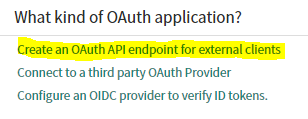
    
    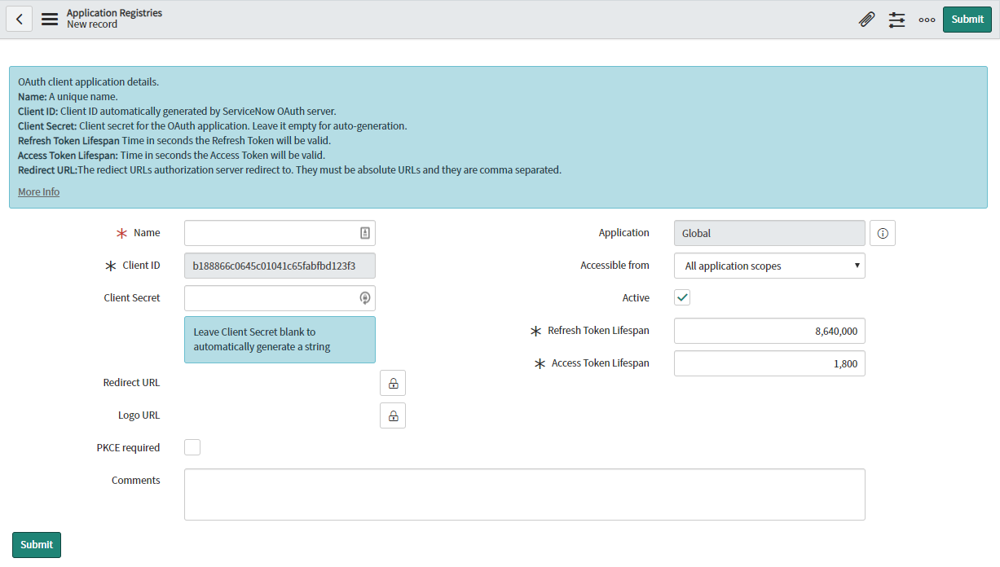
    
3.  Set the “Name” Field to “MettleCI Workbench” and the “Redirect URL” to `https://<workbench url>:<port>/api/auth/delegated/<N>` where `<workbench url>`is the URL of your Workbench installation (usually your Development engine), `<port>` is the https port you are running on (often but not always 8443, check your `<config.yml` file if unsure), and `<N>`is the index of the WIM you plan to add (the default generic is 0 and if this is the first other WIM you are adding, the value here would be 1) and click “Submit”:  
    
    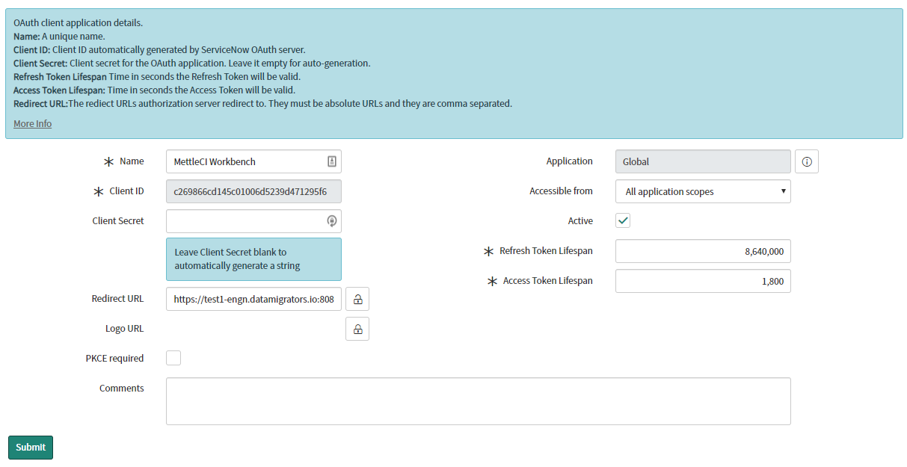
    
      
    Record the redirect URL for later use so you don’t have to derive it again. If your organization has installed multiple MettleCI Workbench applications, you can add them all to the same ServiceNow Application Registration by adding multiple Redirect URLs. (comma separated)
    

> [!INFO]
> Note that some ServiceNow instance connections may not function properly if your workbench instance is using a self signed certificate. The submission shown here will save successfully but runtime errors happen when trying to query work items from MettleCI Workbench. If this occurs you will need to reconfigure your Workbench instance to use a CA signed certificate.

4.  Click on your newly created Application Registration:  
    
    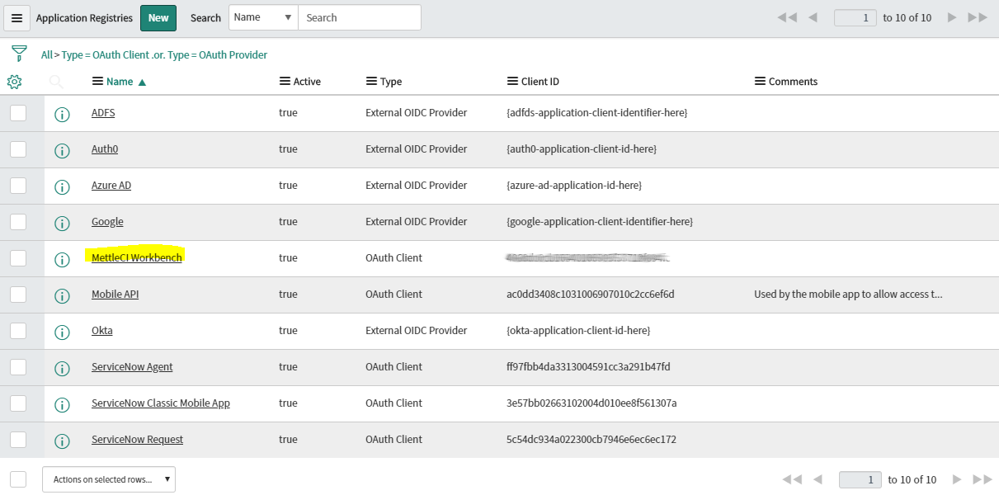
    
5.  Note down the “Client ID” and “Client Secret” field properties for later use:  
    
    
    

Note that the example shows `http://` because it is the automatically supplied default value, but your URL will most likely need to be `https://`. You’re ServiceNow portion of the configuration is now complete.

## Configuring MettleCI Workbench Work Item Lookup with ServiceNow

1.  Access the MettleCI Workbench page to integrate with your ServiceNow Work Item Management system by logging in to MettleCI Workbench and select **Issue Management** from the **Profile** menu (top right)
    
    1.  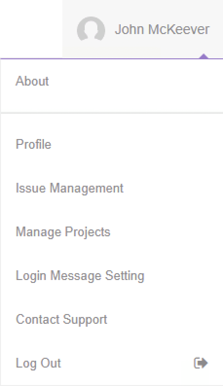
        
2.  On the **Registered Issue Management Systems** screen select the “**+**” to create a new Issue Management type.. Initially you will have only the “**Default Generic Issue Manager**” present, but you can add as many as you need to (including more than one of the same type if necessary) one at a time. It is recommended that you get one working before you add another.  
    
    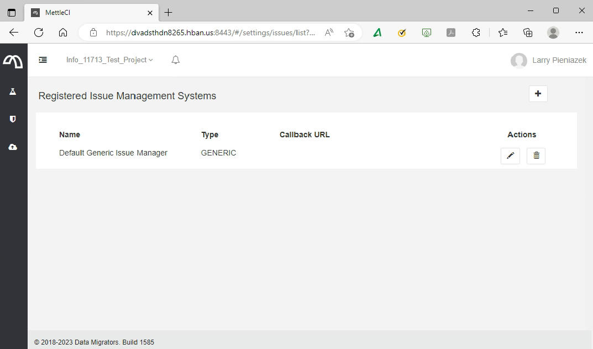
    
3.  On the **Add Issue Management** screen that appears
    
    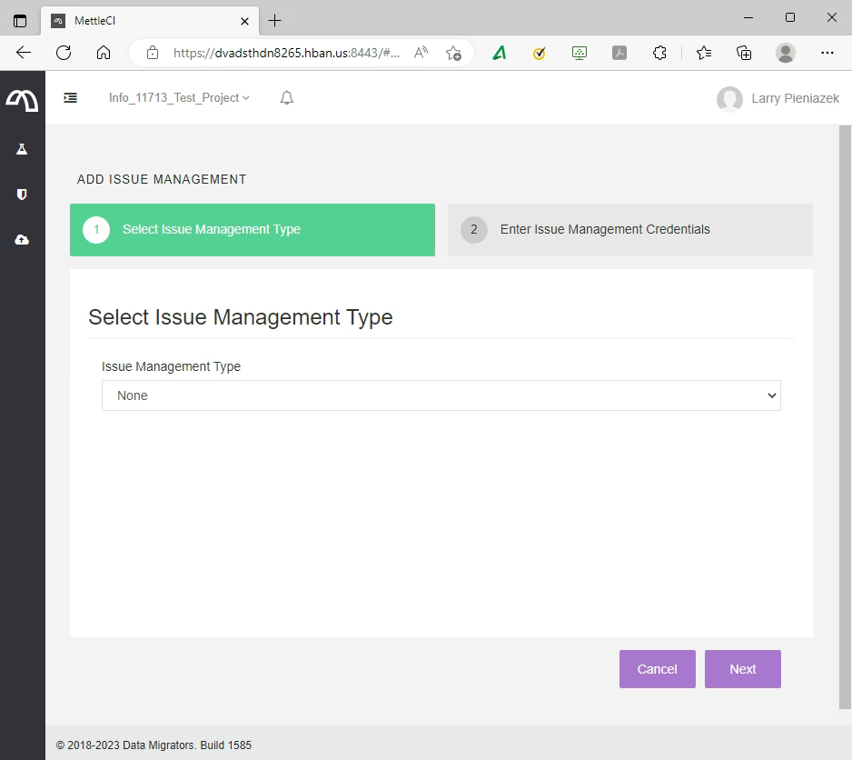
    

select **ServiceNow** from the **Select Issue Management Type** dropdown

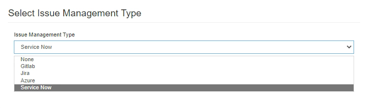

and click **Next**

4\. On the **Register ServiceNow Issue Management** screen that appears next, enter the following values and click **Submit**:


*   **Field list**
    
    *   **Name:** Anything you like, but something that identifies your ServiceNow organisational instance would be a sensible choice
        
    *   **URL:** The URI of your ServiceNow instance recorded earlier.
        
    *   **Client ID:** Your Application (client) ID recorded earlier
        
    *   **Client Secret:** Your client secret recorded earlier
        
    *   **Search Queries:** This has no default, you will need to create at least one query. Consult with your ServiceNow administrators to determine what table(s) your organization uses, and thus, what table(s), then add or edit the query or queries as needed by using the “pencil” icon and “+” icon to edit what is queried or add a new table to query, respectively. The example dialog below uses **incident** as the table, keyed on **${number}** with **${number}: ${short\_description}** as the summary shown to the user.
        
    *   **OPTIONAL** - In the **Search Queries** section of any query, you can add add a filter expression to limit what is returned. Note that this expression is not checked for correct syntax. Consult with your ServiceNow administrators to determine whether you need to filter (most organizations will not) and what columns/values to filter on. The example dialog below includes a filter on the status column, which limits the result to rows where the value of the column is “Active” Leave this field empty if you do not wish to filter results.
        


> [!INFO]
> Search queries use ${ } to represent column values. Other characters, if any, are reproduced as is.
> The filter, on the other hand, takes the column name and a literal without any enclosing ${ }.

*   `Submit` (Save) the newly registered ServiceNow issue management system.
    

> [!INFO]
> *   The Callback URL will be displayed on the Workbench Issue Management System page.
>     
> *   Ensure the callback URL matches the setting on the [ServiceNow Application Registration](#ServiceNowRegisterConfig) page


Tips to aid debugging when having trouble registering a new ServiceNow issue management system.

*   It is not necessary to restart the Workbench service, but clearing the log and then restarting the service may aid in debugging.
    
    ```
    $> cd /opt/dm/mci
    $> mv mci.log mci.log_preIssueManagementChanges
    $> sudo service dm-mettleci-workbench restart
    ```
    
*   During issue lookup, Workbench will search each ServiceNow Table configured in the **Search Queries** list. The Ids that will appear in the commit message are generated from the value of the “Primary Key Column” value and the text shown to the user in the lookup is generated from the “Ticket Summary Column” value. These settings are retained in the `issuesmanagement-settings.yaml` file in the installation directory. Assuming the choices above were made, this file would appear like so: (**Note:** ID `0` is the default generic issue management which takes no other parameters.)
    

```
---
- id: 0
  type: "GENERIC"
  name: Default Generic Issue Manager"
- id: 1
  type: "SERVICENOW"  
  name: MyServiceNow:
  url: <your ServiceNow instance URL>
  clientId: <your Client ID>
  clientSecret: "<your Client Secret>"
  search:
      - table: "incident"
        id: "${number}"
        summary: "${number}: ${short_description}"
        filter: "status='Active'"
```

Template Strings are text containing special `${column_name}` formatted variables which Workbench will replace with Column data from the ServiceNow Table based on the `column_name`. As above, the filter expression, if any, does not use this notation.

5\. You can now select your new ServiceNow WIM for any existing or new project.

From the `Registered Projects` page, select an existing project for editing via the pencil icon:

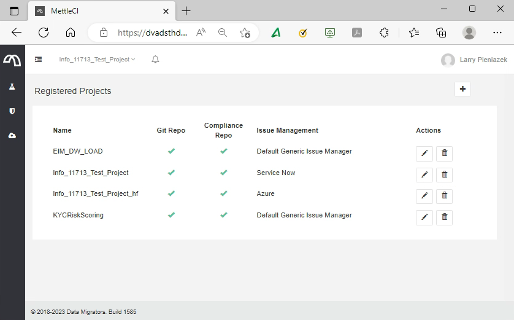

At the bottom there is a dropdown to let you select from all currently configured types of Work Item Management

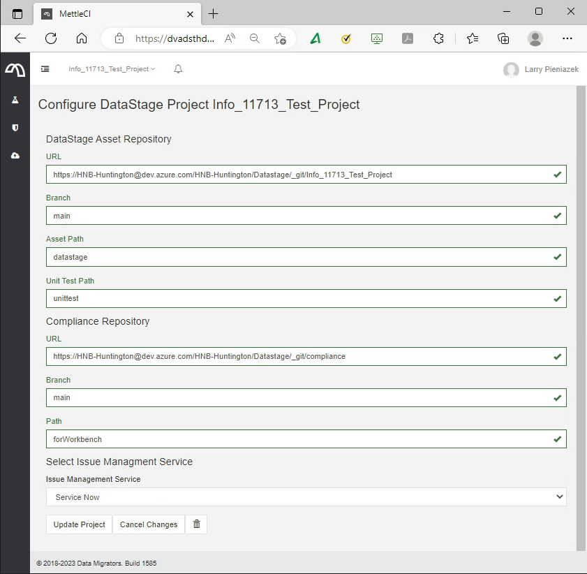

Select `myServiceNow` (or whatever you named your connection) from the available options …

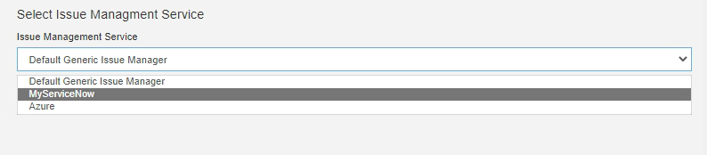

… and then select **Update Project**. Change all existing projects that you want to use ServiceNow with, as desired.

6\. ServiceNow work items will be available from the Issues drop down on the Git Commit page during Check-in for projects using it:

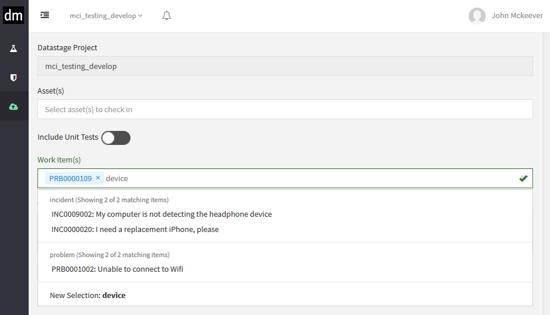

This last step concludes your ServiceNow integration!