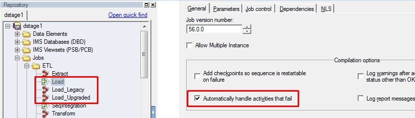

# DataStage Feature Toggles

# Introduction

Feature Toggles, also known as feature flags, are a set of development patterns that allow specific features or behaviours within an ETL solution to be turned on or off at will. This allows developers to safely “toggle” new features on or off for testing and decouples Integration and deployment frequency from the time taken to get changes (truly) done. This guide will show how to implement Feature Toggles in DataStage by exploring a common scenario that occurs frequently within ETL development.

# The Scenario

Consider a simple DataStage ETL pipeline that consists of three separate DataStage jobs which extract, transform and load data using the following Sequence Job:

In the coming month, the external system that is loaded by the ETL will be upgraded and will require changes to the the load job logic. The development team want to implement and test changes to the load job ahead of time but the changes aren’t backwards compatible and can’t be deployed to production until after the external system has been successfully upgraded. At the same time, there is also a backlog of critical defects which need to be fixed and released to production between now and when the external system is scheduled to be upgraded. How can the team satisfy these parallel and potentially competing goals?

# The Solution

The development team can introduce a Feature Toggle which will enable those changes to the load job to be turned on and off at will. This solution has the following benefits:

*   Critical defect fixes can be built, tested and even released to production while the load job changes are still in progress.
    
*   Load job changes can be deployed to testing and production environments alongside critical defect fixes but will never be executed while the Feature Toggle remains off.
    
*   Integration testing of critical defect fixes and load changes can be performed by switching the Feature Toggle on.
    
*   When blocking defects are detected in load job changes, the Feature Toggle can be switched off to continue testing critical defect fixes.
    
*   The Feature Toggle can be switched on in production as soon as the load job changes have passed testing and the external system has been upgraded.
    
*   If the external system upgrade is delayed for any reason, the Feature Toggle can remain switched off and ETL development can continue unaffected.
    

Once the external system has been upgraded and the Feature Toggle is permanently switched on, the feature toggle can be removed from the DataStage project.

# DataStage Feature Toggles Design

The basic design is that jobs affected by a feature toggle will have two versions: one which is run when the feature toggle is off and the other is run when the feature toggle is on. In our example, the `Load` job will be replaced by `Load_Upgraded` and `Load_Legacy`:

To ensure Job Sequences and external Schedules in tools like Control-M continue to work without change, a sequence is created which will be run in place of the original job. It is the sequence’s responsibility to check the current value of the Feature Toggle and run the approriate version of the job:

# Implementing a Feature Toggle

When familiar with this design pattern, a new feature toggle can be added within minutes.

> [!INFO]
> This feature toggle implementation relies on a Basic Routine called `IsFeatureToggleEnabled` . This is available for download from the Attachments section at the bottom of this page.

1.  Add a DataStage Project Environment Variable to store the state of our feature toggle. It is recommended that all Feature Toggles follow a naming conventions such as “FEATURE\_XXX” to ensure they are easy to identify and remain grouped together in DataStage selection dialogs. In this example, we chose `FEATURE_UPGRADED_TARGET`:
    
    
    
2.  Create a copy of the job being changed and name it to reflect the logic when the Feature Toggle is on. In this example, we copied the `Load` job and renamed it to `Load_Upgraded`:
    
    
    
3.  Rename the job being changed to reflect the logic when the Feature Toggle is off (i.e. the pre-change state). DataStage might notify you that the job is being referenced by another item. You can ignore this by clicking “yes”. In this this example, we renamed the `Load` Job to `Load_Legacy`:
    
    
    
4.  Create a new Sequence Job and give it the same name as the original Job ( `Load` in our example). This sequence will be run by your scheduler / execution system instead of the original `Load` job. This Sequence will, in turn, run either `Load_Legacy` or `Load_Upgraded` when the Feature Toggle is On or Off, respectively. Ensure that the Sequence has the combination of all parameters in both the `Load_Upgraded` and `Load_Legacy` jobs and the “Automatically handle activities that fail” option is set in the Job properties:
    
    
    
5.  Setup the sequence design as follows:
    
    
    
6.  The `Load_Upgraded` and `Load_Legacy` job activities call the relevant job versions. All Job Parameters are transferred directly from the Job Sequence Parameters
    
    
    

# Removing a Feature Toggle

1.  Remove the Sequence Job. In the example, this is called `Load`
    
2.  Rename the job version which contains the intended behavior. In this example, we would rename `Load_Upgraded` to `Load`
    
3.  Remove the job version which is no longer required. In this example, we would remove `Load_Legacy`
    
4.  Remove the Project Environment variable. In this example, we would remove `FEATURE_UPGRADED_TARGET`
    
5.  Check in your changes (including the deletions).
    

# Attachments

[FeatureToggleExample.dsx](./attachments/FeatureToggleExample.dsx)
[IsFeatureToggleEnabled.dsx](./attachments/IsFeatureToggleEnabled.dsx)