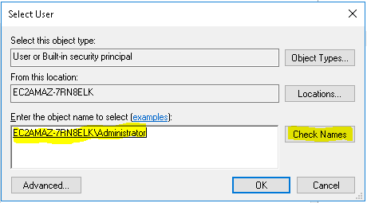

# Bamboo 'Unable to open file' errors on Windows

## Problem

Running a MettleCI Task in Bamboo results in an error message similar to

`Unable to open file C:\Windows\system32\config\systemprofile\AppData\Local\Temp\mci9115423909078010390.auth`.

The temporary directory (`%temp%`) for the current user is in a sub directory of the `%windir%\System32` directory, usually caused by running Bamboo or a remote agent Service using the `Local System` account. When a 32bit Windows applications (ie. some DataStage clients) are executed on a 64bit Operating System, Windows will redirect the file system path from `%windir%\System32` to `%windir%\SysWOW64`. This will prevent DataStage clients from accessing temporary files created by MettleCI.

For more information about the Windows File System Redirector, please refer to the Microsoft’s [documentation](https://docs.microsoft.com/en-us/windows/win32/winprog64/file-system-redirector).

## Solution

This problem usually occurs when Bamboo or a Bamboo Remote Agent are running as a Windows Service using the `Local System` account.

There are two options for resolving this issue.

**Option 1**: Create a dedicated Windows Account and change the Bamboo or Bamboo Remote Agent services to run under that account as follows:

1.  Locate the Bamboo Remote Agent in the Windows Services settings, right click and select “Properties”.  
    
    
    
2.  Click the “Log On” tab, Select “This account” and click the “Browse…” button.
    
    
    
3.  Enter the username of that account you wish to use in the textbox and click “Check Names”
    
    
    
    If your username is not found after clicking “Check Names”, click the “Locations…” button and select “Entire Directory”.
    
4.  Save changes and restart the Bamboo Remote Agent Service.
    

**Option 2**: Override Java’s temporary directory location to a directory that is not a sub directory of the `%windir%\System32` directory:

1.  Edit `<bamboo agent directory>\conf\wrapper.conf` where `<bamboo agent directory>` is the directory that your Bamboo remote agent was installed in.
    
2.  Add `wrapper.java.additional.3=-Djava.io.tmpdir=../temp` after the line starting with `wrapper.java.additional.2`.
    
3.  Save the file and restart the Bamboo Remote Agent Service.
    

> [!WARNING]
> It is strongly recommended that **Option 1** is applied where possible - running services under the **Local System** account can cause problems during DataStage compilation. See [MettleCI never completes job compilation](../troubleshooting/the-mettleci-bamboo-plugin-fails-when-compiling-a-job.md) for details.