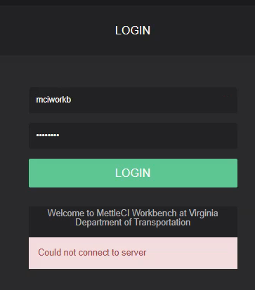

# Configuring Workbench for HTTPS Git authentication causes "could not connect to server" at workbench user login

# Symptom

When using Oracle Java and switching Workbench to use HTTPS Git authentication from the standard SSH authentication, after changing the config.yml to set httpsEnabled: true in the gitAuthentication section (as follows)…

```
gitAuthentication:
  sshKey: "/opt/dm/mci/workbench.key"
  httpsProvider: "SunJSSE"
  httpsEnabled: true  
  httpsCredentialsStore:    
    type: "PKCS12"
    path: "/opt/dm/mci/.secrets/git-credentials.p12"    
    password: ${file:UTF-8:/opt/dm/mci/.secrets/git-credentials-keystore-password}
```

…then restarting Workbench, Workbench starts normally but fails to authorise the user with a “Could not connect to server” message when valid DataStage credentials are presented (login with invalid credentials works as expected, the credentials are validated as failed and logon is denied)  



Examining the log shows an error of the form

```
ERROR [2021-10-20 17:13:11,239] io.dropwizard.jersey.errors.LoggingExceptionMapper: Error handling a request: 748a1e294871f1f5
! java.security.InvalidKeyException: Illegal key size
! at javax.crypto.Cipher.checkCryptoPerm(Cipher.java:1039)
! at javax.crypto.Cipher.implInit(Cipher.java:805)
! at javax.crypto.Cipher.chooseProvider(Cipher.java:864)
! at javax.crypto.Cipher.init(Cipher.java:1396)
! at javax.crypto.Cipher.init(Cipher.java:1327)
! at com.datamigrators.mettle.utils.EncryptionHelper.encrypt(EncryptionHelper.java:50)
! at com.datamigrators.mettle.auth.AuthTokenFactory.buildSignature(AuthTokenFactory.java:71)
! ... 71 common frames omitted
! Causing: java.lang.RuntimeException: Failed to encrypt user secret key
! at com.datamigrators.mettle.auth.AuthTokenFactory.buildSignature(AuthTokenFactory.java:79)
! at com.datamigrators.mettle.auth.AuthTokenFactory.create(AuthTokenFactory.java:42)
! at com.datamigrators.mettle.resources.AuthenticationResource.doLogin(AuthenticationResource.java:78)
```

Switching back to httpEnabled: false resolves the login error but does not allow non ssh access to git

# Cause

When Workbench is set up via the wizard, we create an encrypted keystore to securely house each user's credentials (user ID and password or PAT) for the Git system, should the Workbench be configured to use https or http. This keystore is described in the `httpsCredentialsStore` section of the `config.yml` as seen above. The store is protected with an encryption key that we save in a protected location. Oracle Java is not capable of decrypting the store as we encrypt it with modern strength cyphers, but Oracle Java by default has only weaker versions available.

# Solution

Switch Workbench from using Oracle Java to AdoptOpenJDK. AdoptOpenJDK has more modern encryption and is compatible with the key strength we use. See [Prerequisite Java Installation](https://datamigrators.atlassian.net/wiki/spaces/MCIDOC/pages/488800406/Prerequisite+Java+Installation) for instructions.