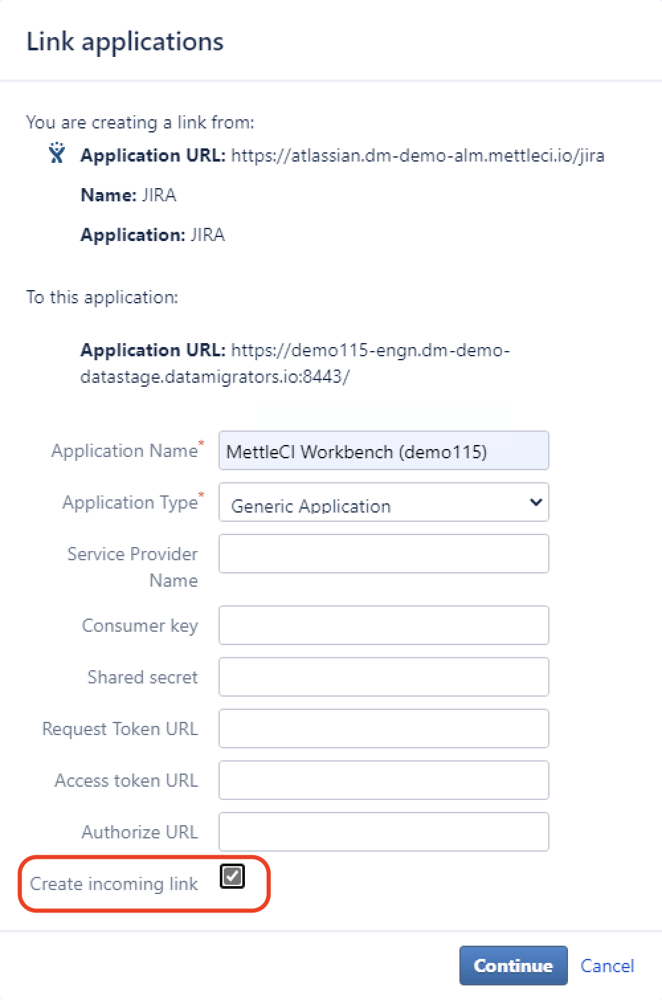

# Jira displays error about Workbench 'not registered as a Consumer' when registering application

# Problem

You receive this message in the Jira ‘Applications’ page when attempting to [integrate MettleCI Workbench with Atlassian Jira](https://datamigrators.atlassian.net/wiki/spaces/MCIDOC/pages/1507328025/Integrating+Atlassian+Jira+with+MettleCI+Workbench):

> [!INFO]
> "MettleCI Workbench (demo115)" (Generic Application) is not
> registered as a Consumer and cannot make requests into "JIRA"
> (JIRA) using OAuth. (?)

# Cause

You forgot to check the **Create incoming link** checkbox on the **Link applications** dialog

# Solution

Ensure you check the **Create incoming link** checkbox on the **Link applications** dialog!