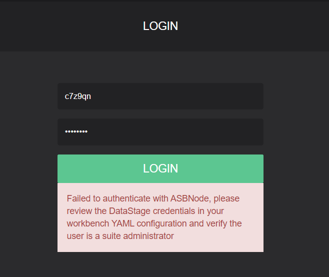

# Logging on to Workbench produces 'Failed to Authenticate with ASBNode' error

# Problem

MettleCI Workbench communicates with DataStage using a set of credentials configured during the setup wizard and stored in `config.yml`:


These credentials are used during most actions within MettleCI Workbench (Git Check-in, Compliance Testing, Unit Test generation, etc) but are also used while validating user credentials during login and retrieving the available DataStage projects.

If you submit valid DataStage credentials at login time and you get an error on the logon screen such as the one shown below, it is likely that the cached credentials Workbench uses are not valid. (the error you get if your own credentials are not valid is different) The most common cause of this issue is that the password for the cached credentials was changed, but it is also possible that the user referred to has lost their DataStage administrative rights.  



Another symptom you may encounter is that even if you can log in successfully, when you try to select a new project during project setup, it reports a blank list, or displays no projects, or an error message. (the list of projects is determined by querying DataStage, so needs these credentials for that)  
  
You may see this problem manifested as an entry in the `mci.log` like this one:

```
10.107.242.61 - - [12/Apr/2023:14:53:10 +0000] "GET /api/systeminfo/version HTTP/1.1" 200 4 "http://cilisdsd0021.sys.cigna.com:8080/" "Mozilla/5.0 (Windows NT 10.0; Win64; x64) AppleWebKit/537.36 (KHTML, like Gecko) Chrome/112.0.0.0 Safari/537.36 Edg/112.0.1722.39" 3
10.22.219.121 - - [12/Apr/2023:14:55:51 +0000] "GET /api/auth/login HTTP/1.1" 502 183 "http://cilisdsd0021.sys.cigna.com:8080/" "Mozilla/5.0 (Windows NT 10.0; Win64; x64) AppleWebKit/537.36 (KHTML, like Gecko) Chrome/112.0.0.0 Safari/537.36 Edg/112.0.1722.34" 3704
ERROR [2023-04-12 14:55:51,428] io.dropwizard.jersey.errors.LoggingExceptionMapper: Error handling a request: 1dbabdd65d5f590f
! javax.security.auth.login.FailedLoginException: CDIHT0401E: Login failed.  Ensure the user ID and password are correct.
<SNIP>
! ... 63 common frames omitted
! Causing: javax.ws.rs.WebApplicationException: Failed to authenticate with ASBNode, please review the DataStage credentials in your workbench YAML configuration and verify the user is a suite administrator
! at com.datamigrators.mettle.auth.DatastageAsbAuthenticationService.authenticate(DatastageAsbAuthenticationService.java:115)
<SNIP>
! at java.lang.Thread.run(Thread.java:750)
```

# Diagnosis

Verify your credentials by attempting to log into the IS Web console for that service tier, and to a DataStage client. For security reasons it is recommended that you ‘iis encrypt’ the password rather than having it in plaintext. For details on doing that see [How do we encrypt our DataStage credentials in the MettleCI Workbench configuration file?](https://datamigrators.atlassian.net/wiki/spaces/MCIDOC/pages/1295417357/How+do+we+encrypt+our+DataStage+credentials+in+the+MettleCI+Workbench+configuration+file)

# Solution

To correct this issue, you will need to edit your `config.yml` file to supply valid credentials. The section in `config.yml` that needs modifying is the `datastage` section. After backing up your current `config.yml` , replace the `username` and `password` with the new credentials that you just verified work correctly, remembering to remove any trailing spaces. Here’s an example:

```
datastage:
   installDir: /opt/IBM/InformationServer/Server/DSEngine
   domain: test1-svcs.datamigrators.io:59445
   server: TEST1-ENGN.DATAMIGRATORS.IO
   username: isadmin
   password: "{iisenc}CZtAigziyHMBboEzHUVZoA=="
```

After you make this modification you will need to [restart Workbench](https://datamigrators.atlassian.net/wiki/spaces/MCIDOC/pages/1954578453/Starting+Stopping+the+Monitoring+MettleCI+Workbench+Service) for the configuration change to take effect.