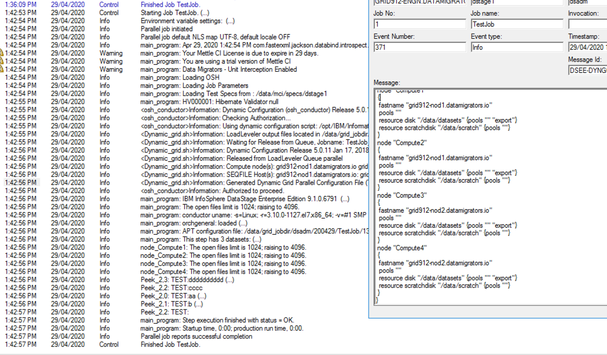

# MettleCI: Configuring Unit Testing for Grid Toolkit

Normally, Grid Toolkit works by sharing various directories via NFS

Each Compute Node can access the same executables as the Conductor Node, so it is not necessary to install software on each machine.

However, there has been some curiousity as to how `osh` is configured and can enable Unit Testing

## Installation of Grid Toolkit

Excerpt from the Grid Enablement Toolkit Redbook:-

*Enables the intercept for interacting with the resource manager by performing the following tasks:*

*– Renaming osh to osh.exe*

*– Renaming osh.sh (provided with the Grid Enablement Toolkit) to osh*

*• The renamed osh script calls either osh.exe (the original osh executable) or the osh\_conductor.sh script.*

## Installation of MettleCI Unit Test Harness

Then we follow the normal process to setup the Unit Test Harness.

This is the contents of the directory after installation:-

`-sh-4.2$ pwd`  
`/opt/IBM/InformationServer/Server/PXEngine/bin`  
`-sh-4.2$ ls -al osh*`  
`lrwxrwxrwx 1 dsadm dstage 6 Jan 21 18:50 osh -> osh-dm`  
`-rwxr-xr-x 1 dsadm dstage 2668 Jan 21 18:20 osh-dm`  
`-rwxr-xr-x 1 dsadm dstage 69048 Jul 5 2018 osh-ibm`  
`-rwxrwxr-x. 1 dsadm dstage 10648 May 10 2017 oshprinthost`  
`-rwxrwxr-x. 1 dsadm dstage 19192 May 10 2017 oshwrapper`  
`-sh-4.2$`

In a non-Grid environment, `osh-ibm` is a renamed `osh`.

In a Grid environment, `osh-ibm` is also a renamed `osh`, but since that has been renamed from `osh.sh` it will actually contain the contents of `osh.sh`

## Example run of a Unit Test on Grid

