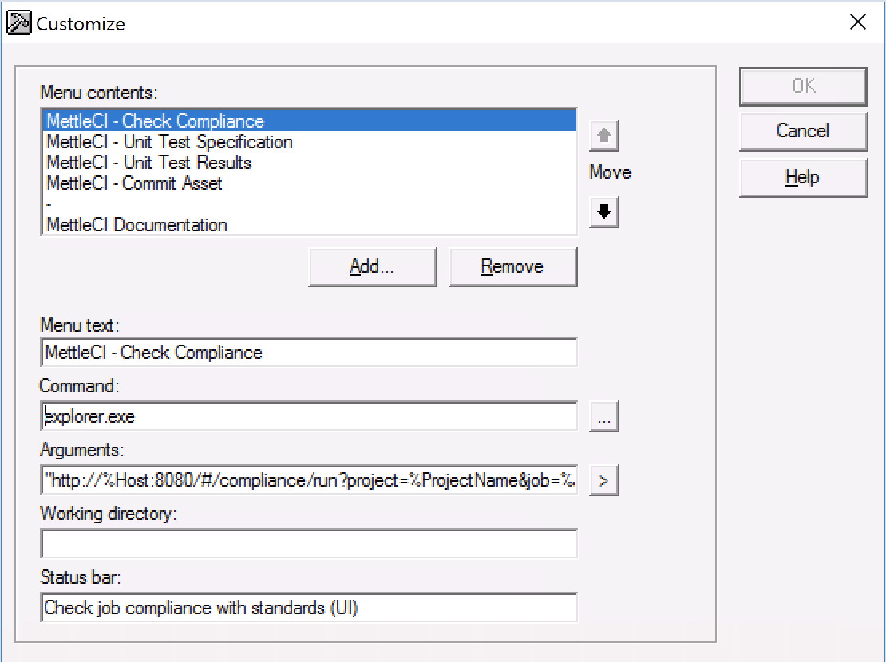

# No permission to install the DataStage Designer MettleCI menu items

# Problem

The MettleCI Workbench provides a [facility to install custom MettleCI menu items](https://datamigrators.atlassian.net/wiki/spaces/MCIDOC/pages/454623235/Integrating+MettleCI+Workbench+and+DataStage+Designer+on+Windows) in your DataStage Designer client application. When you click the **Integrate withe DataStage Client** button on the front page of the MettleCI Workbench your browser will attempt to download a Windows EXE (executable) file which will automatically install the menu items for you by modifying your Windows registry. Some users, however, may not possess the permissions necessary to download and.or execute the necessary `.exe` file from the MettleCI Workbench application.

# Solution

If your users do not have permission to run the EXE installer then users can configure their MettleCI Custom menu items themselves. To do this, open your DataStage Designer client and select the **Tools → Custom → Customize** menu item. This presents a dialog which enables you to create custom menu items

Create the required MettleCI menu items using the values detailed below:

| **Menu text** | **Command** | **Arguments** | **Status bar** |
| --- | --- | --- | --- |
| MettleCI - Check Compliance | explorer.exe | "http://%Host:8080/#/compliance/run?project=%ProjectName&job=%JobName" | Check job compliance with standards |
| MettleCI - Unit Test Specification | explorer.exe | "http://%Host:8080/#/unittest/spec?project=%ProjectName&job=%JobName" | View of modify job unit test specification |
| MettleCI - Unit Test Results | explorer.exe | "http://%Host:8080/#/unittest/result?project=%ProjectName&job=%JobName" | View job unit test results |
| MettleCI - Commit Asset | explorer.exe | "http://%Host:8080/#/checkin?engine=%Host&project=%ProjectName&job=%JobName" | Commit job or other asset(s) to version control |

**Notes**

*   The **explorer.exe** command will invoke your Windows system-default web browser
    
*   Make sure you include the double quotes in the 'Arguments’ value
    

> [!INFO]
> If you have configured your MettleCI Workbench to communicate over HTTPS then ensure the protocol specifier (**HTTPS**) and port (e.g., **8443**) are appropriately adjusted.
> For example, a MettleCI Workbench using HTTPS over port 8443 the **Commit Asset** entry would look like:
> “https://%Host:8443/#/checkin?engine=%Host&project=%ProjectName&job=%JobName"

Describe the detailed steps the user needs to take to resolve the problem, where possible. If the steps are described elsewhere in the documentation then link to those pages rather than repeat those details here.