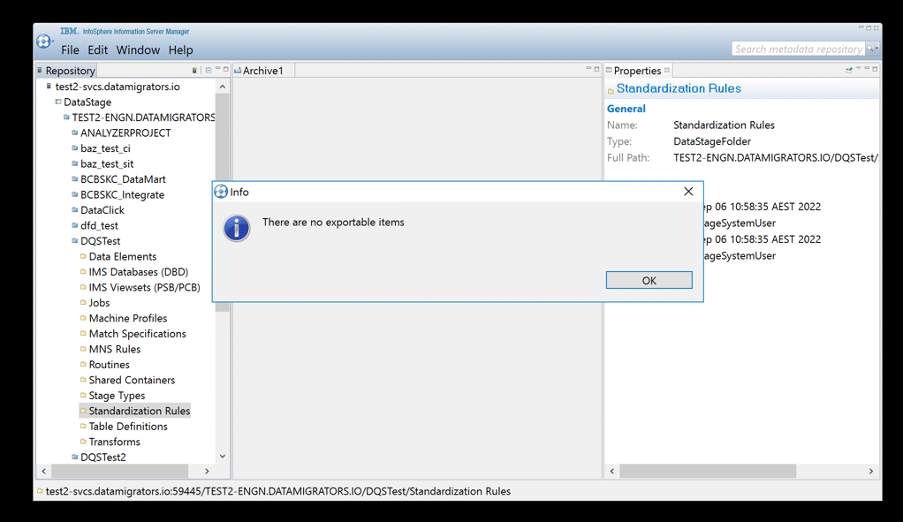
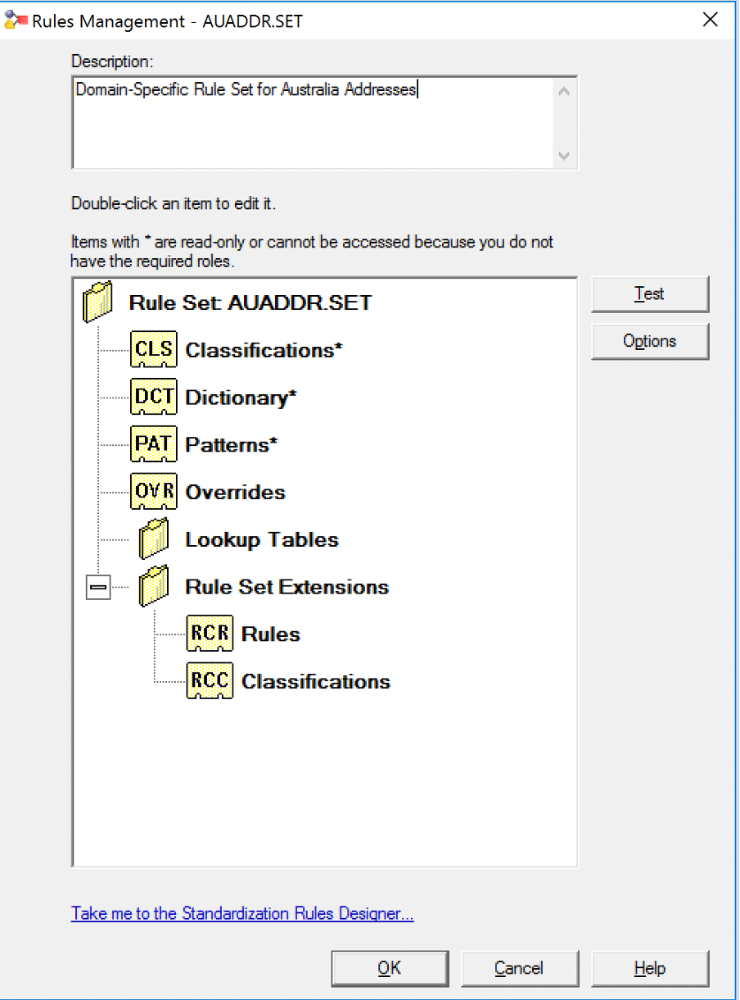
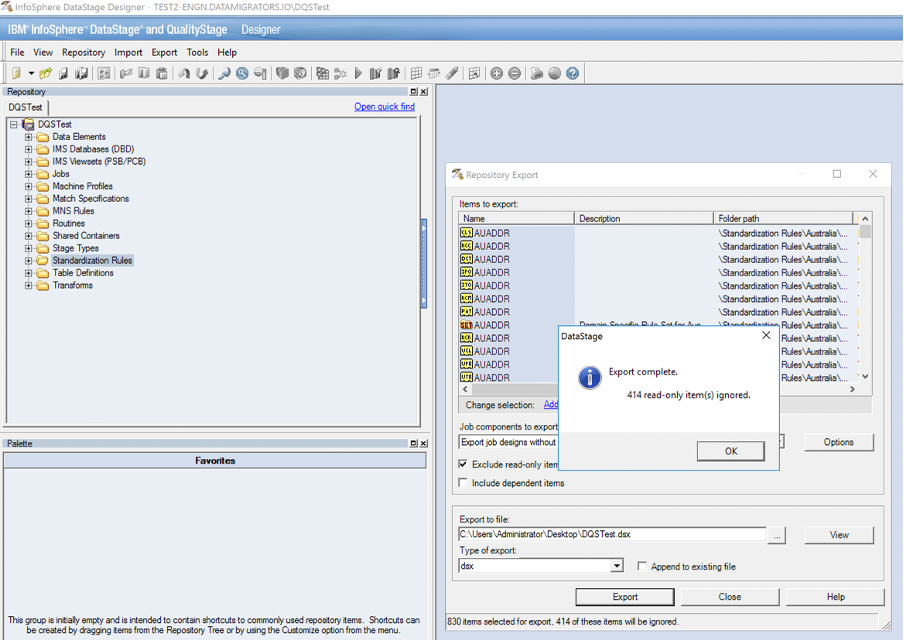
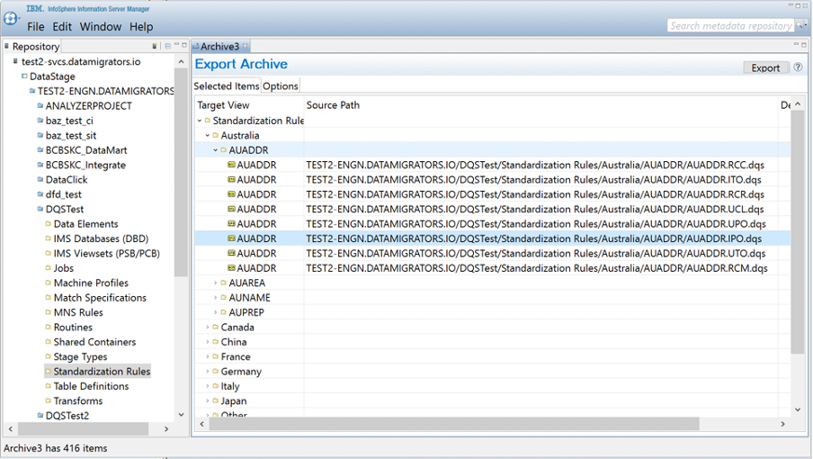
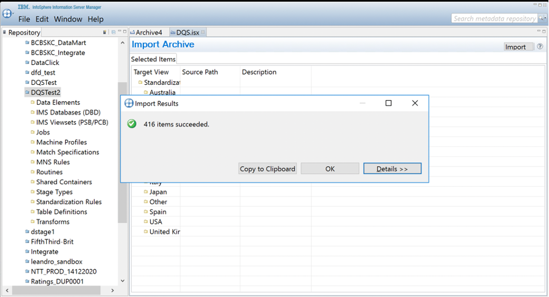
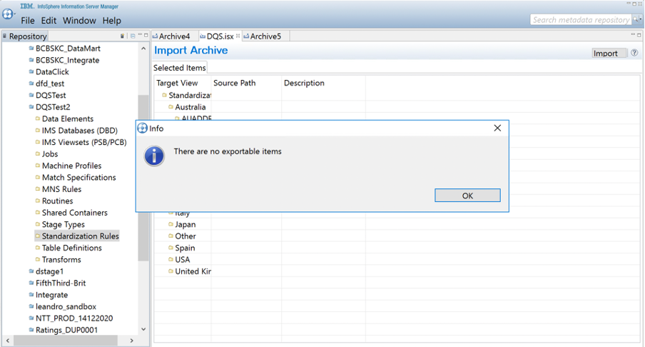

# QualityStage Rulesets Ignore Incremental Compilation

# Problem

[Incremental deployment](https://datamigrators.atlassian.net/wiki/spaces/MCIDOC/pages/1266843717/Repeatable+DataStage+Project+Deployments) of files from the standard [QualityStage Standardisation Rule Sets](https://www.ibm.com/docs/en/iis/11.7?topic=job-standardize-rule-sets) will take longer than expected to deploy and compile. This will be apparent by the deployment logs indicating that all of the QualityStage asset (`.dqs`) files are being imported and compiled despite the fact that no changes have been made to them by a user.

# Cause

**In summary, previous exports and imports of those files using a** `.dsx` **file format will alter the way in which the** `istool` **export process treats those file. Specifically, . and how it differs from Information Server Manager and** `istool` **methods in relation to the out-of-the-box Standardisation Rules.**

Consider the following example from a project called `DQSTest`…

When performing an `.isx` export using `istool` on a new DataStage project, all unmodified QualityStage-related files are considered to be non-exportable objects.

This not only includes the read-only files such as Pattern Action (`.pat`) and Classification (`.cls`) files, but editable files such as Text Override (`.ito` / `.uto`), Pattern Override (`.ipo`/ `.upo`) and Rule Set Extension (`.rcm` / `.rcr`) files.

When exporting assets using the DataStage `.dsx` export function, however only the read-only files are excluded, allowing the editable files listed above to be exported as part of the `.dsx` archive.

Re-importing that `.dsx` archive into DataStage modifies the internal properties of the editable Standardisation Rule Set files so that they are now treated as **exportable** when generating an `isx` file using `istool`.

If those files are exported as part of the MettleCI ‘golden copy’ source repository, and any subsequent deployments will exhibit the observed behaviour:

*   The incremental deployment process takes an `istool` preview of the target project, and does not list the out-of-the-box QualityStage assets.
    
*   The golden copy contains those out-of-the-box QualityStage assets, so they are deemed to be new assets to be imported into the target project.
    
*   Those assets are again imported and compiled, unnecessarily consuming valuable time and resources.
    

Even though these out-of-the-box assets have now been imported into the target project using the `istool` method, the `istool` method does not modify the internal properties of those assets in the same way as the DataStage `.dsx` import process, **so the next time a deployment occurs, those assets are still not included in the** `istool` **preview, and will still trigger a full import and compilation**.

Now consider an example project `DQSTest2`, which is the project the `.isx` extract featuring the problematic QualityStage assets is being deployed (where assets are imported using `istool` prior to compilation).

Note that, even after import of the assets, the next `istool` preview will still not show them, so subsequent deployments will not fix the issue.

Because of the difference in how these two methods of exporting and importing assets work internally there is no way to fix this behaviour.

# Solution

For newer project you will avoid the problem by never exporting and importing jobs as `.dsx` files.

For older projects, which do contain QualityStage assets which have been imported from `.dsx` files, the suggested workaround is to determine which, if any, of these files have been modified by developers. Any of these out-of-the-box Standardization Rules (`.dqs`) files that have not been modified should be removed from the ‘golden copy’ source repository.