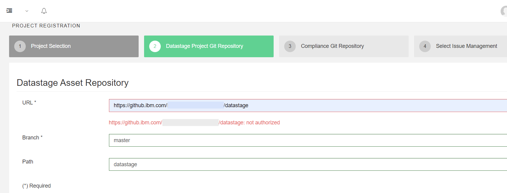

# Receiving a 'not authorized' message when trying to connect to Git repository.

# Problem

When trying to register a Git repository against a DataStage Project in MettleCI Workbench you receive a `https://{URL}: not authorized` error message.

# Cause

You do not have Workbench configured to supply your Git host with an appropriate SSH key.

# Solution

See the explanation [here](https://datamigrators.atlassian.net/wiki/spaces/MCIDOC/pages/1745747969/Configuring+MettleCI+Workbench+to+communicate+with+Git+over+HTTPS).