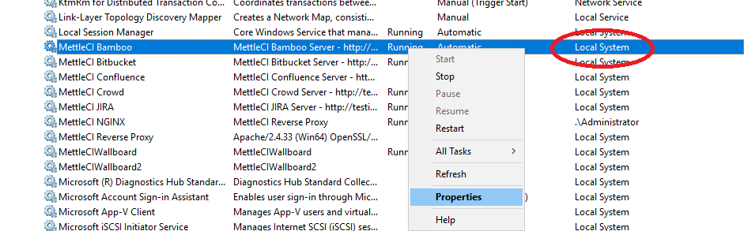

# The MettleCI Bamboo Plugin Fails When Compiling a Job

## Problem

MettleCI logs indicate that compilation commences but the process never completes or Bamboo’s hung build detection kills the processes:

```
simple	27-Nov-2019 21:20:52	Compiling DataStage server routines...
```

The `dscc.exe` command line utility included as part of the DataStage Client will indicate that it is initializing but never complete when it is run under the `Local System` account in Windows:

```
> dscc.exe /d datastage-svcs.datamigrators.io:9080 /h DATASTAGE-ENGN.DATAMIGRATORS.IO /u isadmin /p ***** /j ExampleJob /rcf /rt X ExampleProject

Initializing

```

## Solution

Please verify that any Bamboo or Bamboo Remote Agent Services you have installed on Windows are running as a user other than `Local System`

To change an existing service to run as another user

1.  Right click your service and select “Properties”
    
    
    
2.  Click the “Log On” tab, Select “This account” and click the “Browse…” button.
    
    
    
3.  Enter the username of that account you wish to use in the textbox and click “Check Names”
    
    
    
    If your username is not found after clicking “Check Names”, click the “Locations…” button and select “Entire Directory”.
    
4.  Save all changes restart the Service.
    

> [!WARNING]
> Depending on the permissions set on your Bamboo and/or Bamboo Remove Agent installation directories, you may get a permission denied error when attempting to restart the service.
> To resolve, ensure the Account you have selected to run the service has read and write access to the installation directory and all sub-directories and files.