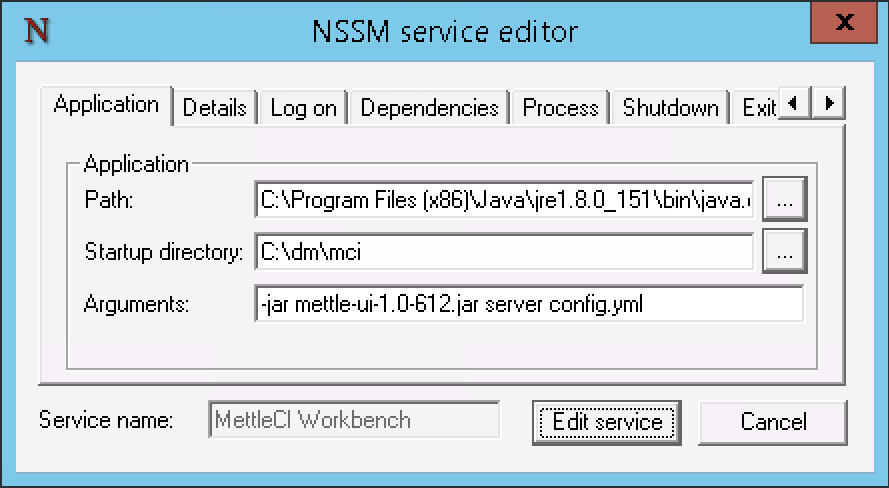

# The Workbench is unreachable, or the Workbench service won't start

# Problem

The Workbench URL cannot be reached (e.g. returns a 404 error) and/or the service appears to not be running. Common symptoms for each operating system are:


Windows


Unix

```
$> sudo service dm-mettleci-workbench start
MettleCI Workbench is not running
Starting MettleCI Workbench ...
MettleCI Workbench has been started
$> sudo service dm-mettleci-workbench status
/opt/dm/mci/METTLE_UI.pid dead but pidfile exist
```

# Diagnostics

There are a number of diagnostic steps you can take to help understand and resolve your particular Workbench issue:

### Ensure you’re using a correct, unblocked URL for the MCI Workbench

The Workbench is most typically installed on your DataStage Engine tier, in which case you would use…

*   `http://[your-engine-tier-URL]:8080`, and/or
    
*   `https://[your-engine-tier-URL]:8443` (if you've [configured Workbench to use HTTPS](https://datamigrators.atlassian.net/wiki/spaces/MCIDOC/pages/458556297/Configuring+Workbench+to+use+HTTPS))
    

Ensure that your MettleCI Workbench menu items are configured to use the correct URL’s.

### Ensure that the relevant ports are available

By default, MettleCI uses ports 8080 / 8443 (for the end-user UI) and 8081 (for the low-level diagnostics UI). There are two port-related scenarios that can cause Workbench to be unavailable:

1.  The port for the UI you are trying to access is blocked by network-level or operating-system-level firewall rules. Time to talk to your friendly network administrator.
    
2.  Either port is taken by other processes (e.g. a popular virus scanning application on Microsoft Windows often uses port 8081). Workbench may appear to start but the browser will fail to get a response when you go to to its URL.
    

In either case you can resolve the problem by [configuring MettleCI Workbench to use a custom port number](https://datamigrators.atlassian.net/wiki/spaces/MCIDOC/pages/588972035/Configuring+MettleCI+Workbench+to+use+a+Custom+Port+Number).

### Find out which ports are already in use

Sometimes an old execution of Workbench from a previous installation may still be running and keeping the port open. Alternatively, a different application definitely requires use of that port. Find out what is already connected to the relevant port using the following methods:-


Windows

Execute Powershell and run this command (replace 8080 which the appropriate Port Number):-

```
PS C:\Users\Administrator> Get-Process -Id (Get-NetTCPConnection -LocalPort 8080).OwningProcess

Handles  NPM(K)    PM(K)      WS(K)     CPU(s)     Id  SI ProcessName
-------  ------    -----      -----     ------     --  -- -----------
    431      43   793404     185376       7.45   2200   0 java
```

> [!NOTE]
> Note: ProcessName ‘java’ indicates MettleCI Workbench is probably running.


Unix

Execute the following `netstat` command (replace 8080 which the appropriate Port Number). Then use `ps -ef` to find what process is running as that pid:-

```
$> sudo netstat -tulpn | grep LISTEN | grep 8080
tcp6       0      0 :::8080                 :::*                    LISTEN      2018/java
$> ps -ef | grep 2018
mciworkb  2018     1  0 04:31 ?        00:00:54 /bin/java -jar /opt/dm/mci/mettle-ui-1.0-1432.jar server /opt/dm/mci/config.yml
root     31582 31469  0 14:19 pts/2    00:00:00 grep --color=auto 2018
$>
```

### Check the status of the workbench service


Windows

Open the Services application and verify that the Workbench service has been installed, has been configured to start automatically, and is running:


Unix

```
[user@host]$> sudo service dm-mettleci-workbench status        # You'll receive either

MettleCI Workbench is not running                              # This message, if the workbench service is running, or
/opt/dm/mci/METTLE_UI.pid dead but pidfile exists              # This message, if it's failed for some reason
```

### Verify your Service settings (Windows)


Windows

Open a Windows Command window and run the `NSSM` tool shipped with your MettleCI installation:

```
C:\> cd C:\dm\mci\nssm\win64
C:\dm\mci\nssm\win64> nssm edit "MettleCI Workbench"

```

This will display a dialog which will enable you to inspect and modify the settings for your Window MettleCI Workbench service. Use this tool to verify the values you provided at installation time.



If you need to make any changes click ‘Edit service’ to make them permanent, then try restarting your MettleCI Workbench service:


### Check the MettleCI log

Inspect the contents of `/opt/dm/mci/mci.log` UNIX or `D:\dm\mci\mci.log` WINDOWS . This may contain log messages which provide guidance on what is going wrong.

### Verify your license file

Ensure your MettleCI license file is…

*   named correctly, and in the correct directory (`<METTLECI-HOME>/mettleci.lic`)
    
*   configured with permissions appropriate to make it readable by the account used to execute the service
    
*   referenced correctly in your `<METTLECI-HOME>/config.yaml` file
    
*   valid. Refer to the details in the email which provided you with your license file. Specifically…
    
    *   Has your license expired? Check the effective dates.
        
    *   Are other license constraints valid? e.g. does the MAC address of the host on which you are running the Workbench service match that embedded in your license?
        

### Verify your MettleCI configuration file

Run the following commands to verify your `config.yml` file, and then try to start the Workbench service manually to provide further opportunities for diagnostic output:


Windows

```
# Where xxxx is your version of MettleCI Workbench...
C:\> java -jar <METTLE-HOME-DIRECTORY>\mettle-ui-1.0-xxxx.jar check <METTLE-HOME-DIRECTORY>\config.yml

then...

C:\> java -jar mettle-ui-1.0-SNAPSHOT.jar server <METTLE-HOME-DIRECTORY>\config.yml
```


Unix

```
# Where xxxx is your version of MettleCI Workbench...
[user@host]$> java -jar <METTLE-HOME-DIRECTORY>/mettle-ui-1.0-xxxx.jar check <METTLE-HOME-DIRECTORY>/config.yml

then...

[user@host]$> java -jar <METTLE-HOME-DIRECTORY>/mettle-ui-1.0-xxxx.jar server <METTLE-HOME-DIRECTORY>/config.yml
```

### Manually run the Workbench Java application

If you have been unable to diagnose the issue with your Workbench service, you can manually run the java command to start Workbench to check if any of the output from the java command can help you identify the issue.

The command should look something like this:

```
java -jar [WORKBENCH_JAR] server [WORKBENCH_CONFIG_FILE]
```

> [!WARNING]
> We recommend running this command as the user that usually would run the Workbench service to recreate the same conditions and to avoid any permissions issues in the future.

This is an example of what this will look like and what the output would be if the port configured in the Workbench config file was already in use:

```
[root@test1-engn mci]# java -jar mettle-ui-1.0-1234.jar server config.yml
java.lang.RuntimeException: java.io.IOException: Failed to bind to 0.0.0.0/0.0.0.0:8080
	at org.eclipse.jetty.setuid.SetUIDListener.lifeCycleStarting(SetUIDListener.java:229)
	at org.eclipse.jetty.util.component.AbstractLifeCycle.setStarting(AbstractLifeCycle.java:205)
	at org.eclipse.jetty.util.component.AbstractLifeCycle.start(AbstractLifeCycle.java:72)
	at io.dropwizard.cli.ServerCommand.run(ServerCommand.java:53)
	at io.dropwizard.cli.EnvironmentCommand.run(EnvironmentCommand.java:45)
	at io.dropwizard.cli.ConfiguredCommand.run(ConfiguredCommand.java:87)
	at com.datamigrators.mettle.setup.StartServerCommand.run(StartServerCommand.java:41)
	at io.dropwizard.cli.Cli.run(Cli.java:78)
	at io.dropwizard.Application.run(Application.java:94)
	at com.datamigrators.mettle.MettleApplication.main(MettleApplication.java:66)
Caused by: java.io.IOException: Failed to bind to 0.0.0.0/0.0.0.0:8080
	at org.eclipse.jetty.server.ServerConnector.openAcceptChannel(ServerConnector.java:349)
	at org.eclipse.jetty.server.ServerConnector.open(ServerConnector.java:310)
	at org.eclipse.jetty.setuid.SetUIDListener.lifeCycleStarting(SetUIDListener.java:216)
	... 9 more
Caused by: java.net.BindException: Address already in use
	at sun.nio.ch.Net.bind0(Native Method)
	at sun.nio.ch.Net.bind(Net.java:433)
	at sun.nio.ch.Net.bind(Net.java:425)
	at sun.nio.ch.ServerSocketChannelImpl.bind(ServerSocketChannelImpl.java:223)
	at sun.nio.ch.ServerSocketAdaptor.bind(ServerSocketAdaptor.java:74)
	at org.eclipse.jetty.server.ServerConnector.openAcceptChannel(ServerConnector.java:345)
	... 11 more
```

## Related articles

*   Page:
    
    [Workbench produces 'Failed to initialize DATASTAGE\_ASB authentication' error on startup](/wiki/spaces/MCIDOC/pages/2461859849/Workbench+produces+Failed+to+initialize+DATASTAGE_ASB+authentication+error+on+startup)
    
*   Page:
    
    [Configuring Authentication between Workbench and Atlassian Bitbucket](/wiki/spaces/MCIDOC/pages/1056047306/Configuring+Authentication+between+Workbench+and+Atlassian+Bitbucket)
    
*   Page:
    
    [How does MettleCI Workbench integrate with Git?](/wiki/spaces/MCIDOC/pages/615546893/How+does+MettleCI+Workbench+integrate+with+Git)
    
*   Page:
    
    [Committing DataStage Assets to Git](/wiki/spaces/MCIDOC/pages/374865930/Committing+DataStage+Assets+to+Git)
    
*   Page:
    
    [Workbench Set-Branch Command](/wiki/spaces/MCIDOC/pages/2449047553/Workbench+Set-Branch+Command)