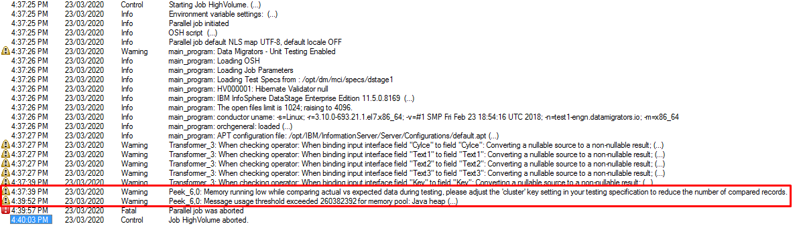

# Unit Test fails due to exceeded memory threshold

# Problem

You receive a memory error in the job log when running a unit test

# Solution

You need to provide a Cluster clause in your Unit Test Specification to help MettleCI optimise memory usage. See [High Volume Unit Tests](https://datamigrators.atlassian.net/wiki/spaces/MCIDOC/pages/644546565/).