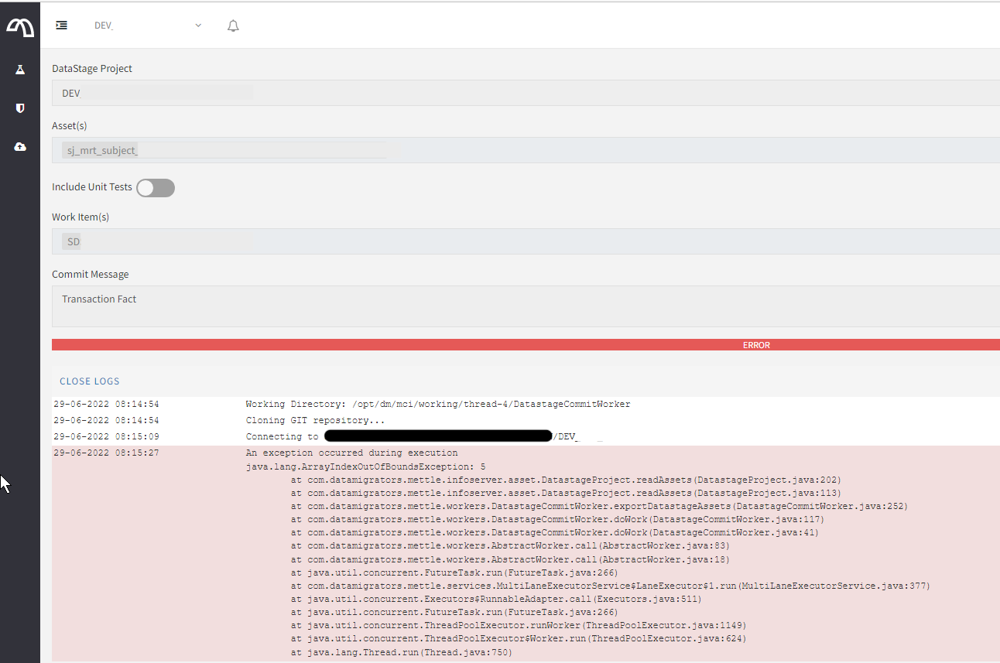

# Workbench commit failed with java.lang.ArrayIndexOutOfBoundsException

## Problem

`MettleCI Workbench` throwing `java.lang.ArrayIndexOutOfBoundsException` when committing asset(s)



## Cause

IBM `istool` has a permission issue with `org.eclipse.osgi`

Run `istool` with the`-preview` option, and you should see problem rows in line 4 and 5

```
Beginning Export Preview
 [1/1] ENGINE/DEV/Jobs/sj_mrt_subject.pjb
Previewed 1 assets
<title>Invalid Configuration Location</title>Locking is not possible in the directory "/opt/IBM/InformationServer/Clients/istools/cli/configuration/org.eclipse.osgi". A common reason is that the file system or Runtime Environment does not support file locking for that location. Please choose a different location, or disable file locking passing "-Dosgi.locking=none" as a VM argument.
ReliableFile is corrupt
```

## Solution

The solution is to change the permissions of the files that need to be locked… Assuming istool is located under `/opt/IBM/InformationServer/Clients/istool`

```
cd /opt/IBM/InformationServer/Clients/istools/cli/configuration/org.eclipse.osgi/.manager
chmod go+r .fileTable*
```

This will resolve the `istool` permission issue, and Workbench commit issue.  

> [!NOTE]
> Note that the solution suggested in the error message (of passing `"-Dosgi.locking=none"` as a VM argument) does not always solve the issue without the permissions change, and with the permissions change, that argument is not needed.