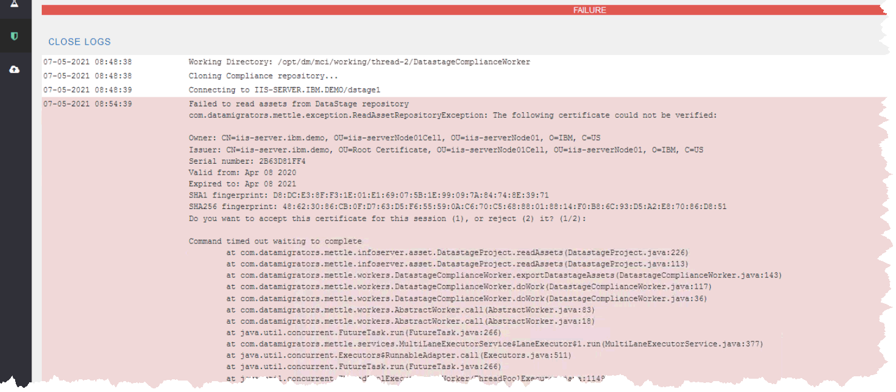

# Workbench exception 'The following certificate could not be verified'

# Problem

Attempting to run Compliance produces an error of the form ‘Failed to read assets from DataStage repository’ and ‘The following certificate could not be verified’. This exception may also be encountered when invoking other MettleCI functions that involve the retrieval of assets from DataStage.

# Reason

The DataStage Services Tier self-signed certificate that usually resides in the trusted store of the MettleCI Workbench host is missing or has expired. The example screenshot shows the second situation and the error text between `...ReadAssetRepositoryException:` and `Command timed out ...` comes straight from the DataStage CLI command that Workbench is attempting to run in the background during its operations. Since this is effectively an API call by Workbench, users cannot respond to that prompt from within the Workbench UI.

# Solution

Users will need to do one of the following:

1.  Run the UpdateSignerCerts command per [IBM’s instructions](https://www.ibm.com/docs/en/iis/11.7?topic=certificates-running-updatesignercerts-command); or
    
2.  Run an `istool export` operation from `<IS_install_path>/Clients/istools/cli`
    

…to trigger that certificate acceptance prompt and permanently accept the up-to-date certificate.

Once accepted, you shouldn’t have to do it again until the cert expires or some other non-MettleCI event invalidates it.

**Note** that this process has to be performed on…

*   The machine hosting that MettleCI Workbench instance (your DataStage Engine tier), and
    
*   The machine running your MettleCI command line used by your build tool. We commonly refer to this machine as the [Mettle Agent Host](https://datamigrators.atlassian.net/wiki/spaces/MCIDOC/pages/2327019539/The+Mettle+Agent+Host).