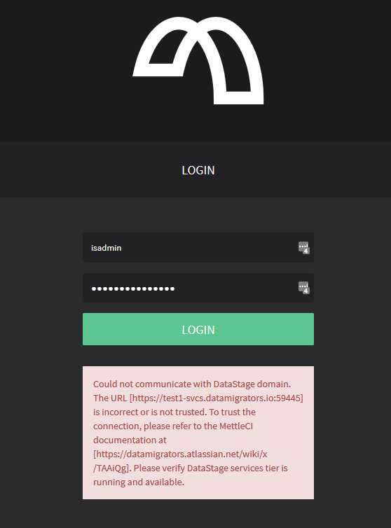

# Workbench login error 'The URL is incorrect or is not trusted'

# Problem

While attempting to log into MettleCI Workbench after upgrading or changing the HTTPS certificates used by DataStage, the following error is presented and login does not occur:



# Cause

When communicating with DataStage over HTTPS, MettleCI Workbench needs to verify that the SSL Certificate used by DataStage has been signed by a trusted authority. Out of the box, MettleCI Workbench will trust all SSL Certificates signed by globally recognized Certificate Authorities but most DataStage installations use self-signed certificates. To trust a DataStage server using a self-signed certificate, the certificate needs to be added to MettleCI Workbench’s trust store.

MettleCI Workbench versions **earlier than 1.0-924** used to share the same trust store used by DataStage clients, so assuming the DataStage engine had been trusted by running the [UpdateSignerCerts](https://www.ibm.com/support/knowledgecenter/SSZJPZ_11.7.0/com.ibm.swg.im.iis.found.admin.common.doc/topics/wsisinst_run_updatesignercerts.html) command this error wouldn’t have occurred.

MettleCI Workbench versions **1.0-924 onwards** uses a set of upgraded HTTPS security algorithms and maintains its own trust store which is no longer compatible with the trust store used by DataStage clients.

# Solution

To add your DataStage Services Tier certificate to the trust store used by MettleCI Workbench to communication with your DataStage instance, run the following command from the MettleCI Workbench installation directory (eg. `/opt/dm/mci`):

```
java -jar mettle-ui-X.X-XXX.jar trust-datastage config.yml
```

…where `X.X-XXX` is the version of MettleCI Workbench currently in use.

After the command has completed, you can verify its success by checking the most recent entries in `mci.log` which should look something like the following:

```
INFO  [2020-10-15 05:37:31,231] com.datamigrators.mettle.cli.TrustDatastageCertificate: The following certificate was retrieved:

Owner: CN=test1-svcs.datamigrators.io, OU=test1-svcsNode01Cell, OU=test1-svcsNode01, O=IBM, C=US
Issuer: CN=test1-svcs.datamigrators.io, OU=Root Certificate, OU=test1-svcsNode01Cell, OU=test1-svcsNode01, O=IBM, C=US
Serial number: 2AF7BCA1E6
Valid from: Sep 20 2020
Expires after: Sep 20 2021
SHA1 fingerprint: 0A65D086200C7B6E48BCDB75C5F2CCBCCB95C39F
SHA256 fingerprint: 530E492EA688CCB280D8E004AA412964D3ADC15D3CE4367D4359B19A2170F153

INFO  [2020-10-15 05:37:31,408] com.datamigrators.mettle.cli.TrustDatastageCertificate: DataStage service tier 'test1-svcs.datamigrators.io:59445' has been added to trust store
```

> [!WARNING]
> The MettleCI Workbench service needs to be [restarted](https://datamigrators.atlassian.net/wiki/spaces/MCIDOC/pages/1954578453/Starting+Stopping+the+Monitoring+MettleCI+Workbench+Service?src=search) for the change to take effect.