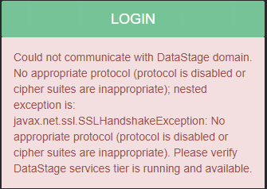
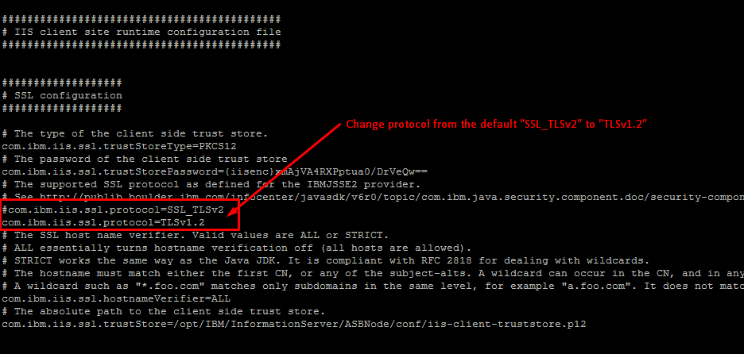

# Workbench login fails with 'No appropriate protocol' error

# Problem

Attempting to login to the MettleCI Workbench user interface presents the following error:

> “Could not communicate with DataStage domain.
> 
> No appropriate protocol (protocol is disabled or cipher suites are inappropriate); nested exception is:
> 
> javax.net.ssl.SSLHandshakeException: No appropriate protocol (protocol is disabled or cipher suites are inappropriate).
> 
> Please verify DataStage services tier is running and available.”

# Solution

To fix this issue…

1.  Login to the Engine Tier where the MettleCI Workbench Service is running.
    
2.  Open the file `/opt/IBM/InformationServer/ASBNode/eclipse/plugins/com.ibm.iis.client/iis.client.site.properties` for editing.
    
3.  Replace `com.ibm.iis.ssl.protocol=SSL_TLSv2` with `com.ibm.iis.ssl.protocol=TLSv1.2`
    
    
    
4.  Save the edited file and [restart the MettleCI Workbench service](https://datamigrators.atlassian.net/wiki/spaces/MCIDOC/pages/1954578453/Starting+Stopping+the+Monitoring+MettleCI+Workbench+Service)
    

# Explanation

Workbench connects to DataStage using IBM's `com.ibm.iis.client` Java library.  However, this library relies on IBM-specific security extensions which are old, insecure, and introduce issues with HTTPS security features in the server/clients upon which the MettleCI Workbench rely.  Workbench handles the inconsistencies inherent in `com.ibm.iis.client` to make it compatible with modern Java distributions, such as the recommended OpenJDK distribution. 

One problem Workbench handles is the way that `com.ibm.iis.client` initiates HTTPS connections.  The IBM `com.ibm.iis.client` library use a non-standard protocol identifier hard-coded into its HTTPS negotiation process. The IBM JRE introduces a proprietary protocol called `SSL_TLSv2` (which is not an HTTPS protocol in the traditional sense) which by-passes standard Java security negotiation processes and is specific to the IBM JRE. A standard JRE has no knowledge of this protocol, and so it cannot be used. MettleCI Workbench remaps this protocol to either `TLSv1`, `TLSv1.1` or `TLSv1.2`.