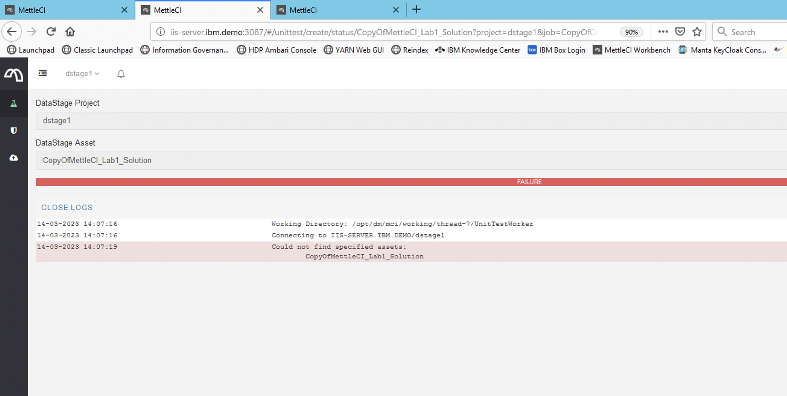

# Workbench operations return ‘Could not find specified assets’

# Symptom

Running compliance or Git Commit in MettleCI Workbench returns a `Could not find specified assets` error, despite the user specifying the name of a valid Asset within the selected Project.



# Diagnosis

1.  Start a shell on the DataStage Engine that hosts your MettleCI Workbench service
    
2.  Ensure you are operating in that shell under the same user account that is being used for the MettleCI Workbench service (typically `mciworkb`)
    
3.  Attempt to use the [istool](https://www.ibm.com/docs/en/iis/11.7?topic=idqa-export-command) command to perform an export of your selected asset.
    

For example…

```
/opt/IBM/InformationServer/Clients/istools/cli/istool.sh export
 -domain myhost.myorganization.com:9443
 -username myusername  -password mypassword
 -archive "/tmp/myexport.isx"  
 -datastage ' -base="myhost.myorganization.com/myproject" "/myjob." '
```

If the `istool` export command runs with no error message but you observe that the export file specified by `-archive` hasn’t been created, it’s likely you have found the reason for the Workbench error.

# Cause

MettleCI uses DataStage’s native export capabilities to extract the required asset(s) from the repository tier. Without a working `istool` - and hence access to the DataStage assets - MettleCI cannot successfully complete the requested operation.

# Solution

See IBM’s technote on this topic which describes the problem and its solution: [https://www.ibm.com/support/pages/infosphere-information-server-manager-and-istool-command-may-encounter-errors-after-applying-jr55455](https://www.ibm.com/support/pages/infosphere-information-server-manager-and-istool-command-may-encounter-errors-after-applying-jr55455) . Note that JR55455 might have been applied to your Information Server system as a by-product of installing an Information Server fix pack or service pack.