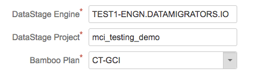

# Compliance Plans

MettleCI's Compliance Plans page is for linking DataStage project with a Compliance Plans on the bamboo server. Every time user [https://datamigrators.atlassian.net/wiki/spaces/MCIDOC/pages/292192311](https://datamigrators.atlassian.net/wiki/spaces/MCIDOC/pages/292192311), bamboo will automatically run the specified plan with provided parameters to commit the changes. For more details on how to configure compliance plan and write new compliance rules, please refer to [Writing Compliance Rules.](https://datamigrators.atlassian.net/wiki/spaces/MCIDOC/pages/117665828/Compliance+Rule+Development)

> [!INFO]
> This administration page is available after installing the **MettleCI - Compliance Plugin** (dm-compliance-plugin.jar)

## To link a DataStage Project to a Compliance Plan

Steps

1.  Navigate to Bamboo Administration page.
2.  Click on Compliance Plans under Mettle section on the left panel.
3.  Click **Add Compliance Plan** button and fill in the values
    
    |     |     |
    | --- | --- |
    | DataStage Engine | <Datastage Engine Name> |
    | DataStage Project | <Datastage Project Name> |
    | Bamboo Plan | <Bamboo Plan>   Select check-in plan that you have setup |
    
    
    
4.  Click **Create**