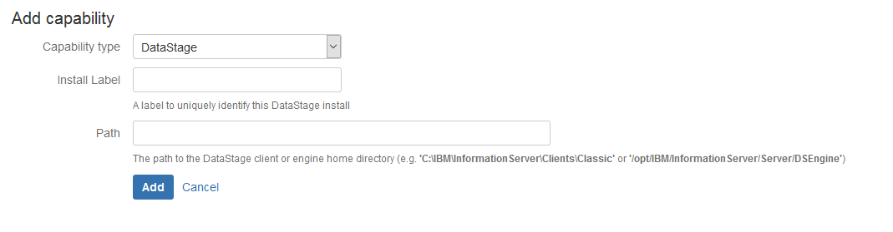

# Bamboo DataStage Capability

Bamboo build agents optionally possess attributes called [capabilities](https://confluence.atlassian.com/bamboo/configuring-capabilities-289277148.html) which describe the functions they are able to perform. An agent which is resident on a host which also provides a database interface might poses a `database` capability, for example. You can then optionally configure each of your build pipeline's steps to only run using build agents which present the capabilities necessary to execute that step.

MettleCI extends the default capabilities of Bamboo with the **MettleCI - DataStage Capability Plugin** which installs a `DataStage` capability. This allows you to identify which of your Bamboo build agents are installed co-resident with a MettleCI Command Line Interface, necessary to execute MettleCI-specific build pipeline steps.

## To configure a DataStage Capability

1.  Navigate to the **Server capabilities** configuration page. Typically at `http://<bamboo base URL>/bamboo/admin/agent/configureSharedLocalCapabilities.action`
    
2.  Click the 'Edit' option of an existing DataStage Capability, or click **Add Capability**.
    
3.  If you can't find the DataStage Capability type, check the add-on **MettleCI - DataStage Capability Plugin** (dm-capability-plugin.jar) has been installed and is enabled.
    
4.  Complete the following settings, then click **Save:**
    

| *Add Capability* |     |
| --- | --- |
| **Capability type** | DataStage |
| Install Label | A label to uniquely identify this DataStage install |
| Path | The path to the DataStage client or engine home directory    (e.g. **'C:\\IBM\\InformationServer\\Clients\\Classic'** or **'/opt/IBM/InformationServer/Server/DSEngine'**) |

