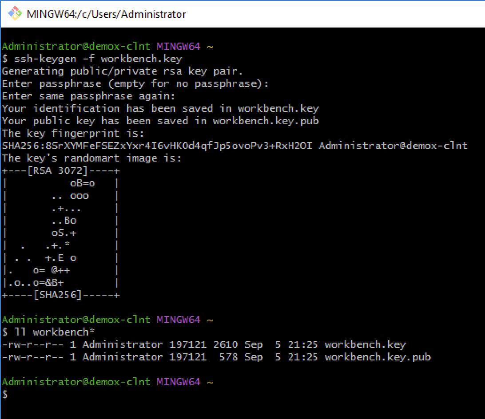

# Creating SSH keys manually

SSH (**S**ecure **SH**ell) is a generic term for a software package or command which implements the [SSH communications protocol](https://www.ssh.com/ssh/protocol/) to enable secure system administration and file transfers over insecure networks. It is used in nearly every datacenter, in every larger enterprise.

An [SSH key](https://www.ssh.com/ssh/key/) is an access credential that fulfils a similar function to that of user names and passwords. The keys are primarily used for automated processes and for implementing single sign-on by system administrators and power users. A key comes as a pair of files: a Public key (also known as an Authorized key) and a private key (also know as an Identity key) .

Public keys are analogous to locks that the corresponding private key can open. Private keys are used by an SSH client to authenticate itself when logging into an SSH server and are analogous to physical keys that can open one or more locks (Public keys).

Many components of MettleCI are integrated to third party systems using SSH to avoid the need for various software components to repeatedly prompt users for authentication credentials. Note that SSH keys are RSA by default, but can be generated using a number of different encryption algorithms. The algorithm you choose will depending upon the system with which you are trying to connect.

On 15th March 2022, for example, GitHub stopped accepting RSA and DSA keys so you should generate an ECDSA or RSA SHA256 key (demonstrated below).

RSA SHA256 keys are preferred as they work with both GitHub and Microsoft Azure.

* * *

# Instructions - Windows

The easiest way to generate an SSH key on Windows is to install a Git client and use Git Bash to follow the same instructions as for Unix.



* * *

# Instructions - Unix

Here’s an example of creating and deploying an SSH key to avoid a username/password prompt when connecting from one host (`localhost`, in this example) to another (`remotehost`).

If you already have an SSH key, you can skip this step. Don’t enter a passphrase if you want to use this key with third party systems like Azure or GitHub.

```
# Generate a 2048-bit RSA key (Will NOT work with GitHub!)
$> ssh-keygen -t rsa -b 2048 -f mykey.rsa.key
Generating public/private rsa key pair.
# (blah blah blah)

# Or
# Generate a 2048-bit RSA SHA256 key (WILL work with GitHub!)
[root@release1-engn ~]# ssh-keygen -t rsa-sha2-256 -b 2048
Generating public/private rsa-sha2-256 key pair.
Enter file in which to save the key (/root/.ssh/id_rsa): mykeyrsa256
Enter passphrase (empty for no passphrase):
Enter same passphrase again:
Your identification has been saved in mykeyrsa256
Your public key has been saved in mykeyrsa256.pub
The key fingerprint is:
SHA256:E8ld6eXF1HynQz9Jx0+tCtUI18R54kTAWhXcLqnKg68 root@release1-engn.mettleci-release-test.datamigrators.io
The key's randomart image is:
+---[RSA 2048]----+
|          .o+%=O+|
|       . o o* @.#|
|        + .= *.@*|
|         .o . Oo+|
|        S  . o o.|
|         .  o    |
|         o .     |
|        . +      |
|        Eo..     |
+----[SHA256]-----+
[root@release1-engn ~]# 


# Copy the public key of your computer to the trusted keys of the target server
localhost:~$ ssh-copy-id -i .ssh/mykeyrsa256 user@remotehost
user@remotehost's password: ••••••••
```

> [!INFO]
> Note that the following steps are not required when using the generated key with MettleCI Workbench.

Now try logging into the machine, with `ssh 'user@remotehost'` to verify the keys we’ve added:

```
# Create the .ssh directory:
localhost:~$ mkdir ~/.ssh

# Set the right permissions:
localhost:~$ chmod 700 ~/.ssh

# Create the authorized_keys file:
localhost:~$ touch ~/.ssh/authorized_keys

# Set the right permissions:
localhost:~$ chmod 600 ~/.ssh/authorized_keys

# Verify
localhost:~$ ls ~/.ssh/authorized_keys
```

Finally check you can log in using your new key…

```
localhost:~$ ssh id@server
user@remotehost:~$ 
```

## Related articles

*   Page:
    
    [Integrating Atlassian Jira with MettleCI Workbench](/wiki/spaces/MCIDOC/pages/1507328025/Integrating+Atlassian+Jira+with+MettleCI+Workbench)
    
*   Page:
    
    [Configuring Authentication between Workbench and Atlassian Bitbucket](/wiki/spaces/MCIDOC/pages/1056047306/Configuring+Authentication+between+Workbench+and+Atlassian+Bitbucket)
    
*   Page:
    
    [What are the MettleCI Infrastructure Requirements?](/wiki/spaces/MCIDOC/pages/272138278/What+are+the+MettleCI+Infrastructure+Requirements)
    
*   Page:
    
    [How does MettleCI Workbench integrate with Git?](/wiki/spaces/MCIDOC/pages/615546893/How+does+MettleCI+Workbench+integrate+with+Git)
    
*   Page:
    
    [Creating SSH keys manually](/wiki/spaces/MCIDOC/pages/457900052/Creating+SSH+keys+manually)