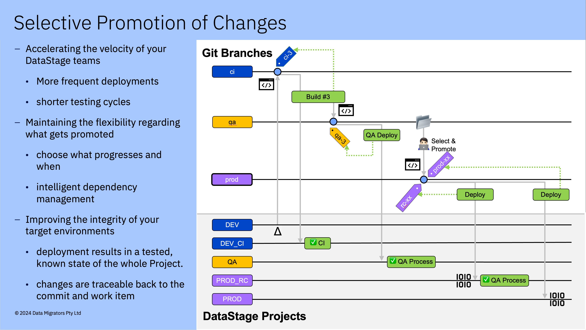

# 🔒 Selective promotion process



```
#
# Create a local clone of our repository
#
$> git clone user@bitbucket.org:myorganisation/myrepository.git
Cloning into '53b-test'...
Receiving objects: 100% (2310/2310), 41.33 MiB | 5.34 MiB/s, done.
Resolving deltas: 100% (904/904), done.

#
# Copy the mci-promote.sh out of the repository into your path
# Note that subsequent steps will involve us switching our session to branches where
# the mci-promote.sh script does not exists, so we need to put it somewhere on our
# path where we can always access it)
#
$> cd myrepository
$> cp ./pipelines/scripts/mci-promote.sh ~

#
# Switch to the DESTINATION git branch (the branch into which you wish to promote assets) 
#
$> git switch qa
Switched to branch 'qa'
Your branch is up to date with 'origin/qa'.

#
# Run the mci_promote script specifying the mandatory parameters ...
# Usage: mci-promote.sh -s <source branch> -a <datastage assets>
#
$> ~/mci-promote.sh -s ci -a ./datastage
Fetching and tracking 'origin/ci'
remote: Enumerating objects: 42, done.
remote: Counting objects: 100% (39/39), done.
remote: Compressing objects: 100% (22/22), done.
remote: Total 24 (delta 14), reused 0 (delta 0), pack-reused 0 (from 0)
Unpacking objects: 100% (24/24), 473.08 KiB | 1.01 MiB/s, done.
From bitbucket.org:myorganisation/myrepository
 * branch            ci         -> FETCH_HEAD
   3268f21..8bbba66  ci         -> origin/ci
branch 'ci' set up to track 'origin/ci'.
Resetting assets folder 'datastage' to 'qa'
Promoting assets from 'ci' (8bbba66)
  datastage/Jobs/Transform/TR_ORDERS.isx

#
# Once you're happy you've promoted the correct assets between the
# correct branches you can commit and push your changes as normal
#
$> git commit -m "Promoted TR_ORDERS to qa"
[qa 71ad047] Promoted to qa
 1 file changed, 0 insertions(+), 0 deletions(-)

$> git push
Enumerating objects: 11, done.
Counting objects: 100% (11/11), done.
Delta compression using up to 10 threads
Compressing objects: 100% (6/6), done.
Writing objects: 100% (6/6), 385.89 KiB | 22.70 MiB/s, done.
Total 6 (delta 4), reused 0 (delta 0), pack-reused 0
remote:
remote: Create pull request for qa:
remote:   https://bitbucket.org/myorganisation/53b-test/pull-requests/new?source=qa&t=1
remote:
To bitbucket.org:myorganisation/myrepository.git
   19769ba..71ad047  qa -> qa

# Done!
```